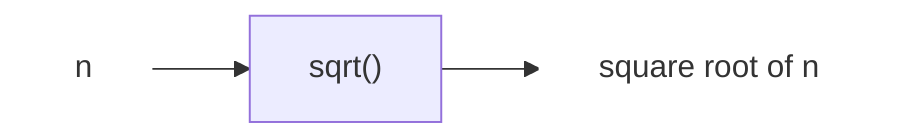
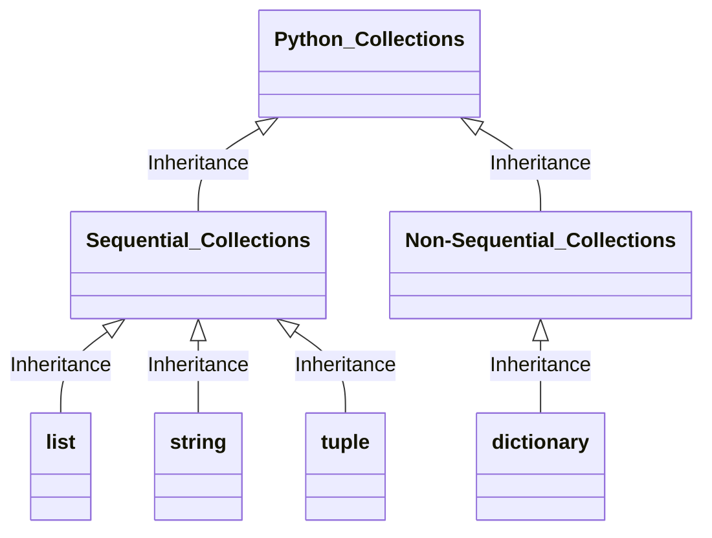

# Week2 DSA & OOP

*Updated 2025-09-15 17:17 GMT+8*  
*Compiled by Hongfei Yan (2025 spring)*    
https://github.com/GMyhf/2025fall-cs201/


Logs:

> 熟练掌握 Linux 系统、Shell 命令、OJ 测试数据处理、Markdown 编写及 GitHub 使用，是必备的基础技能。
>
> 2025年秋“数据结构与算法”课程学生背景调研问卷
>
> 
>
> 
>
> [2025fall 数算（DS Algo）每日选作](https://github.com/GMyhf/2025fall-cs201/blob/main/DSA_problem_list_at_2025fall.md)
>
> LeetCode 热题 100，https://leetcode.cn/studyplan/top-100-liked/
>
> ​	哈希，双指针，滑动窗口，子串，普通数组，回溯，二分查找，贪心算法，动态规划，技巧，图论（前2个）
>
> 


# 引言 数据结构与算法

https://www.geeksforgeeks.org/learn-data-structures-and-algorithms-dsa-tutorial/?ref=outind

## What is DSA?

数据结构与算法（Data Structures and Algorithms，简称 DSA）是两个独立但又紧密关联的计算机科学领域的结合。它被广泛认为是每一位计算机专业学生必须掌握的核心技能之一。

在实践中我们常常发现，对数据结构与算法有深入理解的程序员，通常具备更强的编程能力和问题解决能力。

> 掌握 DSA，不仅是提升编程能力的关键，更是通往优秀软件工程师之路的基石。正因如此，他们往往能在激烈的求职竞争中脱颖而出，成功通过各大科技公司的技术面试。

> DSA is defined as a combination of two separate yet interrelated topics – Data Structure and Algorithms. DSA is one of the most important skills that every computer science student must have. It is often seen that people with good knowledge of these technologies are better programmers than others and thus, crack the interviews of almost every tech giant.


⚠️ **重要提示：算法是前序《计算概论》（Algorithms and Data Structures，简称 ADS）课程的核心内容**

ADS课程涵盖以下四类关键算法：

- 贪心算法（Greedy）
- 递归与回溯（Recursion / Backtracking）
- 动态规划（Dynamic Programming, DP）
- 搜索算法（Searching）

如果你在递归类题目上练习不足，建议针对性地多做相关题目以巩固基础。

**遇到不会的题目怎么办？** 欢迎随时在课程群内提问！

### 学习建议：

1. **递归（Recursion）**  
   是算法设计中的核心基础技能，建议优先掌握。  
   参考资料：[《递归详解》](https://github.com/GMyhf/2024fall-cs101/blob/main/20241029_recursion.md)

2. **队列与广度优先搜索（BFS）**  
   队列在广度优先搜索中有广泛应用。  
   参考资料：[《搜索算法专题》](https://github.com/GMyhf/2024fall-cs101/blob/main/20241119_searching.md)

3. **其他常用算法技巧**  
   即使尚未系统学习，也无需担心。遇到相关问题时逐步掌握即可。常见技巧包括：

   - 双指针（链表中的“快慢指针”需重点掌握）
   - 单调栈
   - 二分查找
   - 并查集
   - 滑动窗口
   - 懒删除（Lazy Deletion）  

   多数技巧通过 1～2 道典型题目即可理解其基本原理，但要熟练运用仍需持续练习。

4. **面向对象编程（OOP）**  
   属于语言语法层面的内容，建议参考：  
   [菜鸟教程：Python3 面向对象](https://www.runoob.com/python3/python3-class.html)

> 


## What is Data Structure?

数据结构是指一种特定的存储和组织数据的方式，旨在我们的设备中高效且有效地管理和利用数据。<mark>采用数据结构的核心理念在于最小化时间和空间复杂度</mark>，即通过占用尽可能少的内存空间并以最短的时间来执行数据操作，从而实现高效的性能。

> A data structure is defined as a particular way of storing and organizing data in our devices to use the data efficiently and effectively. The main idea behind using data structures is to minimize the time and space complexities. An efficient data structure takes minimum memory space and requires minimum time to execute the data.

## What is Algorithm?

算法是指为了解决特定类型的问题或执行某种特定计算而设计的一系列明确定义的步骤。用更简单的话来说，算法就是一组按部就班的操作，通过这些操作来完成一项具体的任务。

> Algorithm is defined as a process or set of well-defined instructions that are typically used to solve a particular group of problems or perform a specific type of calculation. To explain in simpler terms, it is a set of operations performed in a step-by-step manner to execute a task.

## How to start learning DSA?

首先要做的是将整个学习过程分解为一系列需按顺序完成的小任务。从零开始系统地学习数据结构与算法（DSA）的过程可以分为以下四个阶段：

1. **理解时间和空间复杂度**：掌握评估算法效率的关键概念。
2. **学习各数据结构的基础**：熟悉不同数据结构的特点和使用场景。
3. **掌握算法的基础知识**：了解常用算法的工作原理及其应用。
4. **练习DSA相关的题目**：通过实践巩固所学知识，提高解决问题的能力。

> The first and foremost thing is dividing the total procedure into little pieces which need to be done sequentially. The complete process to learn DSA from scratch can be broken into 4 parts:
>
> 1. Learn about Time and Space complexities
> 2. Learn the basics of individual Data Structures
> 3. Learn the basics of Algorithms
> 4. Practice Problems on DSA


## 逻辑视角、物理视角和数据结构

计算机科学的核心研究对象是**问题、解决问题的过程，以及通过该过程得到的解决方案**。给定一个问题，计算机科学家的目标是构建一个能够逐步解决该问题的**算法**。算法是一种有限步骤的过程，遵循这一过程即可得到问题的解答。换言之，算法就是问题的解决方案。

从这个角度看，可以认为计算机科学就是研究算法的学科。但需要注意的是，并非所有问题都存在解法。尽管这一话题超出了本书的范围，但对学习计算机科学的人来说，认识到某些问题无解是至关重要的。综合来看，计算机科学可以被更完整地定义为：**研究问题及其解决方案，以及研究那些目前无法解决的问题的学科**。

除了问题与解决方案，计算机科学还强调**抽象**。抽象思维使我们能够分别从逻辑视角和物理视角来理解问题与解决方案。

例如，想象你每天开车去上班或上学。作为司机，你只需会使用方向盘、油门、刹车、档位与点火钥匙，这是从**逻辑视角**（接口）看待汽车。而修车工则必须理解发动机、变速器、温控系统等的细节，这是**物理视角**。

同样地，大多数计算机使用者只需通过界面完成写作、收发邮件、浏览网页、听音乐、存储照片和玩游戏等任务，而无需了解其背后的技术细节。但计算机科学家、程序员、系统管理员等则必须理解操作系统、网络协议、脚本编写等底层机制。

抽象的本质在于：用户只需掌握**接口**的用法，而无需了解实现的细节。举例来说，Python 的 `math` 模块提供了一个计算平方根的函数：

```python
>>> import math
>>> math.sqrt(16)
4.0
>>>
```

这是一个典型的**过程抽象**示例。我们并不需要知道平方根的计算过程，只需了解函数名、输入参数与返回值即可。函数的实现细节被隐藏在“黑盒”中。



 <center>图1-1 过程抽象</center>


### 1 为何学习数据结构与抽象数据类型

在面对复杂问题时，计算机科学家常借助**抽象**来降低认知负担，专注于问题的本质，而非陷入实现的细枝末节。通过对现实问题进行建模，我们能够更高效地设计和实现解决方案。其中，数据模型在算法设计中扮演着关键角色，它帮助我们一致、清晰地描述算法所操作的数据。

如前所述，**过程抽象**通过隐藏功能的具体实现，使开发者能够从更高层次理解程序行为。类似地，**数据抽象**的核心思想是将数据的使用与其底层实现分离。**抽象数据类型**（Abstract Data Type，简称 ADT）正是这一思想的体现：它从逻辑上定义了数据的结构及其可执行的操作，而无需暴露具体的实现方式。换言之，我们只需关注“数据代表什么”和“可以对数据做什么”，而无需关心“数据是如何存储或操作的”。

这种抽象本质上是一种**封装**，其核心原则是**信息隐藏**——将实现细节隔离在接口之后，仅向用户提供一组明确的操作接口。这不仅提升了代码的可维护性，也增强了系统的模块化程度。

图1-1 展示了抽象数据类型的基本原理。用户通过 ADT 提供的接口与数据交互，而具体的实现则被封装在内部，对用户透明。ADT 充当了用户与数据之间的“外壳”，屏蔽了复杂性，使用户能够专注于问题求解本身。


<center>图1-1 抽象数据类型</center>

<mark>抽象数据类型的**实现**通常被称为**数据结构**</mark>。它是连接**逻辑视图**与**物理视图**的桥梁。一方面，数据结构需体现 ADT 的逻辑特性（如栈的“后进先出”或队列的“先进先出”）；另一方面，它也决定了这些特性如何在计算机中具体实现（例如使用数组或链表）。通过这种分离，我们可以在不暴露底层细节的前提下，构建复杂而高效的数据模型。

这种**逻辑与物理的分离**赋予了数据模型**实现无关性**（implementation independence）。由于同一个 ADT 往往可以通过多种数据结构实现（如栈可用数组或链表实现），实现的灵活性使得程序员可以在不改变用户接口的前提下，根据性能需求或环境约束切换底层实现。用户则可以始终专注于问题本身的逻辑，而不受实现变更的影响。

The implementation of an abstract data type, often referred to as a **data structure**, will require that we provide a physical view of the data using some collection of programming constructs and primitive data types. As we discussed earlier, the separation of these two perspectives will allow us to define the complex data models for our problems without giving any indication as to the details of how the model will actually be built. This provides an **implementation-independent** view of the data. Since there will usually be many different ways to implement an abstract data type, this implementation independence allows the programmer to switch the details of the implementation without changing the way the user of the data interacts with it. The user can remain focused on the problem-solving process.

> **术语辨析：物理视图、逻辑视图与数据结构**
>
> 在计算机科学与软件工程中，“物理视图”、“逻辑视图”（或“数据视图”）和“数据结构”是三个密切相关但含义不同的概念：
>
> **物理视图 (Physical View)**：
>
> - 指数据在内存或存储设备中的实际组织方式，包括数据的存储布局、访问机制、指针结构等底层细节。例如，链表中节点通过指针链接，数组元素在内存中连续存放，这些都属于物理视图的范畴。
>
> **逻辑视图（也称为数据视图, Logical View / Data View）**：
>
> - 指从用户或应用程序角度所看到的数据组织形式。它是 ADT 的核心，定义了数据的抽象行为和操作接口，而不涉及实现。例如，栈的逻辑视图只关注 `push` 和 `pop` 操作的行为规范，而不关心其内部是用数组还是链表实现。
>
> **数据结构 (Data Structure)**：
>
> - 数据结构是用来组织、管理和存储数据的方式，以便能够高效地访问和修改数据。它是物理视图和逻辑视图之间的桥梁，因为数据结构既定义了数据的逻辑特性（如栈或队列的操作），也决定了这些特性的具体实现方式（如使用数组或链表）。其选择直接影响到程序的性能和复杂度。
>
> 原文中的 "physical view of the data" 更贴近于“数据的物理视图”，即关注的是数据在底层硬件上的表示和存储方式；而“implementation-independent view of the data” 则更倾向于描述“逻辑视图”或“数据视图”，强调的是与具体实现无关的数据抽象。
>


#### 数据结构的分类

数据结构通常从两个维度进行分类：**逻辑结构**与**物理结构**。

```
数据结构
├── 逻辑结构
│   ├── 集合结构：数据元素间无特定关系
│   ├── 线性结构：数据元素呈线性排列  
│   │   ├── 线性表（如数组、链表）
│   │   ├── 栈（Stack）
│   │   ├── 队列（Queue）
│   │   └── 串（String）
│   └── 非线性结构：数据元素间存在多对多或层次关系
│       ├── 树形结构（如二叉树、B树、堆）
│       └── 图结构（Graph）
└── 物理结构（存储结构）
    ├── 顺序存储：数据元素在内存中连续存放（如数组）
    ├── 链式存储：通过指针链接非连续的存储单元（如链表）
    ├── 索引存储（Indexing）：建立索引表以加快查找，适用于有序数据和范围查询（如 B树、B+树）
    └── 散列存储（Hashing）：通过哈希函数直接定位数据，适用于快速键值查找
```

通过理解抽象数据类型与数据结构之间的关系，我们能够更系统地设计和选择合适的数据组织方式，从而在解决实际问题时兼顾**逻辑清晰性**与**实现高效性**。这正是学习数据结构与抽象数据类型的根本意义所在。


#### 编程题目

**06640: 倒排索引**

data structures, http://cs101.openjudge.cn/practice/06640/


**04093: 倒排索引查询**

data structures, http://cs101.openjudge.cn/practice/04093/


> 在信息检索Infomation Retrieval领域，搜索引擎的工作原理是抓取网页，每个网页是一个doc，处理成token的序列。为了检索时候快速响应用户输入的查询token，所以要建token -> doc的倒排索引。
>
> document -> token，是正排。token -> doc_i, doc_j, ... 是倒排。名字就是这样来的。


**字典不设置上限，会耗尽内存**

https://github.com/GMyhf/2025spring-cs201/blob/main/code/2048/6_auto_2048_optimized.py

```python
#!/usr/bin/env python3
import random
import os
import sys
import time

BOARD_SIZE = 4
TARGET = 2048
SEARCH_DEPTH = 3  # 搜索深度

# 缓存 expectimax 计算结果
cache = {}

def board_to_key(board):
    return tuple(tuple(row) for row in board)

def init_board():
    board = [[0] * BOARD_SIZE for _ in range(BOARD_SIZE)]
    add_random_tile(board)
    add_random_tile(board)
    return board

def add_random_tile(board):
    empty = [(i, j) for i in range(BOARD_SIZE) for j in range(BOARD_SIZE) if board[i][j] == 0]
    if not empty:
        return
    i, j = random.choice(empty)
    board[i][j] = 4 if random.random() < 0.1 else 2
...
```


### 2 为何学习算法

计算机科学的学习依赖于经验：既要观察他人如何解决问题，也要亲自实践。接触多样化的算法与问题解决方法，有助于在新情境下灵活应对。

不同算法在效率和资源消耗上可能有巨大差异。例如，两个平方根算法都能给出正确答案，但一个可能比另一个快十倍。学习算法分析技巧，能够帮助我们比较算法优劣，并在实践中选择最合适的方案。

有些问题在合理的时间内无法被任何算法解决。这就要求计算机科学家能够区分：

- 可解的问题；
- 无解的问题；
- 有解但代价过高的问题。

算法学习的意义不仅在于“找到解”，更在于**评估解的优劣**。这是一个需要持续练习与经验积累的能力。


# 1 OOP及Python基础

本节将通过更具体的示例来说明前面介绍的思想。
Python是一门现代化、易于学习的面向对象编程语言。它不仅拥有强大的内建数据类型，还提供了简洁易用的控制语句。作为解释型语言，Python无需编译即可直接运行代码。学习时，只需观察交互式会话的输入与输出即可。解释器会显示提示符 `>>>`，等待输入，并立即执行代码。

例如，以下会话展示了提示符、`print` 函数、运行结果，以及下一个提示符：

```python
>>> print("Algorithms and Data Structures")
>>> Algorithms and Data Structures
>>>
```




## 1.1 数据

Python支持**面向对象编程（OOP）**。这意味着在Python中，数据被视为问题求解的核心。
在OOP中，**类（class）**用来描述数据的构成（状态）以及数据可以执行的操作（行为）。通过类实例化得到的对象（object）就是数据的具体表现形式。由于使用者只需关注对象的状态与行为，而无需了解其底层实现，类也可以被看作是一种**抽象数据类型（ADT）**。

### 1.1.1 内建原子数据类型

Python提供了多种基础数据类型：

- **整数与浮点数**：由 `int` 和 `float` 类实现，支持常见的数学运算符：
  `+`、`-`、`*`、`/`、`**`（幂）、`%`（取模）、`//`（整除）。
  注意：两个整数相除时结果为浮点数，而 `//` 会截断小数部分，仅返回整数部分。
- **布尔类型**：由 `bool` 类实现，只有 `True` 和 `False` 两个值。常用逻辑运算符包括：`and`、`or`、`not`。
  布尔值通常作为比较运算（如 `==`、`>`）的结果使用。逻辑运算与关系运算结合，可以表达复杂条件。

表1-1展示了常见的关系与逻辑运算符：

| **Operation Name**    | **Operator** | **Explanation**                                              |
| :-------------------- | :----------- | :----------------------------------------------------------- |
| less than             | <            | Less than operator                                           |
| greater than          | >            | Greater than operator                                        |
| less than or equal    | <=           | Less than or equal to operator                               |
| greater than or equal | >=           | Greater than or equal to operator                            |
| equal                 | ==           | Equality operator                                            |
| not equal             | !=           | Not equal operator                                           |
| logical and           | $and$        | Both operands True for result to be True                     |
| logical or            | $or$         | One or the other operand is True for the result to be True   |
| logical not           | $not$        | Negates the truth value, False becomes True, True becomes False |


**标识符**在程序中用作名字。
在Python中，标识符必须以字母或下划线开头，可以包含字母、数字或下划线，并且区分大小写。采用有意义的命名是良好的编程习惯，有助于代码可读性。

**变量**在首次出现在赋值语句左侧时被创建。赋值语句将名字与数据绑定，变量存储的是数据的引用，而非数据本身。这体现了Python的动态特性：同一个变量在不同时间可以引用不同类型的对象。

> 教学目标：深化对经典数据结构的理解与应用，提升算法设计与分析能力，培养工程化编程思维和代码质量意识。
>
> 教学方式：采用“案例教学+实践训练”的教学模式，通过151余道综合性编程题目进行实践训练，强化算法应用能力。
>
> 考核重点：算法效率（时间复杂度、空间复杂度），程序设计规范性，问题建模与解决能力。
>
> 代码要求：遵循PEP 8代码规范，鼓励采用面向对象编程（OOP）范式，强调代码的可测试性和可扩展性。


### 1.1.2 内建集合数据类型

除数值与布尔类型外，Python还内置了多种集合类。它们可以分为两大类：

- **有序集合**：列表（list）、字符串（string）、元组（tuple）
- **无序集合**：集合（set）、字典（dict）

下面逐一介绍。

------

**（1）列表（list）**
列表是零个或多个数据对象引用的**有序集合**，通过在方括号 `[]` 中用逗号分隔一系列值来表示，例如：

```python
>>> myList = [1, "hello", 3.14]
>>> emptyList = []
```

列表是**异构**的，也就是说，元素可以属于不同的数据类型。由于列表有序，它支持一系列操作（表1-2）。

表1-2 Python序列支持的基本操作

| **Operation Name** | **Operator** | **Explanation**                   |
| ------------------ | ------------ | --------------------------------- |
| indexing           | [ ]          | 访问指定位置的元素（下标从0开始） |
| concatenation      | +            | 拼接两个序列                      |
| repetition         | *            | 重复序列若干次                    |
| membership         | in           | 判断元素是否在序列中              |
| length             | len          | 返回序列长度                      |
| slicing            | [ : ]        | 截取子序列                        |

例如：

```python
>>> myList = [0] * 6
>>> myList
[0, 0, 0, 0, 0, 0]
```

需要注意：重复运算符复制的是引用，而不是数据本身：

```python
>>> myList = [1,2,3,4]
>>> A = [myList]＊3
>>> A
[[1, 2, 3, 4], [1, 2, 3, 4], [1, 2, 3, 4]]
>>> myList[2] = 45
>>> A 
[[1, 2, 45, 4], [1, 2, 45, 4], [1, 2, 45, 4]]
```

此时，`A` 中三个子列表实际上都指向同一个 `myList`。

Python还为列表提供了丰富的方法（表1-3）：

表1-3 Python列表常用方法

| **Method Name** | **Use**                | **Explanation**            |
| --------------- | ---------------------- | -------------------------- |
| `append`        | `alist.append(item)`   | 在末尾添加新元素           |
| `insert`        | `alist.insert(i,item)` | 在指定位置插入元素         |
| `pop`           | `alist.pop()`          | 移除并返回最后一个元素     |
| `pop`           | `alist.pop(i)`         | 移除并返回第 `i` 个元素    |
| `sort`          | `alist.sort()`         | 就地排序                   |
| `reverse`       | `alist.reverse()`      | 就地反转顺序               |
| `del`           | `del alist[i]`         | 删除第 `i` 个元素          |
| `index`         | `alist.index(item)`    | 返回首次出现 `item` 的下标 |
| `count`         | `alist.count(item)`    | 返回 `item` 出现次数       |
| `remove`        | `alist.remove(item)`   | 移除首次出现的 `item`      |

> 你会发现，像pop这样的方法在返回值的同时也会修改列表的内容，<mark>reverse等方法则仅修改列表而不返回任何值</mark>。pop默认返回并删除列表的最后一个元素，但是也可以用来返回并删除特定的元素。这些方法默认下标从0开始。你也会注意到那个熟悉的句点符号，它被用来调用某个对象的方法。
>
> range是一个常见的Python函数，我们常把它与列表放在一起讨论。range会生成一个代表值序列的范围对象。使用list函数，能够以列表形式看到范围对象的值。
>
> 范围对象表示整数序列。默认情况下，它从0开始。如果提供更多的参数，它可以在特定的点开始和结束，并且跳过中间的值。在第一个例子中，range(10) 从0开始并且一直到9为止（不包含10）；在第二个例子中，range(5,10) 从5开始并且到9为止（不包含10）; range(5,10,2) 的结果类似，但是元素的间隔变成了2（10还是没有包含在其中）。
>

> **Matrices 矩阵**
>
> 在学习编程的过程中，经常遇到输入的数据是矩阵的形式，所以我们首先来明确矩阵的概念。
>
> **知识点：矩阵**
>
> 这段矩阵知识点的讲解，借鉴自《数学要素》的1.4和1.5节，作者：姜伟生，2023-06-01出版。
>
> 
>
> 万物皆数。
> All is Number.
> 															——毕达哥拉斯(Pythagoras)｜古希腊哲学家、数学家｜570 B.C.—495 B.C.        
>
> ```mermaid
> flowchart TD
> 	linkStyle default interpolate basis
> 
> 
> AllIsNumber-->complex("复数")
> 	complex-->imaginary("虚数");complex-->real("实数");
> 	real-->irrational("无理数");real-->rational("有理数");
> 	rational-->non-integer("非整数");rational-->integers("整数");
> 	integers-->positive("正整数");integers-->zero("零");integers-->negative("负整数");
> AllIsNumber-->add-sub("加减")
> 	add-sub-->add("加");add-sub-->cumulative("累加");add-sub-->sub("减");
> AllIsNumber-->vector("向量")
> 	vector-->rowvec("行向量");vector-->colvec("列向量");vector-->transpose("向量转置");
> 
> AllIsNumber(万物皆数)--> matrix("矩阵");
> 
> 
> subgraph matrices
> 		matrix-->Numberofrows-columns("行数和列数"); 
> 		matrix-->element("元素");
> 		matrix-->chunk("分块");
> 			chunk-->YZLXL("一组列向量");chunk-->YZHXL("一组行向量");
> 		matrix-->transpose-diagonal("矩阵转置和主对角线");
> 		matrix-->TSJZXZ("特殊矩阵形状");
> 
> 		matrix-->JJF("加减法");
> 			JJF-->identicalshapes("形状相同");JJF-->correspondingpositions("对应位置");JJF-->Batchaddition-subtraction("批量加减");
> 
> end
> ```
>
> ​				图1 数的结构
>
> 
>
> **向量：数字排成行、列**
>
> 向量、矩阵等线性代数概念对于数据科学和机器学习至关重要。在机器学习中，数据几乎都以矩阵形式存储、运算。毫不夸张地说，没有线性代数就没有现代计算机运算。逐渐地，大家会发现算数、代数、解析几何、微积分、概率统计、优化方法并不是一个个孤岛，而线性代数正是连接它们的重要桥梁之一。
>
> **行向量、列向量**
>
> 若干数字排成一行或一列，并且用中括号括起来，得到的数组叫作向量(vector)。
> 排成一行的叫作行向量(row vector)，排成一列的叫作列向量(column vector)。
> 通俗地讲，行向量就是表格的一行数字，列向量就是表格的一列数字。以下两例分别展示了行向量和列向量，即
> $$
> \left[
> \matrix{
> 1 & 2 & 3 
> }
> \right]_{1\times 3},
> 
> \left[
> \matrix{
> 1 \\
> 2 \\
> 3 
> }
> \right]_{3\times 1}\tag{1}
> $$
>
>
> 式(1)中，下角标“1×3”代表“1行、3列”，“3×1”代表“3行、1列”。
>
> **转置**
>
> 转置符号为上标“T”。行向量转置(transpose)可得到列向量；同理，列向量转置可得到行向量。举例如下，有
> $$
> \left[
> \matrix{
> 1 & 2 & 3 
> }
> \right]^\mathrm T
> =
> \left[
> \matrix{
> 1 \\
> 2 \\
> 3 
> }
> \right],
> 
> 
> \left[
> \matrix{
> 1 \\
> 2 \\
> 3 
> }
> \right]^\mathrm T
> =
> \left[
> \matrix{
> 1 & 2 & 3
> }
> \right]
> 
> \tag{2}
> $$
>
> **矩阵：数字排列成长方形**
>
> 矩阵(matrix)将一系列数字以长方形方式排列，如
>
>
> $$
> \left[
> \matrix{
> 1 & 2 & 3 \\
> 4 & 5 & 6
> }
> \right]_{2\times 3},
> 
> \left[
> \matrix{
> 1 & 2 \\
> 3 & 4 \\
> 5 & 6 
> }
> \right]_{3\times 2},
> 
> \left[
> \matrix{
> 1 & 2 \\
> 3 & 4 
> }
> \right]_{2\times 2}
> 
> \tag{3}
> $$
>
> 通俗地讲，矩阵将数字排列成表格，有行、有列。式 (3) 给出了三个矩阵，形状分别是2行3列、3行2列和2行2列。
> 通常用大写字母代表矩阵，比如矩阵A和矩阵B。
> 图2所示为一个n×D矩阵X。n是矩阵的行数(number of rows in the matrix)，D是矩阵的列数(number of columns in the matrix)。X可以展开写成表格形式，即
> $$
> X_{n\times D}=
> \left[
> \matrix{
> x_{1,1} & x_{1,2} & ... & x_{1,D} \\
> x_{2,1} & x_{2,2} & ... & x_{2,D} \\
> \vdots & \vdots & \ddots & \vdots\\
> x_{n,1} & x_{n,2} & ... & x_{n,D} 
> }
> \right]
> 
> \tag{4}
> $$
>
>
> ​				
>
> 
>
> ​				图2　n×D矩阵X
>
> 
>
> 再次强调：先说行号，再说列号。数据矩阵一般采用大写X表达。
>
> 矩阵X中，元素(element) $x_{i,j}$ 被称作i,j元素（i j entry或i j element），也可以说$x_{i,j}$出现在i行j列(appears in row i and column j)。比如，$x_{n,1}$是矩阵X的第n行、第1列元素。
> 表1 总结了如何用英文读矩阵和矩阵元素。
>
> 表1　矩阵有关英文表达
>
> 
>
> 
>
> 
>
> **range中使用min、max**
>
> 
>
> **02659:Bomb Game**
>
> matrices, http://cs101.openjudge.cn/practice/02659/
>
> ```python
> ...
>     for (R, S, P, T) in bombs:
>         for i in range(max(0, R - (P - 1) // 2), min(A, R + (P + 1) // 2)):
>             for j in range(max(0, S - (P - 1) // 2), min(B, S + (P + 1) // 2)):
> ...
> ```
>
> **04133:垃圾炸弹**
>
> matrices, http://cs101.openjudge.cn/practice/04133/
>
> ```python
>     for i in range(max(x-d, 0), min(x+d+1, 1025)):
>         for j in range(max(y-d, 0), min(y+d+1, 1025)):
> ```
>
> 


**（2）字符串（string）**
字符串是由字符（字母、数字、符号等）组成的**有序集合**。
字符串与列表类似，也支持序列操作（如索引、切片、拼接等），但**字符串不可变**。

常见方法示例（表1-4）：

表1-4 Python字符串常用方法

| **Method Name** | **Use**                | **Explanation**                           |
| --------------- | ---------------------- | ----------------------------------------- |
| `center`        | `astring.center(w)`    | 返回宽度为 `w` 的居中字符串               |
| `count`         | `astring.count(item)`  | 返回子串出现次数                          |
| `lower`         | `astring.lower()`      | 转换为小写                                |
| `find`          | `astring.find(item)`   | 返回首次出现子串的下标，若不存在则返回 -1 |
| `split`         | `astring.split(schar)` | 按分隔符拆分为字符串列表                  |

例如：

```python
>>> "CS101".lower()
'cs101'
>>> "a,b,c".split(",")
['a', 'b', 'c']
```

------

**（3）元组（tuple）**
元组与列表类似，也是有序集合，但与字符串一样**不可变**。
语法形式为括号 `()` 内一组逗号分隔的值：

```python
>>> t = (1, "data", 3.14)
```

元组可用于需要不可修改序列的场景，例如作为字典的键。

------

**（4）集合（set）**
集合是零个或多个**不可变对象**的**无序集合**，不允许重复元素。
语法形式为花括号 `{}`，或使用 `set()` 构造函数：

```python
>>> s = {1, 2, 3}
>>> emptySet = set()
```

集合支持数学运算（表1-5）：

表1-5 Python集合的基本运算

| **Operation Name** | **Operator** | **Explanation**      |
| ------------------ | ------------ | -------------------- |
| membership         | in           | 判断元素是否在集合中 |
| union              | ` | `        | 合并                 |
| intersection       | `&`          | 交集                 |
| difference         | `-`          | 差集                 |
| subset             | `<=`         | 判断是否为子集       |

集合的方法（表1-6）：

表1-6 Python集合常用方法

| **Method Name** | **Use**                       | **Explanation**            |
| --------------- | ----------------------------- | -------------------------- |
| `union`         | `aset.union(otherset)`        | 返回并集                   |
| `intersection`  | `aset.intersection(otherset)` | 返回交集                   |
| `difference`    | `aset.difference(otherset)`   | 返回差集                   |
| `issubset`      | `aset.issubset(otherset)`     | 判断是否为子集             |
| `add`           | `aset.add(item)`              | 添加元素                   |
| `remove`        | `aset.remove(item)`           | 移除元素（若不存在则报错） |
| `pop`           | `aset.pop()`                  | 随机移除并返回一个元素     |
| `clear`         | `aset.clear()`                | 清空集合                   |

------

**（5）字典（dict）**
字典是由**键-值对**组成的无序集合。语法形式为花括号 `{}` 内一系列 `key:value`：

```python
>>> student = {"name": "Alice", "id": 1001}
```

键必须是不可变对象（如字符串、整数、元组），值则没有限制。

常见操作（表1-7）：

表1-7 Python字典的基本操作

| **Operator** | **Use**          | **Explanation**              |
| ------------ | ---------------- | ---------------------------- |
| `[]`         | `myDict[k]`      | 通过键访问值，若不存在则报错 |
| `in`         | `key in adict`   | 判断键是否存在               |
| `del`        | `del adict[key]` | 删除指定键                   |

常见方法（表1-8）：

表1-8 Python字典常用方法

| **Method Name** | **Use**            | **Explanation**                              |
| --------------- | ------------------ | -------------------------------------------- |
| `keys`          | `adict.keys()`     | 返回所有键（dict_keys对象）                  |
| `values`        | `adict.values()`   | 返回所有值（dict_values对象）                |
| `items`         | `adict.items()`    | 返回所有键-值对（dict_items对象）            |
| `get`           | `adict.get(k)`     | 获取键对应的值，不存在时返回 `None`          |
| `get`           | `adict.get(k,alt)` | 获取键对应的值，不存在时返回指定默认值 `alt` |

例如：

```python
>>> student.get("name")
'Alice'
>>> student.get("age", 18)
18
```


## 1.2基本语法

### 1.2.1 输入与输出

程序通常需要与用户交互，以便获取输入或输出结果。多数应用使用图形化对话框来收集数据，但在入门阶段，Python 提供了更简洁的方式。

**输入：**
Python 内置函数 `input` 用于从用户处获取输入。它接受一个字符串作为参数，该字符串常被称为**提示字符串**（prompt），用于提示用户输入内容。

```python
aName = input("Please enter your name: ")
```

无论用户输入什么，`input` 都会返回一个字符串。若需要使用其他类型（如整数或浮点数），必须显式进行类型转换：

```python
age = int(input("Please enter your age: "))
```

**输出：**
`print` 函数用于向屏幕输出信息。默认情况下，参数之间以空格分隔，末尾带有换行符。可以通过 `sep` 参数更改分隔符，通过 `end` 参数修改结尾字符：

```python
print("Hello", "World", sep="-", end="!")
# 输出: Hello-World!
```

当需要更精确地控制输出格式时，可以使用**格式化字符串**。格式化字符串将固定文本与占位符结合，后续由变量填充：

```python
name = "Alice"
age = 20
print(f"{name} is {age} years old.")
```


> **04140: 方程求解**
>
> 牛顿迭代法，http://cs101.openjudge.cn/practice/04140/
>
> ```python
> ....
> print(f"{root2:.9f}")
> ```


> 有的题目输入数据本来是给C++设计的，如果用Python需要一次性都读入。
>
> **04093: 倒排索引查询**
>
> data structures, http://cs101.openjudge.cn/practice/04093/
>
> ...
>
> 样例输入
>
> ```
> 3
> 3 1 2 3
> 1 2
> 1 3
> 3
> 1 1 1
> 1 -1 0
> 1 -1 -1
> ```
>
> ...
>
> ```python
> import sys
> input = sys.stdin.read
> data = input().split()
> 
> index = 0
> N = int(data[index])
> index += 1
> 
> word_documents = []
> 
> # 读取每个词的倒排索引
> for _ in range(N):
>  ci = int(data[index])
>  index += 1
>  documents = sorted(map(int, data[index:index + ci]))
>  index += ci
>  word_documents.append(documents)
> ....
> ```
>
> 
>
> **09201: Freda的越野跑**
>
> http://cs101.openjudge.cn/practice/09201/
>
> ...
>
> 样例输入
>
> ```
> 5
> 1 3 10 8 5
> ```
>
> ...
>
> ```python
> import sys
> ...
> n = int(sys.stdin.readline())
> a = list(map(int, sys.stdin.readline().split()))
> ```
>
> 


### 1.2.2 控制结构

算法的执行离不开**迭代**和**分支**两类控制结构。Python 提供了多种方式来实现。

**迭代：**

- `while` 语句在条件为真时重复执行：

  ```python
  while count < 5:
      print(count)
      count += 1
  ```

- `for` 语句更为常用，能够直接遍历序列或其他可迭代对象：

  ```python
  for item in [1, 2, 3]:
      print(item)
  ```

**分支：**
`if` 语句用于条件判断。可与 `else` 和 `elif` 组合，实现多分支逻辑：

```python
if x > 0:
    print("Positive")
elif x == 0:
    print("Zero")
else:
    print("Negative")
```

与多数语言类似，Python 允许**嵌套分支**，但推荐使用 `elif` 来减少层次，提高可读性。

**列表解析式：**
除了常规循环，Python 提供了**列表解析式（list comprehension）**，用于基于条件与处理规则快速构建列表：

```python
squares = [x**2 for x in range(10) if x % 2 == 0]
```


### 1.2.3 异常处理

在编程过程中，错误主要分为两类：

1. **语法错误**：编写语句或表达式时出错，解释器无法执行。
2. **逻辑错误**：程序能够运行，但结果错误。例如除以零、访问越界，这些通常会引发**运行时错误**，也称为**异常**。

Python 提供了机制来处理异常，而不是简单地终止程序。可以使用 `try-except` 语句捕获并处理异常：

```python
try:
    result = 10 / 0
except ZeroDivisionError:
    print("Division by zero is not allowed.")
```

此外，程序员还可以在特定情况下主动抛出异常，以便提醒调用者：

```python
raise ValueError("Invalid input!")
```


> 处理不定行输入的常用方法
> 在 Python 中，处理多行输入有以下几种常见方式：
>
> 使用 try...except 捕获输入结束（如 EOFError）
> 利用 sys.stdin 逐行读取
> 通过 sys.stdin.read() 一次性读取所有输入
>
> 
>
> 
>
> 
>
> **04015: 邮箱验证**
>
> strings, http://cs101.openjudge.cn/practice/04015
>
> 这题目输入没有明确结束，需要套在try ...  except里面。测试时候，需要模拟输入结束，看你是window还是mac。If the user hits EOF (*nix: Ctrl-D, Windows: Ctrl-Z+Return), raise EOFError.
>
> ```python
> while True:
>  try:
>      s = input()
>  except EOFError:
>      break
> 
> 		...
>  print('NO' if q==-1 else 'YES')
> ```
>
> 


### 1.2.4 定义函数

函数是一种过程抽象工具，可以将复杂的计算隐藏在简洁的调用中。
在 Python 中，函数定义包含：

- **函数名**
- **参数列表**（可以为空）
- **函数体**
- （可选）**返回值**

示例：

```python
def square(x):
    return x * x

print(square(5))  # 输出 25
```

通过函数，程序员可以将问题分解为更小的部分，提高代码的可读性与复用性。


> 


> 


## 1.3 面向对象编程

Python 是一门支持面向对象编程（Object-Oriented Programming, OOP）的语言。到目前为止，我们已经使用了一些内置类来展示数据结构与控制流程的基本用法。面向对象编程最强大的特性之一，是允许程序员（即问题求解者）定义全新的类，以精确地对现实世界或抽象问题中的数据进行建模。

此前，我们通过**抽象数据类型**（Abstract Data Type, ADT）从逻辑上描述了数据对象的状态及其行为。通过构建实现这些抽象数据类型的类，我们既能利用抽象思维，又能为程序中实际使用这些抽象提供具体的实现细节。每当需要实现一个抽象数据类型时，创建一个新的类便成为自然的选择。

> Q: ADT是Class还高级的抽象？
>
> 简单来说：**是的，ADT（抽象数据类型）比 Class（类）更高级、更抽象。**
>
> 可以从以下几个层面来理解它们之间的关系：
>
> ---
>
> 1. **定义上的区别**
>
> | 概念                         | 定义                                                         |
> | ---------------------------- | ------------------------------------------------------------ |
> | **ADT (Abstract Data Type)** | 是一种**逻辑上的数学模型**，它只关心“**能做什么**”——即定义了一组操作（如 `push`, `pop` 对于栈），以及这些操作的数学性质和行为规范，但完全不涉及“如何实现”。 |
> | **Class (类)**               | 是一种**具体的编程语言构造**，它描述了“**怎么做**”——即用代码实现 ADT 所要求的数据结构和方法，并包含具体的状态（字段/属性）和行为（方法）。 |
>
> > ✅ 类比：  
> > - ADT 像是一份**产品需求说明书**：“这个东西必须能存数据、取数据、返回大小。”  
> > - Class 是根据这份说明书写的**工程图纸或实际产品**：“我用数组/链表实现了这个功能。”
>
> ---
>
> 2. **抽象层次对比**
>
> ```
> 最高层抽象
> │
> ├── 抽象数据类型 (ADT)  
> │   └── 只定义接口与语义（What）
> │       例如：栈（Stack）、队列（Queue）、集合（Set）、分数（Fraction）
> │
> ├── 数据结构 (Data Structure)  
> │   └── 实现 ADT 的一种方式（How）
> │       例如：用数组实现栈、用链表实现队列
> │
> └── 类 (Class)  
>     └── 在面向对象语言中的具体编码实现
>         例如：Python 中的 `class Stack:`，Java 中的 `public class ArrayList<E> implements List<E>`
> ```
>
> 所以：
> - **ADT 是思想层面的抽象**；
> - **Class 是实现层面的具体化**。
>
> ---
>
> 3. **举例说明：栈（Stack）**
>
> | 层次                          | 内容                                                         |
> | ----------------------------- | ------------------------------------------------------------ |
> | **ADT: 栈**                   | 定义两个核心操作：<br> - `push(item)`：将元素压入栈顶<br> - `pop()`：移除并返回栈顶元素<br>行为遵循 LIFO（后进先出）原则。 |
> | **数据结构实现**              | 可以用数组或链表来实现这个“后进先出”的行为。                 |
> | **Class 实现（Python 示例）** | ```python<br>class Stack:<br>    def __init__(self):<br>        self.items = []<br><br>    def push(self, item):<br>        self.items.append(item)<br><br>    def pop(self):<br>        return self.items.pop()<br>``` |
>
> 👉 注意：上面的 `class Stack` 是对“栈”这一 ADT 的一个具体实现。你也可以用链表重新实现一次 `Stack` 类，只要行为符合 ADT 规范，就是合法的。
>
> ---
>
> 4. **为什么说 ADT 更“高级”？**
>
> - **独立于语言**：ADT 可以在任何编程范式中存在（函数式、过程式、面向对象），而 Class 是 OOP 特有的。
> - **屏蔽细节**：ADT 隐藏了所有实现细节，使用者只需知道“接口”，不必关心内部是数组还是链表。
> - **可替换性**：同一个 ADT 可以有多种 Class 实现。比如 `List` 这个 ADT，可以用 `ArrayList` 或 `LinkedList` 来实现，在 Java 中它们都是 `List` 接口的不同类实现。
>
> ---
>
> 5. **回到你的原文例子：Fraction**
>
> 在原文中：
> - **ADT 层面**：我们想要一个“分数”类型，支持加减乘除、比较、最简形式输出等。
> - **Class 层面**：我们用 Python 的 `class Fraction:` 来实现这个想法，使用两个整数 `num` 和 `den` 存储状态，并重写 `__add__`, `__eq__` 等方法。
>
> ✅ 所以，“Fraction”作为一个抽象数据类型，先于 `Fraction` 类而存在。类只是它的实现载体。
>
> ---
>
> 总结
>
> | 维度         | ADT                          | Class               |
> | ------------ | ---------------------------- | ------------------- |
> | 抽象级别     | 高（概念层）                 | 低（实现层）        |
> | 关注点       | “做什么”（What）             | “怎么做”（How）     |
> | 是否依赖语言 | 否                           | 是（依赖 OOP 语言） |
> | 是否可执行   | 否（只是一个规范）           | 是（可运行的代码）  |
> | 多态性       | 行为多态（同一接口不同实现） | 支持继承与多态      |
>
> > 🎯 **一句话总结**：  
> > **ADT 是蓝图，Class 是按照蓝图建造的房子。**  
> > 一栋房子可以有不同的建造方式（钢筋混凝土 or 木结构），就像一个 ADT 可以有多个 Class 实现。
>
> 因此，**ADT 确实比 Class 更高级、更抽象**。


### 1.3.1 Fraction类

为了展示如何定义用户自定义类，我们将以实现一个名为 `Fraction` 的类为例，该类用于表示数学中的分数。虽然 Python 已经提供了多种数值类型（如 `int` 和 `float`），但浮点数存在精度损失的问题，无法精确表示所有分数。因此，我们需要一种方式来**精确表示并操作分数**。

一个分数由两部分组成：  

- **分子**（numerator）：可以是任意整数；  
- **分母**（denominator）：必须是大于 0 的正整数（负数通过负的分子表示）。

例如，分数 $\frac{3}{5}$ 的分子为 3，分母为 5。我们的目标是让 `Fraction` 对象的行为与其他数值类型相似：支持加、减、乘、除等运算，能够以标准形式（如 `3/5`）输出，并且所有运算结果都应化简为最简形式。

#### 定义类的基本结构

在 Python 中，定义一个新类的基本语法如下：

```python
class ClassName:
    # 方法定义
    pass
```

> **说明**：在 Python 中，所有类默认继承自 `object` 类，它是所有类的根类。如果未显式指定父类，Python 会自动将其设为 `object` 的子类。

<mark>类中的每个方法都必须将 `self` 作为第一个参数。`self` 是一个指向当前实例对象的引用</mark>，由 Python 在调用方法时自动传入。开发者在调用方法时无需手动传递该参数。这种机制使得不同实例可以调用相同的方法，而方法内部能正确访问对应实例的数据。

#### 构造方法：`__init__`

每个类通常都需要一个**构造方法**（constructor），用于定义对象的初始化过程。在 Python 中，构造方法的名称固定为 `__init__`（注意前后各有两个下划线）。

以下是 `Fraction` 类的构造方法实现：

```python
def __init__(self, top, bottom):
    self.num = top      # 分子
    self.den = bottom   # 分母
```

该方法接受三个参数：`self`、`top`（分子）和 `bottom`（分母）。其中，`self.num` 和 `self.den` 是对象的**实例变量**（也称属性），用于保存对象的状态信息。

创建 `Fraction` 实例时，只需调用类名并传入相应的参数即可（无需直接调用 `__init__`）：

```python
myfraction = Fraction(3, 5)
```

这行代码创建了一个值为 $\frac{3}{5}$ 的 `Fraction` 对象，其内部状态如图 2-1 所示。


<center>图2-1 Fraction类的一个实例</center>

#### 自定义字符串表示：`__str__` 方法

如果我们尝试打印一个 `Fraction` 对象：

```python
myf = Fraction(3, 5)
print(myf)
```

输出可能是类似：

```
<__main__.Fraction object at 0x...>
```

这是 Python 默认的字符串表示，仅显示对象的内存地址，显然不符合我们的需求。我们希望 `print(myf)` 能输出 `3/5`。

为此，我们需要重写类中的 `__str__` 方法。`__str__` 是 Python 内置的标准方法，用于将对象转换为可读的字符串形式。其默认实现仅返回对象的地址信息，因此我们需要提供更合适的实现：

```python
def __str__(self):
    return f"{self.num}/{self.den}"
```

现在再次测试：

```python
myf = Fraction(3, 5)
print(myf)                        # 输出：3/5
print("I ate", myf, "of the pizza") # 输出：I ate 3/5 of the pizza
str(myf)                          # 返回：'3/5'
```

> ✅ 提示：`__str__` 方法被 `print()` 函数、字符串格式化操作以及 `str()` 函数自动调用。

虽然也可以定义一个 `show()` 方法来打印分数：

```python
def show(self):
    print(self.num, "/", self.den)
```

但这并不通用，因为 `print()` 不会自动调用它。相比之下，`__str__` 是标准接口，能无缝集成到 Python 的输出系统中。


#### 实现加法运算：`__add__` 方法

目前，如果尝试将两个 `Fraction` 对象相加：

```python
f1 = Fraction(1, 4)
f2 = Fraction(1, 2)
f1 + f2
```

会抛出异常：

```
TypeError: unsupported operand type(s) for +: 'Fraction' and 'Fraction'
```

这是因为 Python 不知道如何对 `Fraction` 类型执行加法操作。要解决这个问题，我们需要重写 `__add__` 方法。

`__add__` 方法接收两个参数：`self` 和 `other`（表示另一个操作数）。它应返回一个新的 `Fraction` 对象作为结果。

根据分数加法规则：
$$
\frac{a}{b} + \frac{c}{d} = \frac{ad + bc}{bd}
$$

我们可实现如下：

```python
def __add__(self, otherfraction):
    newnum = self.num * otherfraction.den + self.den * otherfraction.num
    newden = self.den * otherfraction.den
    return Fraction(newnum, newden)
```

测试：

```python
f1 = Fraction(1, 4)
f2 = Fraction(1, 2)
f3 = f1 + f2
print(f3)  # 输出：6/8
```

虽然结果正确，但 `6/8` 并非最简形式。理想结果应为 `3/4`。为此，我们需要在返回前对结果进行**约分**。


#### 辅助函数：求最大公因数（GCD）

为了化简分数，我们需要计算分子和分母的**最大公因数**（Greatest Common Divisor, GCD），然后将两者同时除以 GCD。

最经典的算法是**欧几里得算法**（Euclidean Algorithm），其原理如下：

- 若 $ m \mod n = 0 $，则 $ \gcd(m, n) = n $；
- 否则，$ \gcd(m, n) = \gcd(n, m \mod n) $。

迭代实现如下：

```python
def gcd(m, n):
    while m % n != 0:
        m, n = n, m % n
    return n
```

> 📌 注意：该实现要求分母为正数，这与我们之前对 `Fraction` 的定义一致（负数由负分子表示）。

我们可以使用 Python 标准库验证结果：

```python
import math
print(math.gcd(20, 10))  # 输出：10
```

#### 改进 `__add__` 方法以返回最简分数

结合 `gcd` 函数，我们改进 `__add__` 方法：

```python
def __add__(self, otherfraction):
    newnum = self.num * otherfraction.den + self.den * otherfraction.num
    newden = self.den * otherfraction.den
    common = gcd(newnum, newden)
    return Fraction(newnum // common, newden // common)
```

再次测试：

```python
f1 = Fraction(1, 4)
f2 = Fraction(1, 2)
f3 = f1 + f2
print(f3)  # 输出：3/4 ✅
```

结果已是最简形式。


#### 实现相等性比较：`__eq__` 方法

默认情况下，Python 使用“**浅相等**”（shallow equality）判断对象是否相等，即仅当两个变量引用同一个对象时，`==` 才返回 `True`。例如：

```python
f1 = Fraction(1, 2)
f2 = Fraction(1, 2)
print(f1 == f2)  # False（即使数值相同）
```

但我们希望实现“**深相等**”（deep equality），即根据对象的实际值（分子与分母）来判断是否相等。

为此，需重写 `__eq__` 方法：

```python
def __eq__(self, other):
    firstnum = self.num * other.den
    secondnum = other.num * self.den
    return firstnum == secondnum
```

> 原理：交叉相乘，比较 $ a \cdot d $ 与 $ b \cdot c $ 是否相等。

测试：

```python
f1 = Fraction(1, 2)
f2 = Fraction(2, 4)
print(f1 == f2)  # True ✅
```

这样，即使分数形式不同，只要值相同，就被视为相等。

其他关系运算符（如 `<`, `<=`, `!=` 等）也可通过类似方式重写，例如 `__le__` 表示小于等于。


<center>图2-2 包含两个方法的Fraction实例</center>


<center>图2-3 浅相等与深相等</center>


#### 完整实现代码

以下是 `Fraction` 类的完整实现：

```python
def gcd(m,n):
    while m%n != 0:
        oldm = m
        oldn = n

        m = oldn
        n = oldm%oldn
    return n

class Fraction:
     def __init__(self,top,bottom):
         self.num = top
         self.den = bottom

     def __str__(self):
         return str(self.num)+"/"+str(self.den)

     def show(self):
         print(self.num,"/",self.den)

     def __add__(self,otherfraction):
         newnum = self.num*otherfraction.den + \
                      self.den*otherfraction.num
         newden = self.den * otherfraction.den
         common = gcd(newnum,newden)
         return Fraction(newnum//common,newden//common)

     def __eq__(self, other):
         firstnum = self.num * other.den
         secondnum = other.num * self.den

         return firstnum == secondnum

# 测试代码
x = Fraction(1, 2)
y = Fraction(2, 3)
print(x + y)     # 输出：7/6
print(x == y)    # 输出：False
```

**小结**

本节通过构建 `Fraction` 类，系统地展示了面向对象编程的核心概念：

- 使用 `class` 定义新类型；
- 利用 `__init__` 初始化对象状态；
- 通过 `__str__` 自定义对象的字符串表示；
- 重写 `__add__` 和 `__eq__` 等特殊方法，使自定义类具备与内置类型相似的行为；
- 引入辅助函数（如 `gcd`）提升功能完整性。

`Fraction` 类的成功实现，体现了面向对象技术在封装数据与行为、提升代码可读性与可维护性方面的强大优势。其余算术运算（减、乘、除）和比较运算符的实现，可作为练习进一步巩固所学知识。


#### 示例27300: 模型整理

http://cs101.openjudge.cn/practice/27300/


定义一个 `ParamSize` 类

```python
from collections import defaultdict

class llm:

    def __init__(self,fullname:str) -> None:
        self.name,self.m=fullname.split('-')
        self.unit=self.m[-1]
        self.num=eval(self.m[:-1])

    def __lt__(self,other):
        if self.unit!=other.unit:
            return self.unit=='M'
        else:
            return self.num<other.num

d = defaultdict(list)
n = int(input())
for i in range(n):
    l = llm(input())
    d[l.name].append(l)
names = sorted(d.keys())
for i in names:
    llms = sorted(d[i])
    print(f'{i}: {", ".join([j.m for j in llms])}')
```

参数量的数字部分取值在 [1, 1000) 区间（一个 8 亿参数的模型表示为 800M 而非 0.8B，10 亿参数的模型表示为 1B 而非 1000M）。所以 

```python
				if self.unit!=other.unit:
            return self.unit=='M'
```


> 【戴嘉震, 24EECS】定义一个 `ParamSize` 类，继承 `str`，专门用于定义模型大小的排序。
>
> ```python
> from collections import defaultdict
> 
> class ParamSize(str):
>     def __lt__(self, other):
>         metri_self = self[-1]
>         metri_other = other[-1]
>         if metri_other == metri_self:
>             num_self = float(self[:-1])
>             num_other = float(other[:-1])
>             return num_self < num_other
>         if metri_self == 'M':
>             return True
>         else:
>             return False
> 
> 
> models = defaultdict(list)
> n = int(input())
> for _ in range(n):
>     s = input().split('-')
>     models[s[0]].append(ParamSize(s[1]))
> for key in sorted(models.keys()):
>     print(f"{key}: {', '.join(sorted(models[key]))}")
> ```
>


### 1.3.2 继承（Inheritance）

**继承**是面向对象编程（OOP）的四大特性之一（封装、抽象、多态、继承），它允许一个类（**子类 / 派生类**）基于另一个类（**父类 / 超类 / 基类**）来构建，自动获得父类的数据属性和方法行为。

> 类比：孩子从父母那里继承基因和习惯，但也可以发展出自己的独特特征。

**IS-A 关系**

- 如果类 A 是类 B 的子类，则可以说 “A **是一个** B”。
- 例如：
  - `list` 是一个 `sequence` → `list IS-A sequence`
  - `Car` 是一个 `Vehicle` → `Car IS-A Vehicle`

这表示子类具备父类的所有基本能力，同时可以扩展或重写功能。


Python 内建集合的继承层次结构，如图2-4。



<center>图2-4 Python容器的继承层次结构</center>


分析：

| 类型    | 特点                     | 是否可变 |
| ------- | ------------------------ | -------- |
| `list`  | 有序、可变、元素可重复   | ✅ 可变   |
| `tuple` | 有序、不可变、常用于记录 | ❌ 不可变 |
| `str`   | 有序字符序列             | ❌ 不可变 |
| `dict`  | 无序键值对、通过键访问   | ✅ 可变   |

> 尽管 `string` 和 `tuple` 看似不像是“集合”，但在 Python 中它们都支持索引、切片、遍历等序列操作，因此属于 `Sequential_Collections`。

**关键点**：  
所有这些类型都共享某些通用行为（如长度 `len()`、迭代、成员检测），因为它们共同继承自更高层的抽象结构 —— 这正是继承带来的代码复用优势。

> 列表、字符串和元组都是有序集合。它们都继承了共同的数据组织和操作。不过，根据数据是否同类以及集合是否可修改，它们彼此又有区别。子类从父类继承共同的特征，但是通过额外的特征彼此区分。
>
> 通过将类组织成继承层次结构，面向对象编程语言使以前编写的代码得以扩展到新的应用场景中。此外，这种结构有助于更好地理解各种关系，从而更高效地构建抽象表示。


**扩展知识：`namedtuple` —— 更优雅的元组**

`namedtuple` 是 Python 的 `collections` 模块中提供的一种数据结构，它扩展了标准元组（tuple）的功能。与普通元组不同的是，`namedtuple` 允许你通过名称访问元素，而不仅仅是通过索引，这使得代码更具可读性和自解释性。

```python
from collections import namedtuple

# 定义一个名为 'Car' 的 namedtuple 类型，它有两个字段：'make' 和 'model'
Car = namedtuple('Car', ['make', 'model'])

# 创建一个 Car 实例
my_car = Car(make='Toyota', model='Corolla')

# 访问元素
print(my_car.make)  # 输出: Toyota
print(my_car[0])     # 输出: Toyota

# 尝试修改元素会引发错误，因为 namedtuple 是不可变的
# my_car.make = 'Honda'  # ❌ 报错！namedtuple 是不可变的
```

**优点**：

- 保持元组的轻量与不可变性；
- 支持字段名访问，提升代码可读性；
- 可作为简单数据容器替代小型类定义。

**应用场景**：配置项、数据库记录、API 返回值等。


#### 实战案例：`IrisNet(nn.Module)` 中的继承

https://github.com/GMyhf/2025spring-cs201/blob/main/LLM/iris_neural_network.md

来看这个 PyTorch 深度学习模型是如何利用继承的：

```python
class IrisNet(nn.Module):
    def __init__(self, input_size=4, hidden_size=10, num_classes=3):
        super(IrisNet, self).__init__()  # ← 关键：调用父类构造函数
        self.fc1 = nn.Linear(input_size, hidden_size)
        self.relu = nn.ReLU()
        self.fc2 = nn.Linear(hidden_size, num_classes)

    def forward(self, x):
        x = self.fc1(x)
        x = self.relu(x)
        x = self.fc2(x)
        return x
```

**继承分析**

| 项目                   | 说明                                                         |
| ---------------------- | ------------------------------------------------------------ |
| `nn.Module`            | PyTorch 提供的**基类**，所有神经网络模块必须继承它           |
| `super().__init__()`   | 调用父类初始化逻辑，确保内部机制（如参数注册、设备管理）正常工作 |
| `.forward(x)`          | 子类必须实现的方法，定义前向传播流程                         |
| `self.fc1`, `self.fc2` | 使用 `nn.Linear` 等模块构建网络层，会被自动注册为模型参数    |

**为什么需要继承？**

1. **统一接口**：所有模型都有 `.forward()` 方法，便于训练循环统一处理；
2. **参数管理**：`nn.Module` 自动追踪 `self.fc1` 这样的子模块，方便优化器更新权重；
3. **设备迁移**：`.to(device)` 可一键将整个模型移到 GPU；
4. **保存与加载**：`torch.save(model.state_dict(), ...)` 依赖于模块化结构；
5. **扩展性强**：你可以创建 `DeepIrisNet` 继承 `IrisNet` 并添加更多层。

> 
>
> **示例进阶：使用继承扩展模型**
>
> ```python
> class DeepIrisNet(IrisNet):  # 继承自 IrisNet
>     def __init__(self, input_size=4, hidden_size=20, num_classes=3, dropout_rate=0.3):
>         super(DeepIrisNet, self).__init__(
>             input_size=input_size,
>             hidden_size=hidden_size,
>             num_classes=num_classes
>         )
>         # 新增一层和 Dropout
>         self.fc3 = nn.Linear(hidden_size, hidden_size // 2)
>         self.relu2 = nn.ReLU()
>         self.dropout = nn.Dropout(dropout_rate)
>         self.fc4 = nn.Linear(hidden_size // 2, num_classes)
> 
>     def forward(self, x):
>         x = super().forward(x)  # 复用父类的前两层
>         x = self.fc3(x)
>         x = self.relu2(x)
>         x = self.dropout(x)
>         x = self.fc4(x)
>         return x
> ```
>
> 👉 这体现了继承的强大之处：**在不修改原类的前提下进行功能增强**。
>
> ---
>
> **总结：继承的核心价值**
>
> | 优势       | 说明                                      |
> | ---------- | ----------------------------------------- |
> | ✅ 代码复用 | 避免重复编写相似代码                      |
> | ✅ 层次清晰 | 构建类之间的逻辑关系，易于理解和维护      |
> | ✅ 扩展灵活 | 子类可在继承基础上自由添加/覆盖行为       |
> | ✅ 多态支持 | 同一接口调用不同子类对象，实现动态绑定    |
> | ✅ 框架兼容 | 如 PyTorch、Django 等框架大量依赖继承机制 |
>


```python
import torch
import torch.nn as nn
import torch.optim as optim
from torch.utils.data import TensorDataset, DataLoader
from sklearn.datasets import load_iris
from sklearn.model_selection import train_test_split
from sklearn.preprocessing import StandardScaler

# 1. 加载数据
iris = load_iris()
X = iris.data
y = iris.target

# 2. 划分训练集和测试集（注意这里先划分再标准化）
X_train, X_test, y_train, y_test = train_test_split(
    X, y, test_size=0.2, random_state=42, stratify=y
)
"""
random_state=42
设定随机数种子，从而确保每次运行代码时数据划分的结果都是相同的。这样做可以使实验具有可重复性，
有利于调试和结果对比。

stratify=y
这个参数表示按照 y 中的标签进行分层抽样，也就是说，训练集和测试集中各类别的
比例会与原始数据中的类别比例保持一致。这对于类别不平衡的数据集尤为重要，可以
避免某一类别在划分时被严重低估或过采样。
"""

# 3. 数据标准化：只在训练集上计算均值和标准差，再将相同的变换应用到测试集上
scaler = StandardScaler()
X_train = scaler.fit_transform(X_train)
X_test = scaler.transform(X_test)

# 转换为 PyTorch 的 tensor
X_train = torch.tensor(X_train, dtype=torch.float32)
X_test = torch.tensor(X_test, dtype=torch.float32)
y_train = torch.tensor(y_train, dtype=torch.long)
y_test = torch.tensor(y_test, dtype=torch.long)

# 构造数据集和 DataLoader
train_dataset = TensorDataset(X_train, y_train)
train_loader = DataLoader(train_dataset, batch_size=16, shuffle=True)


# 4. 定义模型
class IrisNet(nn.Module):
    def __init__(self, input_size=4, hidden_size=10, num_classes=3):
        super(IrisNet, self).__init__()
        self.fc1 = nn.Linear(input_size, hidden_size)
        self.relu = nn.ReLU()
        self.fc2 = nn.Linear(hidden_size, num_classes)

    def forward(self, x):
        x = self.fc1(x)
        x = self.relu(x)
        x = self.fc2(x)
        return x


model = IrisNet()

# 5. 定义损失函数和优化器
criterion = nn.CrossEntropyLoss()
optimizer = optim.Adam(model.parameters(), lr=0.01)

# 6. 训练模型
num_epochs = 100
for epoch in range(num_epochs):
    model.train()  # 切换到训练模式
    running_loss = 0.0
    for batch_X, batch_y in train_loader:
        optimizer.zero_grad()         # 清空梯度
        outputs = model(batch_X)       # 前向传播
        loss = criterion(outputs, batch_y)  # 计算损失

        loss.backward()                # 反向传播
        optimizer.step()               # 更新权重

        running_loss += loss.item() * batch_X.size(0)

    epoch_loss = running_loss / len(train_loader.dataset)
    if (epoch + 1) % 10 == 0:
        print(f"Epoch [{epoch + 1}/{num_epochs}], Loss: {epoch_loss:.4f}")

# 7. 在测试集上评估
model.eval()  # 切换到评估模式
with torch.no_grad():  # 禁用梯度计算，加快测试速度，减少内存消耗
    outputs = model(X_test)
    _, predicted = torch.max(outputs, 1)
    accuracy = (predicted == y_test).sum().item() / len(y_test)
    print(f"Test Accuracy: {accuracy * 100:.2f}%")

# 最终预测示例
sample = X_test[0].unsqueeze(0)  # 取第一个测试样本
prediction = torch.argmax(model(sample), dim=1)
print(f"\nSample prediction: True class {y_test[0].item()}, "
      f"Predicted class {prediction.item()}")
```


**结语**

继承不仅是语法技巧，更是一种**思维方式**——通过建立类之间的层级关系，我们能更好地组织复杂系统，提升代码的可维护性和可扩展性。无论是设计数据结构还是搭建深度学习模型，掌握继承都是迈向高级编程的重要一步。

> “学会继承，就是学会了站在巨人的肩膀上编程。”


# 附录

[Python数据结构与算法分析（第3版）](https://runestone.academy/ns/books/published/pythonds3/index.html)


算法导论 第三版  (Thmos.H.Cormen ,Charles E. Leiserson etc.) 


https://excalidraw.com


