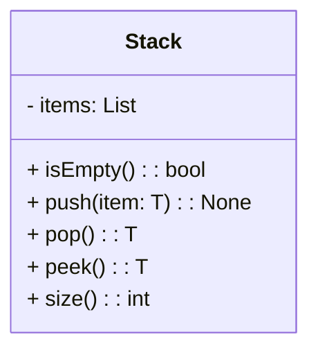
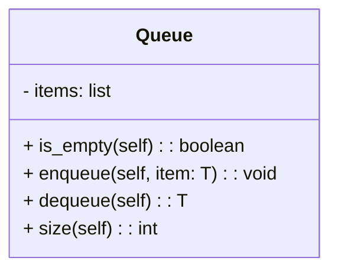
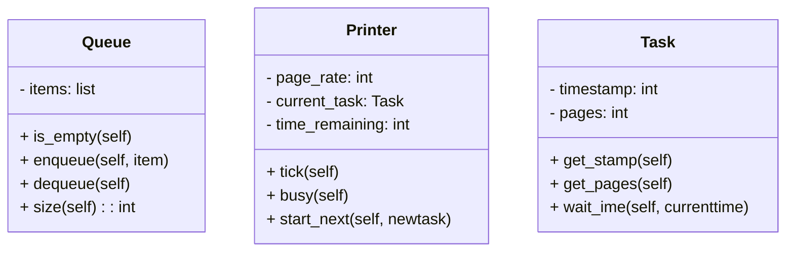

# Week4～5 线性数据结构&时间复杂度

Updated 2025-09-29 16:36 GMT+8*  
 *Compiled by Hongfei Yan (2025 Spring)*  


Logs:

> 2025/03/18, week5, 讲时间复杂度、栈、队列 
>
> 2025/03/11, week4, 因为assign#4 留了链表题目，我们<mark>先从 3 基本数据结构讲起</mark>，之后再讲 2 时间复杂度。
>
> cs201数算（计算机基础2/2）2025pre每日选做，https://github.com/GMyhf/2025spring-cs201/blob/main/pre_problem_list_2025spring.md
>
> 《Python数据结构与算法分析》v2与v3基本一致的，新版程序更规范了。我们会选讲v3部分内容，书上不足的地方，有其他材料补充。https://runestone.academy/ns/books/published/pythonds3/index.html


# Continuing with the content 

之前复习好了递归

https://github.com/GMyhf/2024fall-cs101/blob/main/20241029_recursion.md


# 2 时间复杂度 Big-O

使用数据结构与算法（DSA）的主要目的是为了有效地和高效地解决问题。你如何决定自己编写的程序是否高效呢？这通过复杂度来衡量。复杂度分为两种类型：

1. 时间复杂度：时间复杂度用于衡量执行代码所需的时间。
2. 空间复杂度：空间复杂度指的是成功执行代码功能所需的存储空间量。 在数据结构与算法中，会经常遇到**辅助空间**这个术语，它指的是程序中除了输入数据结构外使用的额外空间。

> LC234.回文链表。**进阶：**能否用 `O(n)` 时间复杂度和 `O(1)` 空间复杂度解决此题？


> Here comes one of the interesting and important topics. The primary motive to use DSA is to solve a problem effectively and efficiently. How can you decide if a program written by you is efficient or not? This is measured by complexities. Complexity is of two types:
>
> 1. Time Complexity: Time complexity is used to measure the amount of time required to execute the code.
> 2. Space Complexity: Space complexity means the amount of space required to execute successfully the functionalities of the code. 
>    You will also come across the term **Auxiliary Space** very commonly in DSA, which refers to the extra space used in the program other than the input data structure.

上述两种复杂度都是相对于输入参数来衡量的。但这里出现了一个问题。执行一段代码所需的时间取决于多个因素，例如：

- 程序中执行的操作数量，设备的速度，以及如果是在在线平台上执行的话，数据传输的速度。

那么如何确定哪一个更高效呢？答案是使用渐近符号。<mark>渐近符号</mark>是一种数学工具，它根据输入大小计算所需时间，并不需要实际执行代码。

> Both of the above complexities are measured with respect to the input parameters. But here arises a problem. The time required for executing a code depends on several factors, such as: 
>
> - The number of operations performed in the program, 
> - The speed of the device, and also 
> - The speed of data transfer if being executed on an online platform. 
>
> So how can we determine which one is efficient? The answer is the use of asymptotic notation. **Asymptotic notation** is a mathematical tool that calculates the required time in terms of input size and does not require the execution of the code. 

它忽略了依赖于系统的常数，并且只与整个程序中执行的模块化操作的数量有关。以下三种渐近符号最常用以表示算法的时间复杂度：

- **大O符号 (Ο)** – <mark>大O符号特别描述了最坏情况下的情形</mark>。$\Theta$记号渐进地给出算法的平均复杂度，即一个函数的上界和下界。当只有一个渐进上界时，即当n足够大时，使用 $O$ 记号。
- **欧米伽符号 (Ω)** – 欧米伽(Ω)符号特别描述了最好情况下的情形。
- **西塔符号 ($\Theta$)** – 这个符号代表了算法的平均复杂度。

> It neglects the system-dependent constants and is related to only the number of modular operations being performed in the whole program. The following 3 asymptotic notations are mostly used to represent the time complexity of algorithms:
>
> - **Big-O Notation (Ο)** – Big-O notation specifically describes the worst-case scenario.
> - **Omega Notation (Ω)** – Omega(Ω) notation specifically describes the best-case scenario.
> - **Theta Notation (θ)** – This notation represents the average complexity of an algorithm.


算法的增长率

<mark>在代码分析中最常用的符号是**大O符号**，它给出了代码运行时间的上界</mark>（或者说是输入规模大小对应的内存使用量）。大O符号帮助我们理解当输入数据量增加时，算法的执行时间或空间需求将以怎样的速度增长。

> Rate of Growth of Algorithms
>
> The most used notation in the analysis of a code is the **Big O Notation** which gives an upper bound of the running time of the code (or the amount of memory used in terms of input size).


## 2.1 Analyzing algorithms

分析算法意味着预测该算法所需的资源。虽然有时我们主要关心像内存、通信带宽或计算机硬件这类资源，但是通常想要度量的是计算时间。一般来说，通过分析某个问题的几种候选算法，可以识别出最高效的那一个。这样的分析可能会指出不止一个可行的候选算法，但在这一过程中，通常可以淘汰几个较差的算法。

> **Analyzing** an algorithm has come to mean predicting the resources that the algorithm requires. Occasionally, resources such as memory, communication bandwidth, or computer hardware are of primary concern, but most often it is computational time that we want to measure. Generally, by analyzing several candidate algorithms for a problem, we can identify a most efficient one. Such analysis may indicate more than one viable candidate, but we can often discard several inferior algorithms in the process.

在分析一个算法之前，必须有一个要使用的实现技术的模型，包括该技术的资源模型及其成本。我们将假设一种通用的<mark>单处理器计算模型——随机存取机（random-access machine, RAM）</mark>来作为实现技术，算法可以用计算机程序来实现。在RAM模型中，指令是顺序执行的，没有并发操作。

> Before we can analyze an algorithm, we must have a model of the implementation technology that we will use, including a model for the resources of that technology and their costs. For most of this book, we shall assume a generic oneprocessor, **random-access machine (RAM)** model of computation as our implementation technology and understand that our algorithms will be implemented as computer programs. In the RAM model, instructions are executed one after another, with no concurrent operations.

严格来说，应该精确地定义RAM模型的指令及其成本。然而这样做会很繁琐，并且不会对算法设计和分析提供太多的洞察力。但必须小心不要滥用RAM模型。例如，如果RAM有一个排序指令，那么就可以只用一条指令完成排序。这样的RAM将是不现实的，因为实际的计算机没有这样的指令。因此，**指导原则是实际计算机的设计方式**。<mark>RAM模型包含了在实际计算机中常见的指令：算术运算（如加法、减法、乘法、除法、求余数、取底、取顶），数据移动（加载、存储、复制），以及控制（条件分支和无条件分支、子程序调用和返回）。每条这样的指令都需要固定的时间量。</mark>

> Strictly speaking, we should precisely define the instructions of the RAM model and their costs. To do so, however, would be tedious and would yield little insight into algorithm design and analysis. Yet we must be careful not to abuse the RAM model. For example, what if a RAM had an instruction that sorts? Then we couldsort in just one instruction. Such a RAM would be unrealistic, since real computers do not have such instructions. Our guide, therefore, is how real computers are designed. The RAM model contains instructions commonly found in real computers: arithmetic (such as add, subtract, multiply, divide, remainder, floor, ceiling), data movement (load, store, copy), and control (conditional and unconditional branch, subroutine call and return). Each such instruction takes a constant amount of time.

<mark>RAM模型中的数据类型有整型和浮点实数型</mark>。虽然在此处通常不关心精度问题，但在某些应用中精度是至关重要的。也假设每个数据字的大小有限制。例如，在处理大小为n的输入时，我们通常假设对某个常数c≥1， 整数由`c lgn`位表示。我们要求c≥1是为了确保每个字能够容纳n的值，从而使我们能够索引各个输入元素，并且我们将c限制为常数以防止字长无限增长。（如果字长可以无限增长，我们就可以在一个字中存储大量数据并在恒定时间内对其进行操作——这显然是一种不切实际的情况。）

> The data types in the RAM model are integer and floating point (for storing real numbers). Although we typically do not concern ourselves with precision in this book, in some applications precision is crucial. We also assume a limit on the size of each word of data. For example, when working with inputs of size n, we typically assume that integers are represented by c lg n bits for some constant $c \ge 1$. We require $c \ge 1$​ so that each word can hold the value of n, enabling us to index the individual input elements, and we restrict c to be a constant so that the word size does not grow arbitrarily. (If the word size could grow arbitrarily, we could store huge amounts of data in one word and operate on it all in constant time—clearly an unrealistic scenario.)

> 计算机字长（Computer Word Length）是指计算机中用于存储和处理数据的基本单位的位数。它表示计算机能够一次性处理的二进制数据的位数。
>
> 字长的大小对计算机的性能和数据处理能力有重要影响。较大的字长通常意味着计算机能够处理更大范围的数据或执行更复杂的操作。常见的字长包括 8 位、16 位、32 位和 64 位。
>
> 较小的字长可以节省存储空间和资源，适用于简单的计算任务和资源有限的设备。较大的字长通常用于处理更大量级的数据、进行复杂的计算和支持高性能计算需求。
>
> 需要注意的是，字长并不是唯一衡量计算机性能的指标，还有其他因素如处理器速度、缓存大小、操作系统等也会影响计算机的整体性能。


#### **Q. Distill,32B,<mark>Q4</mark>这些参数是什么意思?**

DeepSeek-R1-Distill-Qwen-32B-GGUF/DeepSeek-R1-Distill-Qwen-32B-Q4_K_M.gguf 

> A: 问题涉及 **GGUF 格式的量化模型文件**，特别是 `DeepSeek-R1-Distill-Qwen-32B-GGUF/DeepSeek-R1-Distill-Qwen-32B-Q4_K_M.gguf` 这类文件名的参数含义。以下是详细解析：
>
> 
>
> **文件名结构解析**
>
> `DeepSeek-R1-Distill-Qwen-32B-Q4_K_M.gguf`
>
> **1. `DeepSeek-R1-Distill`**
>
>    - **DeepSeek-R1-Distill**：指的是 DeepSeek 实验室训练的第一代（R1）蒸馏版（Distill）模型。  
>    - **蒸馏（Distill）** 通常意味着这个模型是从一个更大的模型（如 DeepSeek 原始模型）压缩或优化而来的，以提高推理速度并减少计算需求。
>
> **2. `Qwen-32B`**
>
>    - **Qwen**：表示这个模型基于 Qwen（通义千问）架构，由阿里巴巴 DAMO 研发。
>    - **32B**：表示该模型有 **320 亿（32 Billion）参数**，是一个较大的模型。
>
> **3. `GGUF`**
>
>    - **GGUF（GPT-Generated Unified Format）** 是一种 **高效的 LLM 量化格式**，专为 GGML/GGUF 兼容的推理引擎（如 llama.cpp）设计。
>    - 这种格式可以优化大语言模型在 CPU 和 GPU 上的推理速度。
>
> **4. `Q4_K_M`**
>
>    - **Q4**：指的是 **量化精度为 4-bit**（表示每个权重只占 4 比特）。
>    - **K**：代表 **K-quants 量化方案**，用于更好的推理精度和平衡计算效率。
>    - **M**：通常表示 **Mixed**（混合量化），意味着模型可能使用了混合精度量化（例如部分权重 4-bit，部分 8-bit）。
>
> ---
>
> **Q4_K_M 代表的量化方案**
>
> - `Q4` 指 4-bit 量化，意味着模型的参数被压缩为 4-bit，而不是原始的 16-bit 或 32-bit 浮点数。
>
>   > 在模型压缩中，量化通常是指从浮点数到整数的映射过程，目前比较常用的是8比特整数量化，即INT8量化。针对神经网络模型，通常有两种类型的数据需要进行量化，分别是权重（也称为模型参数）和激活，它们都以浮点数形式进行表示和存储。量化过程可以看作一个函数变换，目标是将连续的输入数值映射为离散的输出集合。
>
> - `K`（K-quant）是一种增强的量化技术，可以提高量化模型的精度，减少推理误差。
>
> - `M`（Mixed）表示 **混合量化**，通常意味着：
>
>   - 可能对不同层使用不同的量化精度。
>   - 可能混合不同的块（blockwise quantization）。
>
> ---
>
> **GGUF 量化格式的选择**
>
> 你可能会看到类似的 GGUF 文件，例如：
>
> - `Q4_K_S`（4-bit K-quants, Small）
> - `Q5_K_M`（5-bit K-quants, Mixed）
> - `Q8_K`（8-bit K-quants）
>
> 通常：
>
> - **Q4_K_M**：平衡性能和速度，适合中等计算资源（如 CPU + 高端 GPU）。
> - **Q5_K_M**：更好的精度，但计算开销更大。
> - **Q8_K**：最高精度，但需要更多显存（VRAM）。


实际计算机包含未在上述列表中的指令，这些指令在RAM模型中代表了一个灰色地带。例如，幂运算是否是常数时间指令？在一般情况下，并不是；当x和y是实数时，计算 $x^y$ 需要多条指令。然而，<mark>在某些受限的情况下，幂运算是一个常数时间操作</mark>。许多计算机有一个“左移”指令，它可以在常数时间内将一个整数的位向左移动 k 个位置。在大多数计算机中，将一个整数的位向左移动一个位置等价于乘以 2，因此将位向左移动 k 个位置就等价于乘以 $2^k$。因此，只要 k 不超过计算机字的位数，这样的计算机可以通过将整数1左移k个位置来在一个常数时间内计算出$2^k$。我们将努力避免在RAM模型中出现这样的灰色地带，但在 k 是一个足够小的正整数时，我们会把 $2^k$ 的计算视为一个常数时间操作。

> Real computers contain instructions not listed above, and such instructions represent a gray area in the RAM model. For example, is exponentiation a constanttime instruction? In the general case, no; it takes several instructions to compute $x^y$ when x and y are real numbers. In restricted situations, however, exponentiation is a constant-time operation. Many computers have a “shift left” instruction, which in constant time shifts the bits of an integer by k positions to the left. In most computers, shifting the bits of an integer by one position to the left is equivalent to multiplication by 2, so that shifting the bits by k positions to the left is equivalent to multiplication by $2^k$. Therefore, such computers can compute $2^k$ in one constant-time instruction by shifting the integer 1 by k positions to the left, as long as k is no more than the number of bits in a computer word. We will endeavor to avoid such gray areas in the RAM model, but we will treat computation of $2^k$ as a constant-time operation when k is a small enough positive integer.

<mark>在RAM模型中，并不试图模拟现代计算机中常见的内存层次结构</mark>。也就是说，不模拟缓存或虚拟内存。一些计算模型尝试考虑内存层次结构效应，这在实际程序运行在真实机器上时有时是非常显著的。但总体而言，分析不会考虑它们。包括内存层次结构的模型比RAM模型复杂得多，所以可能难于使用。此外，基于RAM模型的分析通常是实际机器性能的良好预测指标。

> In the RAM model, we do not attempt to model the memory hierarchy that is common in contemporary computers. That is, we do not model caches or virtual memory. Several computational models attempt to account for memory-hierarchy effects, which are sometimes significant in real programs on real machines. A handful of problems in this book examine memory-hierarchy effects, but for the most part, the analyses in this book will not consider them. Models that include the memory hierarchy are quite a bit more complex than the RAM model, and so they can be difficult to work with. Moreover, RAM-model analyses are usually excellent predictors of performance on actual machines.

即使是在RAM模型中分析一个简单的算法也可能是一项挑战。所需的数学工具可能包括组合数学、概率论、代数技巧以及识别公式中最重要项的能力。由于一个算法的行为可能对每个可能的输入都是不同的，需要一种方式来用简单且易于理解的公式概括这种行为。

> Analyzing even a simple algorithm in the RAM model can be a challenge. The mathematical tools required may include combinatorics, probability theory, algebraic dexterity, and the ability to identify the most significant terms in a formula. Because the behavior of an algorithm may be different for each possible input, we need a means for summarizing that behavior in simple, easily understood formulas.

尽管通常只选择一种机器模型来分析给定的算法，但在决定如何表达分析时，仍然面临许多选择。希望有一种方法可以简单地书写和操作，能够展示算法资源需求的重要特征，并抑制繁琐的细节。

> Even though we typically select only one machine model to analyze a given algorithm, we still face many choices in deciding how to express our analysis. We would like a way that is simple to write and manipulate, shows the important characteristics of an algorithm’s resource requirements, and suppresses tedious details.

### 1 Analysis of insertion sort

在算法分析中有两个关键概念：输入规模（input size）和运行时间（running time），并以插入排序（INSERTION-SORT）为例来说明这些概念。

> The time taken by the INSERTION-SORT procedure depends on the input: sorting a thousand numbers takes longer than sorting three numbers. Moreover, INSERTIONSORT can take different amounts of time to sort two input sequences of the same size depending on how nearly sorted they already are. In general, the time taken by an algorithm grows with the size of the input, so it is traditional to describe the running time of a program as a function of the size of its input. To do so, we need to define the terms “running time” and “size of input” more carefully.


**输入规模**是衡量一个算法输入大小的标准，它取决于具体的问题。对于一些问题，比如排序或计算离散傅里叶变换，最自然的度量方式是输入中项目的数量——例如，排序时的数组长度n。对于其他问题，如整数乘法，输入规模的最佳度量可能是表示输入所需的总位数。<mark>有时，用两个数字描述输入规模比用一个更合适，例如，如果算法的输入是一个图，则可以用顶点和边的数量来描述输入规模</mark>。

> The best notion for **input size** depends on the problem being studied. For many problems, such as sorting or computing discrete Fourier transforms, the most natural measure is the number of items in the input—for example, the array size n for sorting. For many other problems, such as multiplying two integers, the best measure of input size is the total number of bits needed to represent the input in ordinary binary notation. Sometimes, it is more appropriate to describe the size of the input with two numbers rather than one. For instance, if the input to an algorithm is a graph, the input size can be described by the numbers of vertices and edges in the graph. We shall indicate which input size measure is being used with each problem we study.


<mark>**运行时间**是指特定输入上算法执行的基本操作或“步骤”的数量</mark>。为了使这个概念尽可能与机器无关，通常假设伪代码中的每一行需要常量时间来执行。也就是说，每一行可能需要不同的时间，但每执行第i行所需的时间为ci，其中ci是一个常数。这种观点符合随机访问机（RAM）模型，并且反映了大多数实际计算机上如何实现伪代码。

> The **running time** of an algorithm on a particular input is the number of primitive operations or “steps” executed. It is convenient to define the notion of step so that it is as machine-independent as possible. For the moment, let us adopt the following view. A constant amount of time is required to execute each line of our pseudocode. One line may take a different amount of time than another line, but we shall assume that each execution of the ith line takes time ci, where ci is a constant. This viewpoint is in keeping with the **RAM** model, and it also reflects how the pseudocode would be implemented on most actual computers.


随着讨论的深入，对插入排序运行时间的表达将从使用所有语句成本ci的复杂公式演变为一种更简单、更简洁、更易处理的符号。这种简化后的符号也将使得比较不同算法的效率变得更加容易。

> In the following discussion, our expression for the running time of INSERTIONSORT will evolve from a messy formula that uses all the statement costs ci to a much simpler notation that is more concise and more easily manipulated. This simpler notation will also make it easy to determine whether one algorithm is more efficient than another.


接下来，使用插入排序过程来展示每个语句的时间“成本”以及每个语句被执行的次数。对于每一个`j = 2, 3, ..., n`（其中`n = A.length`），令$t_j$表示当j取该值时，第7行的while循环测试被执行的次数。当for或while循环以常规方式退出（即由于循环头中的测试）时，测试被执行的次数比循环体多一次。另外，这里假定注释不是可执行语句，因此它们不需要任何时间。

> We start by presenting the INSERTION-SORT procedure with the time “cost” of each statement and the number of times each statement is executed. For each `j = 2, 3, ... , n`, where `n = A.length`, we let $t_j$ denote the number of times the **while** loop test in line 7 is executed for that value of j . When a **for** or **while** loop exits in the usual way (i.e., due to the test in the loop header), the test is executed one time more than the loop body. We assume that comments are not executable statements, and so they take no time.

Implementation of Insertion Sort Algorithm

> <mark>**插入排序**是一种简单的排序算法，其工作原理类似于你在手中整理扑克牌的方式。数组被虚拟地分成已排序和未排序两部分。从未排序部分选取值，并将其放置到已排序部分的正确位置上。</mark>
>
> `\sum_{j=1}^{n-1} t_j`  是 $\sum_{j=1}^{n-1} t_j$ 的LaTex表示，
>
> `\sum_{j=1}^{n-1} (t_{j}-1)` 是 $\sum_{j=1}^{n-1} (t_{j}-1)$​ 的LaTex表示。

```python
def insertion_sort(arr):														# cost	times
    for i in range(1, len(arr)):										# c1		n
        j = i																				# c2 		n - 1
        
        # Insert arr[j] into the
        # sorted sequence arry[0..j-1]							#	0			n - 1
        while arr[j - 1] > arr[j] and j > 0:				# c4		\sum_{j=1}^{n-1} t_j
            arr[j - 1], arr[j] = arr[j], arr[j - 1] # c5		\sum_{j=1}^{n-1} (t_j - 1)
            j -= 1																	# c6		\sum_{j=1}^{n-1} (t_j - 1)


arr = [2, 6, 5, 1, 3, 4]
insertion_sort(arr)
print(arr)

# [1, 2, 3, 4, 5, 6]
```


> https://www.geeksforgeeks.org/insertion-sort/
>
> **Insertion sort** is a simple sorting algorithm that works similarly to the way you sort playing cards in your hands. The array is virtually split into a sorted and an unsorted part. Values from the unsorted part are picked and placed in the correct position in the sorted part.
>
> 
>
> 要以升序对大小为N的数组进行排序，需要遍历数组并将当前元素（称为“关键字”）与它的前一个元素进行比较；如果关键字比它的前一个元素小，则将它与前面的元素进行比较。将较大的元素移动一个位置以腾出空间给被交换的元素。
>
> To sort an array of size N in ascending order iterate over the array and compare the current element (key) to its predecessor, if the key element is smaller than its predecessor, compare it to the elements before. Move the greater elements one position up to make space for the swapped element.
>
> 


<mark>笔试题目示例</mark>

> **Q:** Suppose you have the following list of numbers to sort: [15, 5, 4, 18, 12, 19, 14, 10, 8, 20] which list represents the partially sorted list after three complete passes of insertion sort? (C)
>
> A. [4, 5, 12, 15, 14, 10, 8, 18, 19, 20]
> B. [15, 5, 4, 10, 12, 8, 14, 18, 19, 20]
> **C. [4, 5, 15, 18, 12, 19, 14, 10, 8, 20]**
> D. [15, 5, 4, 18, 12, 19, 14, 8, 10, 20]


算法的运行时间是每个被执行语句的运行时间之和；一个执行一次需要$c_i$步骤并且总共执行n次的语句将对总运行时间贡献$c_i \times n$。为了计算T(n)，即在n个值的输入上INSERTION-SORT的运行时间，我们将成本列和次数列的乘积相加，得到

$ T(n) = \sum (c_i \times t_i) $

这里，每个$c_i$代表伪代码中第i行执行一次所需的时间（常量），而$t_i$则表示该行被执行的次数。对于插入排序，我们需要考虑每一行代码被执行的具体情况，特别是内层循环的执行次数会依赖于数组中元素的初始排列。通过这种方式，我们可以得出一个关于n（输入大小）的函数表达式，用来描述插入排序的运行时间。

> The running time of the algorithm is the sum of running times for each statement executed; a statement that takes $c_i$ steps to execute and executes n times will contribute $c_in$​ to the total running time. To compute T(n), the running time of INSERTION-SORT on an input of n values, we sum the products of the cost and times columns, obtaining


$T(n) = c_1n + c_2(n-1) + c_4\sum_{j=1}^{n-1} t_j + c_5\sum_{j=1}^{n-1} (t_j-1) + c_6\sum_{j=1}^{n-1} (t_j-1)$


即使对于给定大小的输入，<mark>算法的运行时间也可能取决于给出的是哪个具体输入</mark>。例如，在插入排序（INSERTION-SORT）中，最佳情况发生在数组已经是有序的时候。对于每个i = 1, 2, 3, ..., n-1，当$j$在其初始值$i$时，我们在第7行发现$arr[j-1] \le arr[j]$。因此，对于i = 1, 2, 3, ..., n-1，有$t_j = 1$，这时最佳情况下的运行时间是

> Even for inputs of a given size, an algorithm’s running time may depend on which input of that size is given. For example, in INSERTION-SORT, the best case occurs if the array is already sorted. For each i = 1, 2, 3, ... , n-1, we then find that $arr[j-1] \le arr[j]$ in line 7 when $j$ has its initial value of $i$. Thus $t_j = 1$ for i = 1, 2, 3, ... , n-1, and the best-case running time is


$T_{\text{best}}(n) = c_1n + c_2(n-1) + c_4(n-1)$​

$\quad = (c_1 + c_2 + c_4)n - (c_2 + c_4)$


我们可以将这个运行时间表示为`an + b`，其中常量a和b取决于语句成本$c_i$；因此，它是n的**线性函数**。

如果数组是以逆序排序的——也就是说，以递减顺序排列——那么就会出现最坏情况。我们必须将每个元素A[j]与整个已排序子数组`A[0..j-1]`中的每个元素进行比较，因此 $t_j = j$ 对于`j = 1, 2, ..., n-1`。注意到这一点，

> We can express this running time as `an + b` for constants a and b that depend on the statement costs $c_i$; it is thus a **linear function** of n.
>
> If the array is in reverse sorted order—that is, in decreasing order—the worst case results. We must compare each element A[j]  with each element in the entire sorted subarray `A[0..j-1]`, and so $t_j = j$ for `j = 1, 2, ..., n-1`. Noting that

$\sum_{j=1}^{n-1} j = \frac{n(n-1)}{2}$​ 

$\sum_{j=1}^{n-1} (j-1) = \frac{(n-1)(n-2)}{2}$ 

we find that in the worst case, the running time of INSERTION-SORT is


$T_{\text{worst}}(n) = c_1n + c_2(n-1) + c_4(\frac{n(n-1)}{2} -1) + c_5(\frac{(n-1)(n-2)}{2}) + + c_6(\frac{(n-1)(n-2)}{2})$

$\quad = (\frac{c_4}2 + \frac{c_5}2 + \frac{c_6}2)n^2 + (c_1 + c_2 - \frac{c_4}2 - \frac{3c_5}2 - \frac{2c_6}2)n + (-c_2 - c_4 + c_5 + c_6)$


可以将这种最坏情况下的运行时间表示为$an^2 + bn + c$，其中常量a、b和c再次取决于语句成本$c_i$；因此，它是n的**二次函数**。

通常情况下，就像在插入排序中一样，对于给定的输入，算法的运行时间是固定的，尽管一些有趣的“随机化”算法，即使对于固定的输入，它们的行为也可能有所不同。

> We can express this worst-case running time as $an^2 + bn + c$ for constants a, b, and c that again depend on the statement costs ci; it is thus a **quadratic function** of n.
>
> Typically, as in insertion sort, the running time of an algorithm is fixed for a given input, although in later chapters we shall see some interesting “randomized” algorithms whose behavior can vary even for a fixed input.


### 2 Worst-case and average-case analysis

在我们对插入排序的分析中，我们既考虑了最佳情况，即输入数组已经排序的情况，也考虑了最坏情况，即输入数组是逆序排列的情况。然而，<mark>通常专注于寻找只有最坏情况下的运行时间</mark>，也就是对于任何大小为n的输入最长的运行时间。我们给出关注最坏情况的三个理由：

> In our analysis of insertion sort, we looked at both the best case, in which the input array was already sorted, and the worst case, in which the input array was reverse sorted. For the remainder of this book, though, we shall usually concentrate on finding only the **worst-case running time**, that is, the longest running time for any input of size n. We give three reasons for this orientation.


- 一个算法的最坏情况下的运行时间为任何输入提供了一个运行时间的上限。了解它提供了算法永远不会超过这个时间的保证。

- 对于某些算法，最坏情况出现得相当频繁。例如，在数据库中搜索特定信息时，<mark>当信息不在数据库中时，搜索算法的最坏情况经常发生</mark>。在某些应用中，可能经常会进行不存在的信息搜索。

  

<mark>笔试题目示例</mark>

> 对长度为 3 的顺序表进行查找，若查找第一个元素的概率为 1/2，查找第二个元素的概率为 1/4，查找第三个元素的概率为 1/8，则执行任意查找需要比较元素的平均个数为 _ _ _ _ 。
>
> #$1*(1/2) + 2*(1/4) + 3*(1/8) + 3*(1/8) = 1.75$, 还有1/8的失败查询概率。
>
> 

- “平均情况”通常几乎和最坏情况一样糟糕。假设我们随机选择n个数字并应用插入排序。确定元素A[j]应该插入到子数组`A[0 .. j-1]`中的哪个位置需要多长时间？平均来说，`A[0 .. j-1]`中的一半元素小于`A[j]`，另一半大于`A[j]`。因此，平均而言，我们需要检查子数组`A[0 .. j-1]`的一半，所以$t_j$大约是$j/2$。结果得到的平均情况下的运行时间最终是输入规模的二次函数，就像最坏情况下的运行时间一样。

> The worst-case running time of an algorithm gives us an upper bound on the running time for any input. Knowing it provides a guarantee that the algorithm will never take any longer. We need not make some educated guess about the running time and hope that it never gets much worse.
>
> For some algorithms, the worst case occurs fairly often. For example, in searching a database for a particular piece of information, the searching algorithm’s worst case will often occur when the information is not present in the database. In some applications, searches for absent information may be frequent.
>
> The “average case” is often roughly as bad as the worst case. Suppose that we randomly choose n numbers and apply insertion sort. How long does it take to determine where in subarray `A[0 ..  j-1]` to insert element A[j] ? On average, half the elements in `A[0 .. j-1]` are less than `A[j]` , and half the elements are greater. On average, therefore, we check half of the subarray `A[0 ..  j-1]`, and so $t_j$ is about $j/2$. The resulting average-case running time turns out to be a quadratic function of the input size, just like the worst-case running time.


> 在某些特殊情况下，我们将对算法的**平均情况**运行时间感兴趣；我们将看到**概率分析**技术应用于各种算法。平均情况分析的范围是有限的，因为可能不清楚什么构成特定问题的“平均”输入。经常假设所有给定大小的输入都是等可能的。实际上，这一假设可能会被违反，但有时可以使用一种**随机化算法**，它会做出随机选择，从而使概率分析成为可能，并得出一个**期望**的运行时间。
>
> In some particular cases, we shall be interested in the **average-case** running time of an algorithm; we shall see the technique of **probabilistic analysis** applied to various algorithms throughout this book. The scope of average-case analysis is limited, because it may not be apparent what constitutes an “average” input for a particular problem. Often, we shall assume that all inputs of a given size are equally likely. In practice, this assumption may be violated, but we can sometimes use a **randomized algorithm**, which makes random choices, to allow a probabilistic analysis and yield an **expected** running time. 

### 3 Order of growth增长量级

我们使用了一些简化的抽象来简化对INSERTIONSORT过程的分析。首先，忽略了每个语句的实际成本，用常数$c_i$来表示这些成本。然后，注意到即使这些常数也给出了比实际需要更多的细节：将最坏情况下的运行时间表达为$an^2 + bn + c$，其中a、b和c是依赖于语句成本$c_i$的常数。因此，我们不仅忽略了实际的语句成本，还忽略了抽象成本$c_i$。

> We used some simplifying abstractions to ease our analysis of the INSERTIONSORT procedure. First, we ignored the actual cost of each statement, using the constants ci to represent these costs. Then, we observed that even these constants give us more detail than we really need: we expressed the worst-case running time as $an^2 + bn + c$ for some constants a, b, and c that depend on the statement costs $c_i$. We thus ignored not only the actual statement costs, but also the abstract costs $c_i$.


现在我们将引入另一个简化的抽象：<mark>真正引起我们兴趣的是运行时间的增长率，或称为增长量级</mark>。因此，只考虑公式的主要项（例如，$an^2$），因为对于n的较大值来说，低阶项相对来说不那么重要。忽略主要项的常数系数，因为在确定大输入的计算效率时，常数因子不如增长率重要。对于插入排序，当忽略低阶项和主要项的常数系数后，剩下的是来自主要项的$n^2$因子。说插入排序具有$\Theta(n^2)$（发音为“theta of n-squared”）的最坏情况运行时间。

> We shall now make one more simplifying abstraction: it is the **rate of growth**, or **order of growth**, of the running time that really interests us. We therefore consider only the leading term of a formula (e.g., $an^2$), since the lower-order terms are relatively insignificant for large values of n. We also ignore the leading term’s constant coefficient, since constant factors are less significant than the rate of growth in determining computational efficiency for large inputs. For insertion sort, when we ignore the lower-order terms and the leading term’s constant coefficient, we are left with the factor of $n^2$ from the leading term. We write that insertion sort has a worst-case running time of $\Theta(n^2)$ (pronounced “theta of n-squared”). 


通常我们认为一个算法如果其最坏情况运行时间的增长阶较低，则它比另一个算法更高效。<mark>由于常数因子和低阶项的影响，一个运行时间增长阶较高的算法在小输入的情况下可能会比一个增长阶较低的算法花费的时间更少</mark>。但对于足够大的输入，例如，在最坏情况下，一个$\Theta(n^2)$的算法将比一个$\Theta(n^3)$的算法运行得更快。

> We usually consider one algorithm to be more efficient than another if its worstcase running time has a lower order of growth. Due to constant factors and lowerorder terms, an algorithm whose running time has a higher order of growth might take less time for small inputs than an algorithm whose running time has a lower order of growth. But for large enough inputs, a $\Theta(n^2)$ algorithm, for example, will run more quickly in the worst case than a $\Theta(n^3)$​ algorithm.
>
> 这里提到的$\Theta$ 符号是用来描述算法运行时间的增长阶的紧确界，意味着算法的运行时间在渐近情况下既不会快于也不会慢于$n^2$的某个常数倍。这是关于算法复杂度分析中的渐近记法的一种表述方式，用来概括地说明算法性能随输入规模变化的趋势。


### 4 O-notation

> 通用的记号应该是，O表示上界，$\Omega$表示下界，$\Theta$表示渐进阶，就是既上界又下界。

$\Theta$-记号从渐近上界和下界两个方面约束一个函数。当我们只有渐近上界时，我们使用O-记号。对于给定的函数g(n)，用O(g(n)（读作“大O of g of n”或简称“O of g of n”）来表示满足以下条件的函数集合：

> The $\Theta$-notation asymptotically bounds a function from above and below. When we have only an asymptotic upper bound, we use O-notation. For a given function g(n), we denote by O(g(n) (pronounced “big-oh of g of n” or sometimes just “oh of g of n”) the set of functions


$ O(g(n)) = \{f(n): 存在正的常数c 和 n_0，使得对所有 n ≥ n_0, 有 0 ≤ f(n) ≤ cg(n)\} $

我们使用O-记号来给出一个函数的上界，最多相差一个常数因子。

利用O-记号，通常可以通过检查算法的整体结构来简单描述算法的运行时间。例如，插入排序算法中的双重嵌套循环结构立即给出了最坏情况下运行时间为$O(n^2)$的上界。

由于O-记号描述的是上界，当用它来约束算法的最坏情况运行时间时，就得到了该算法在任何输入上的运行时间的上限。这意味着，在最坏情况下，算法不会比这个上界更慢，无论输入是什么。

> We use O-notation to give an upper bound on a function, to within a constant factor.
>
> Using O-notation, we can often describe the running time of an algorithm merely by inspecting the algorithm’s overall structure. For example, the doubly nested loop structure of the insertion sort algorithm immediately yields an $O(n^2)$ upper bound on the worst-case running time.
>
> Since O-notation describes an upper bound, when we use it to bound the worstcase running time of an algorithm, we have a bound on the running time of the algorithm on every input.


**举例：**$2n + 10$ is $O(n)$

$2n + 10 \le cn$

$(c - 2) n \ge 10$

$n \ge 10/(c - 2)$

Pick $c = 3 \space and \space n_0 = 10$


**举例：**the function $n^2$ is not O(n)

$n^2 \le cn$

$n \le c$, the inequality cannot be satisfied since $c$​ must be a constant 


**More Big-Oh Examples**

$7n - 2$​ is O(n)

need $c \gt 0$ and $n_0 \ge 1$ such that $7n - 2 \le cn$ for $n \ge n_0$​


$3n^3 + 20n^2 + 5$ is $O(n^3)$

need $c \gt 0$ and $n_0 \ge 1$ such that $3n^3 + 20n^2 + 5 \le cn^3$ for $n \ge n_0$

This is true for $c = 4$ and $n_0 = 21$


$3logn + 5$ is $O(logn)$

need $c \gt 0$ and $n_0 \gt 1$ such that $3logn + 5 \le clogn$ for $n \ge n_0$

this is true for $c=8$ and $n_0 = 2$


<mark>大O记号给出了函数增长率的上界。陈述`f(n) 是 O(g(n))`意味着`f(n)`的增长率不超过`g(n)`的增长率。</mark>

可以使用大O记号根据它们的增长率来对函数进行排序。

换句话说，如果一个函数`f(n)`是O(g(n))，那么对于足够大的输入n，`f(n)`的值不会超过`g(n)`的某个常数倍。这提供了一种方式来描述和比较不同算法随着输入规模增加而表现出的效率差异，通过将算法的运行时间或空间需求的增长率与一些基准函数（如线性、平方、立方、指数等）进行对比。在算法分析中，经常使用大O记号来简化表达，并专注于算法性能的关键趋势，忽略掉那些对于大规模输入影响较小的细节。

> The big-Oh notation gives an upper bound on the growth rate of a function. The statement `f(n) is O(g(n))` means that the growth rate of `f(n)` is no more than the growth rate of `g(n)`. •We can use the big-Oh notation to rank functions according to their growth rate.


<mark>**Big-Oh Rules**</mark>

If is `f(n)` a polynomial of degree `d`, then `f(n)` is $O(n^d)$, i.e.,

​	Drop lower-order terms 忽略低阶项

​	Drop constant factors 忽略常数因子

Use the smallest possible class of functions 使用尽可能小的函数类别

​	Say $2n$ is $O(n)$ instead of $2n$ is $O(n^2)$

Use the simplest expression of the class 使用该类别中最简单的表达方式

​	Say $3n + 5$ is $O(n)$ instead of $3n + 5$ is $O(3n)$


**Asymptotic Algorithm Analysis** **渐近算法分析**

算法的渐近分析确定了以大O记号表示的运行时间。

为了执行渐近分析，找到作为输入规模函数的最坏情况下的原始操作数量，并用大O记号来表示这个函数。

例子：

可以说算法find_max“在O(n)时间内运行”

由于最终无论如何都会忽略常数因子和低阶项，所以在计算原始操作时可以不考虑它们。

> 这意味着，在进行算法分析时，主要关注的是随着输入大小增加，算法性能如何变化的趋势。通过忽略那些对于大输入规模影响较小的细节（如低阶项和常数因子），可以简化分析，并专注于理解算法在处理大规模数据时的行为。这种分析方法允许我们比较不同算法之间的效率，而不需要深入到具体的实现细节中去。
>
> The asymptotic analysis of an algorithm determines the running time in big-Oh notation.
>
> To perform the asymptotic analysis, find the worst-case number of primitive operations executed as a function of the input size, express this function with big-Oh notation
>
> Example:
>
> say that algorithm **find_max** “runs in **O**(**n**) time”
>
> Since constant factors and lower-order terms are eventually dropped anyhow, disregard them when counting primitive operations


https://www.ics.uci.edu/~pattis/ICS-33/lectures/complexitypython.txt


## 2.2 Sorting Algorithm

**Sorting Algorithm** is used to rearrange a given array or list elements according to a comparison operator on the elements. The comparison operator is used to decide the new order of element in the respective data structure.

There are a lot of different types of sorting algorithms. Some widely used algorithms are:

- [Bubble Sort](http://www.geeksforgeeks.org/bubble-sort/)
- [Selection Sort](http://www.geeksforgeeks.org/selection-sort/)
- [Insertion Sort](http://www.geeksforgeeks.org/insertion-sort/)
- [Quick Sort](http://www.geeksforgeeks.org/quick-sort/)
- [Merge Sort](http://www.geeksforgeeks.org/merge-sort/)
- [ShellSort](https://www.geeksforgeeks.org/shellsort/)

There are several other sorting algorithms also and they are beneficial in different cases. You can learn about them and more in our dedicated article on [Sorting algorithms](https://www.geeksforgeeks.org/sorting-algorithms/).


> https://github.com/GMyhf/2024spring-cs201/blob/main/code/ten_sort_algorithms.md
>
> 包括：冒泡排序（Bubble Sort），插入排序（Insertion Sort），选择排序（Selection Sort），希尔排序（Shell Sort），归并排序（Merge Sort），快速排序（Quick Sort），堆排序（Heap Sort），计数排序（Counting Sort），桶排序（Bucket Sort），基数排序（Radix Sort）


### 1 Bubble Sort

Bubble Sort is the simplest sorting algorithm that works by repeatedly swapping the adjacent elements if they are in the wrong order. This algorithm is not suitable for large data sets as its average and worst-case time complexity is quite high.

Algorithm

> In Bubble Sort algorithm, 
>
> - traverse from left and compare adjacent elements and the higher one is placed at right side. 
> - In this way, the largest element is moved to the rightmost end at first. 
> - This process is then continued to find the second largest and place it and so on until the data is sorted.


```python
# Optimized Python program for implementation of Bubble Sort
def bubbleSort(arr):
    n = len(arr)

    # Traverse through all array elements
    for i in range(n):
        swapped = False

        # Last i elements are already in place
        for j in range(0, n - i - 1):

            # Traverse the array from 0 to n-i-1
            # Swap if the element found is greater
            # than the next element
            if arr[j] > arr[j + 1]:
                arr[j], arr[j + 1] = arr[j + 1], arr[j]
                swapped = True
        if (swapped == False):
            break


# Driver code to test above
if __name__ == "__main__":
    arr = [64, 34, 25, 12, 22, 11, 90]

    bubbleSort(arr)
    print(' '.join(map(str, arr)))

```


**Complexity Analysis of Bubble Sort:**

Time Complexity: $O(N^2)$
Auxiliary Space: $O(1)$

**Advantages of Bubble Sort:**

- Bubble sort is easy to understand and implement.
- It <mark>does not require any additional memory space</mark>.
- It is a <mark>stable sorting</mark> algorithm, meaning that elements with the same key value maintain their relative order in the sorted output.

**Disadvantages of Bubble Sort:**

- Bubble sort has a time complexity of $O(N^2)$ which makes it very slow for large data sets.
- Bubble sort is a comparison-based sorting algorithm, which means that it requires a comparison operator to determine the relative order of elements in the input data set. It can limit the efficiency of the algorithm in certain cases.


> **Some FAQs related to Bubble Sort:**
>
> **Q1. What is the Boundary Case for Bubble sort?**
>
> Bubble sort takes minimum time (Order of n) when elements are already sorted. Hence it is best to check if the array is already sorted or not beforehand, to avoid $O(N^2)$ time complexity.
>
> **Q2. Does sorting happen in place in Bubble sort?**
>
> Yes, Bubble sort performs the swapping of adjacent pairs without the use of any major data structure. Hence Bubble sort algorithm is an <mark>in-place</mark> algorithm.
>
> **Q3. Is the Bubble sort algorithm stable?**
>
> Yes, the bubble sort algorithm is <mark>stable</mark>.
>
> **Q4. Where is the Bubble sort algorithm used?**
>
> Due to its simplicity, bubble sort is often used to introduce the concept of a sorting algorithm. 
>
> 
>
> **Q:** Suppose you have the following list of numbers to sort: [19, 1, 9, 7, 3, 10, 13, 15, 8, 12] which list represents the partially sorted list after three complete passes of bubble sort?? （ B ）
>
> A： [1, 9, 19, 7, 3, 10, 13, 15, 8, 12]	B： **[1, 3, 7, 9, 10, 8, 12, 13, 15, 19]**	
>
> C： [1, 7, 3, 9, 10, 13, 8, 12, 15, 19]	D：[1, 9, 19, 7, 3, 10, 13, 15, 8, 12]
>


### 2 Selection Sort

> **Selection sort** is a simple and efficient sorting algorithm that works by repeatedly selecting the smallest (or largest) element from the unsorted portion of the list and moving it to the sorted portion of the list. 

The algorithm repeatedly <mark>selects the smallest (or largest)</mark> element from the unsorted portion of the list and swaps it with the first element of the unsorted part. This process is repeated for the remaining unsorted portion until the entire list is sorted. 

> 
>
> ```python
> A = [64, 25, 12, 22, 11]
> 
> # Traverse through all array elements
> for i in range(len(A)):
> 
>     # Find the minimum element in remaining
>     # unsorted array
>     min_idx = i
>     for j in range(i + 1, len(A)):
>         if A[min_idx] > A[j]:
>             min_idx = j
> 
>         # Swap the found minimum element with
>     # the first element
>     A[i], A[min_idx] = A[min_idx], A[i]
> 
> # Driver code to test above
> print(' '.join(map(str, A)))
> 
> # Output: 11 12 22 25 64 
> ```
>


The **selection sort** <mark>improves on the bubble sort by making only one exchange</mark> for every pass through the list. In order to do this, a selection sort looks for the largest value as it makes a pass and, after completing the pass, places it in the proper location. As with a bubble sort, after the first pass, the largest item is in the correct place. After the second pass, the next largest is in place. This process continues and requires n−1 passes to sort *n* items, since the final item must be in place after the (n−1) st pass.

Figure 3 shows the entire sorting process. On each pass, the largest remaining item is selected and then placed in its proper location. The first pass places 93, the second pass places 77, the third places 55, and so on. 


Figure 3: `selectionSort`


```python
def selectionSort(alist):
    for fillslot in range(len(alist)-1, 0, -1):
        positionOfMax = 0
        for location in range(1, fillslot+1):
            if alist[location] > alist[positionOfMax]:
                positionOfMax = location

        if positionOfMax != fillslot:
            alist[fillslot], alist[positionOfMax] = alist[positionOfMax], alist[fillslot]

alist = [54, 26, 93, 17, 77, 31, 44, 55, 20]
selectionSort(alist)
print(alist)

# [17, 20, 26, 31, 44, 54, 55, 77, 93]
```


You may see that the selection sort makes the same number of comparisons as the bubble sort and is therefore also $(O^2)$. However, <mark>due to the reduction in the number of exchanges, the selection sort typically executes faster in benchmark studies</mark>. In fact, for our list, the bubble sort makes 20 exchanges, while the selection sort makes only 8.


**Complexity Analysis of Selection Sort**

**Time Complexity:** The time complexity of Selection Sort is $O(N^2) $as there are two nested loops:

- One loop to select an element of Array one by one = $O(N)$
- Another loop to compare that element with every other Array element = $O(N)$
- Therefore overall complexity = O(N) * O(N) = O(N*N) = $O(N^2)$

**Auxiliary Space:** $O(1)$ as the only extra memory used is for temporary variables while swapping two values in Array. The selection sort never makes more than $O(N)$ swaps and can be useful when memory writing is costly. 


**Advantages of Selection Sort Algorithm**

- Simple and easy to understand.
- Works well with small datasets.


**Disadvantages of the Selection Sort Algorithm**

- Selection sort has a time complexity of $O(n^2)$ in the worst and average case.
- Does not work well on large datasets.
- Does not preserve the relative order of items with equal keys which means it is not stable.


> **Frequently Asked Questions on Selection Sort**
>
> **Q1. Is Selection Sort Algorithm stable?**
>
> The default implementation of the Selection Sort Algorithm is <mark>not stable</mark>. However, it can be made stable. Please see the [stable Selection Sort](https://www.geeksforgeeks.org/stable-selection-sort/) for details.
>
> **Q2. Is Selection Sort Algorithm in-place?**
>
> Yes, Selection Sort Algorithm is an <mark>in-place</mark> algorithm, as it does not require extra space.
>
> 
>
> **Q:** Suppose you have the following list of numbers to sort: [11, 7, 12, 14, 19, 1, 6, 18, 8, 20] which list represents the partially sorted list after three complete passes of selection sort? (D)
>
> A. [7, 11, 12, 1, 6, 14, 8, 18, 19, 20]
> B. [7, 11, 12, 14, 19, 1, 6, 18, 8, 20]
> C. [11, 7, 12, 14, 1, 6, 8, 18, 19, 20]
> D. **[11, 7, 12, 14, 8, 1, 6, 18, 19, 20]**


### 3 Quick Sort

> quickSort is a sorting algorithm based on the[ Divide and Conquer algorithm](https://www.geeksforgeeks.org/divide-and-conquer-algorithm-introduction/) that picks an element as a pivot and partitions the given array around the picked pivot by placing the pivot in its correct position in the sorted array.

How does QuickSort work?

> The key process in quickSort is a partition(). The target of partitions is to place the pivot (any element can be chosen to be a pivot) at its correct position in the sorted array and put all smaller elements to the left of the pivot, and all greater elements to the right of the pivot.
>
> Partition is done <mark>recursively</mark> on each side of the pivot after the pivot is placed in its correct position and this finally sorts the array.


> https://www.geeksforgeeks.org/introduction-to-divide-and-conquer-algorithm-data-structure-and-algorithm-tutorials/
>
> <mark>**Divide And Conquer** </mark>
> This technique can be divided into the following three parts:
>
> 1. **Divide:** This involves dividing the problem into smaller sub-problems.
> 2. **Conquer:** Solve sub-problems by calling recursively until solved.
> 3. **Combine:** Combine the sub-problems to get the final solution of the whole problem.
>
>
> The following are some standard algorithms that follow Divide and Conquer algorithm. 
>
> 1. [**Quicksort**](https://www.geeksforgeeks.org/quick-sort/) is a sorting algorithm. The algorithm picks a pivot element and rearranges the array elements so that all elements smaller than the picked pivot element move to the left side of the pivot, and all greater elements move to the right side. Finally, the algorithm recursively sorts the subarrays on the left and right of the pivot element.
>
> 2. [**Merge Sort**](https://www.geeksforgeeks.org/merge-sort/) is also a sorting algorithm. The algorithm divides the array into two halves, recursively sorts them, and finally merges the two sorted halves.
>
> 
>
> What does not qualifies as Divide and Conquer:
> Binary Search is a searching algorithm. In each step, the algorithm compares the input element x with the value of the middle element in the array. If the values match, return the index of the middle. Otherwise, if x is less than the middle element, then the algorithm recurs for the left side of the middle element, else recurs for the right side of the middle element. Contrary to popular belief, this is not an example of Divide and Conquer because there is only one sub-problem in each step (<mark>Divide and conquer requires that there must be two or more sub-problems</mark>) and hence this is a case of <mark>Decrease and Conquer</mark>.


在partition函数中两个指针 `i` 和 `j` 的方式实现。快排中的partition可以用双指针或者单指针实现，前者更容易理解，也是机考中喜欢出的题目类型。

```python
def quicksort(arr, left, right):
    if left < right:
        partition_pos = partition(arr, left, right)
        quicksort(arr, left, partition_pos - 1)
        quicksort(arr, partition_pos + 1, right)


def partition(arr, left, right):
    i = left
    j = right - 1
    pivot = arr[right]
    while i <= j:
        while i <= right and arr[i] < pivot:
            i += 1
        while j >= left and arr[j] >= pivot:
            j -= 1
        if i < j:
            arr[i], arr[j] = arr[j], arr[i]
    if arr[i] > pivot:
        arr[i], arr[right] = arr[right], arr[i]
    return i


arr = [22, 11, 88, 66, 55, 77, 33, 44]
quicksort(arr, 0, len(arr) - 1)
print(arr)

# [11, 22, 33, 44, 55, 66, 77, 88]
```


要分析`quickSort`函数，注意对于长度为*n*的列表，如果分区总是发生在列表中间，则将再次有$logn$次划分。为了找到分割点，需要检查每个*n*项与枢轴值（pivot value）。结果是$nlogn$。此外，不需要额外的内存，不像归并排序过程那样。

不幸的是，在最坏的情况下，分割点可能不在中间，并且可能会极度偏向左侧或右侧，导致非常不均匀的划分。在这种情况下，对*n*项的列表进行排序会被分为对0项和n−1项的两个列表进行排序。然后，对n−1项的列表排序又被分为大小为0和大小为n−2的列表，依此类推。结果是一个$O(n^2)$的排序，伴随着递归所需的所有开销。

我们之前提到过<mark>有多种方式来选择枢轴值</mark>。特别地，我们可以尝试通过一种称为“三数取中”（median of three）的技术来缓解因划分不均带来的问题。为了选择枢轴值，我们会考虑列表中的第一个、中间的和最后一个元素。在我们的例子中，它们是54、77和20。现在选取中位数值，在我们的情况中是54，并用它作为枢轴值（当然，这正是我们最初使用的枢轴值）。这个想法是在列表中的第一项不属于列表中间位置时，使用三数取中能选择一个更好的“中间”值。当原始列表初始时已部分排序的情况下，这种方法将特别有用。

> To analyze the `quickSort` function, note that for a list of length *n*, if the partition always occurs in the middle of the list, there will again be $log⁡n$ divisions. In order to find the split point, each of the *n* items needs to be checked against the pivot value. The result is $nlogn$. In addition, there is no need for additional memory as in the merge sort process.
>
> Unfortunately, in the worst case, the split points may not be in the middle and can be very skewed to the left or the right, leaving a very uneven division. In this case, sorting a list of *n* items divides into sorting a list of 0 items and a list of n−1 items. Then sorting a list of n−1 divides into a list of size 0 and a list of size n−2, and so on. The result is an $O(n^2)$ sort with all of the overhead that recursion requires.
>
> We mentioned earlier that <mark>there are different ways to choose the pivot value</mark>. In particular, we can attempt to alleviate some of the potential for an uneven division by using a technique called **median of three**. To choose the pivot value, we will consider the first, the middle, and the last element in the list. In our example, those are 54, 77, and 20. Now pick the median value, in our case 54, and use it for the pivot value (of course, that was the pivot value we used originally). The idea is that in the case where the first item in the list does not belong toward the middle of the list, the median of three will choose a better “middle” value. This will be particularly useful when the original list is somewhat sorted to begin with.
>


**Complexity Analysis of Quick Sort:**

Time Complexity:

- Best Case: $\Omega(N log N)$
  The best-case scenario for quicksort occur when the pivot chosen at the each step divides the array into roughly equal halves.
  In this case, the algorithm will make balanced partitions, leading to efficient Sorting.
- <mark>Average Case</mark>: $\Theta ( N log N)$
  Quicksort’s average-case performance is usually very good in practice, making it one of the fastest sorting Algorithm.
- Worst Case: $O(N^2)$
  The worst-case Scenario for Quicksort occur when the pivot at each step consistently results in highly unbalanced partitions. When the array is already sorted and the pivot is always chosen as the smallest or largest element. To mitigate the worst-case Scenario, various techniques are used such as choosing a good pivot (e.g., median of three) and using Randomized algorithm (Randomized Quicksort ) to shuffle the element before sorting.

Auxiliary Space: $O(1)$, if we don’t consider the recursive stack space. If we consider the recursive stack space then, in the worst case quicksort could make $O(N)$.


**Advantages of Quick Sort:**

- It is a divide-and-conquer algorithm that makes it easier to solve problems.
- It is efficient on large data sets.
- It has a low overhead, as it only requires a small amount of memory to function.

**Disadvantages of Quick Sort:**

- It has a worst-case time complexity of $O(N^2)$, which occurs when the pivot is chosen poorly.
- It is not a good choice for small data sets.
- It is <mark>not a stable</mark> sort, meaning that if two elements have the same key, their relative order will not be preserved in the sorted output in case of quick sort, because here we are swapping elements according to the pivot’s position (without considering their original positions).


**Q.** Choose the leftmost element as pivot, given the following list of numbers [14, 17, 13, 15, 19, 10, 3, 16, 9, 12] which answer shows the contents of the list after the second partitioning according to the quicksort algorithm? (D)

A. [9, 3, 10, 13, 12]
B. [9, 3, 10, 13, 12, 14]
C. [9, 3, 10, 13, 12, 14, 17, 16, 15, 19]
**D. [9, 3, 10, 13, 12, 14, 19, 16, 15, 17]**

The first partitioning works on the entire list, and <mark>the second partitioning works on the left partition not the right</mark>. It's important to remember that quicksort works on the entire list and sorts it in place.


> **Q:** Given the following list of numbers [1, 20, 11, 5, 2, 9, 16, 14, 13, 19] what would be the first pivot value using the median of 3 method? (B)
>
> A. 1
> **B. 9**
> C. 16
> D. 19
>
>  although 16 would be the median of 1, 16, 19 the middle is at len(list) // 2.
>


**Q:** Which of the following sort algorithms are guaranteed to be O(n log n) even in the worst case? (C)

A. Shell Sort
B. Quick Sort
**C. Merge Sort**
D. Insertion Sort

<mark>Merge Sort is the only guaranteed O(n log n) even in the worst case</mark>. The cost is that merge sort uses more memory.


### 4 Merge Sort

> Merge sort is defined as a sorting algorithm that works by dividing an array into smaller subarrays, sorting each subarray, and then merging the sorted subarrays back together to form the final sorted array.

In simple terms, we can say that the process of merge sort is to divide the array into two halves, sort each half, and then merge the sorted halves back together. This process is repeated until the entire array is sorted.

How does Merge Sort work?

> Merge sort is a recursive algorithm that continuously splits the array in half until it cannot be further divided i.e., the array has only one element left (an array with one element is always sorted). Then the sorted subarrays are merged into one sorted array.


```python
def mergeSort(arr):
	if len(arr) > 1:
		mid = len(arr)//2

		L = arr[:mid]	# Dividing the array elements
		R = arr[mid:] # Into 2 halves

		mergeSort(L) # Sorting the first half
		mergeSort(R) # Sorting the second half

		i = j = k = 0
		# Copy data to temp arrays L[] and R[]
		while i < len(L) and j < len(R):
			if L[i] <= R[j]:
				arr[k] = L[i]
				i += 1
			else:
				arr[k] = R[j]
				j += 1
			k += 1

		# Checking if any element was left
		while i < len(L):
			arr[k] = L[i]
			i += 1
			k += 1

		while j < len(R):
			arr[k] = R[j]
			j += 1
			k += 1


if __name__ == '__main__':
	arr = [12, 11, 13, 5, 6, 7]
	mergeSort(arr)
	print(' '.join(map(str, arr)))
# Output: 5 6 7 11 12 13
```


**Complexity Analysis of Merge Sort**

Time Complexity: $O(N logN)$,  Merge Sort is a <mark>recursive</mark> algorithm and time complexity can be expressed as following recurrence relation. 

> T(n) = 2T(n/2) + θ(n)

The above recurrence can be solved either using the Recurrence Tree method or the Master method. It falls in case II of the Master Method and the solution of the recurrence is θ(Nlog(N)). The time complexity of Merge Sort is θ(Nlog(N)) in all 3 cases (worst, average, and best) as merge sort always divides the array into two halves and takes linear time to merge two halves.

Auxiliary Space: O(N), In merge sort all elements are copied into an auxiliary array. So <mark>N auxiliary space is required for merge sort</mark>.

**Applications of Merge Sort:**

- Sorting large datasets: Merge sort is particularly well-suited for sorting large datasets due to its guaranteed worst-case time complexity of O(n log n).
- <mark>External sorting</mark>: Merge sort is commonly used in external sorting, where the data to be sorted is too large to fit into memory.
- Custom sorting: Merge sort can be adapted to handle different input distributions, such as partially sorted, nearly sorted, or completely unsorted data.
- [Inversion Count Problem](https://www.geeksforgeeks.org/inversion-count-in-array-using-merge-sort/): <mark>Inversion Count</mark> for an array indicates – how far (or close) the array is from being sorted. If the array is already sorted, then the inversion count is 0, but if the array is sorted in reverse order, the inversion count is the maximum. 

**Advantages of Merge Sort:**

- Stability: <mark>Merge sort is a stable sorting</mark> algorithm, which means it <mark>maintains the relative order of equal elements in the input array</mark>.
- Guaranteed worst-case performance: Merge sort has a worst-case time complexity of O(N logN), which means it performs well even on large datasets.
- Parallelizable: Merge sort is a naturally parallelizable algorithm, which means it can be easily parallelized to take advantage of multiple processors or threads.

**Drawbacks of Merge Sort:**

- Space complexity: Merge sort requires additional memory to store the merged sub-arrays during the sorting process. 
- Not in-place: Merge sort is not an in-place sorting algorithm, which means it requires additional memory to store the sorted data. This can be a disadvantage in applications where memory usage is a concern.
- Not always optimal for small datasets: For small datasets, Merge sort has a higher time complexity than some other sorting algorithms, such as insertion sort. This can result in slower performance for very small datasets.


**Q:** 给定排序列表 [21,1,26,45,29,28,2,9,16,49,39,27,43,34,46,40]，在归并排序的第 3 次递归调用时，排序的是哪个子表? （ B ）

A： [16, 49,39,27,43,34,46,40]	B： **[21,1]**	C： [21,1,26,45]	D：[21]

Remember <mark>mergesort doesn't work on the right half of the list until the left half is completely sorted.</mark>


**Q:** 排序数据同上，归并排序中，哪两个子表是最先归并的?（ C ）

A： [21,1] and [26,45]	B：[1, 2, 9,21,26,28,29,45] and [16,27,34,39,40,43, 46,49] 	

C： **[21] and [1]**	D：[9] and [16]

The lists [21] and [1] are the first two base cases encountered by mergesort and will therefore be the first two lists merged.


> ## 归并排序如果自上而下是递归，自下而上是迭代？
>
> 是的，**归并排序**有两种常见的实现方式，对应不同的思维方式：
>
> ------
>
> ✅ **自上而下（递归实现）**
>
> - **思路**：分治法。把数组不断二分直到每个子数组长度为1，然后两两合并。
> - **过程**：递归地将数组拆分为两半；合并排序好的左右子数组。
> - **特点**：
>   - 写法直观，易理解；
>   - 使用系统栈递归，空间复杂度为 O(log n)。
>
> ```python
> def merge_sort(arr):
>     if len(arr) <= 1:
>         return arr
>     mid = len(arr) // 2
>     left = merge_sort(arr[:mid])
>     right = merge_sort(arr[mid:])
>     return merge(left, right)
> 
> def merge(left, right):
>     result = []
>     i = j = 0
>     while i < len(left) and j < len(right):
>         result.append(left[i] if left[i] <= right[j] else right[j])
>         if left[i] <= right[j]:
>             i += 1
>         else:
>             j += 1
>     result.extend(left[i:])
>     result.extend(right[j:])
>     return result
> ```
>
> ------
>
> ✅ **自下而上（迭代实现）**
>
> - **思路**：从最小粒度（每个元素是一个已排序段）开始，两两合并，不断扩大子数组的大小。
> - **过程**：
>   1. 初始时，每个长度为1的元素看作已排序；
>   2. 进行第一轮合并：长度为1的段合并成长度为2；
>   3. 再进行第二轮：长度为2合并成长度为4，以此类推；
>   4. 最后整段合并完成。
> - **特点**：无需递归；空间复杂度相同，但可以避免系统栈溢出。
>
> ```python
> def merge_sort_iterative(arr):
>     n = len(arr)
>     size = 1
>     while size < n:
>         for start in range(0, n, 2 * size):
>             mid = min(start + size, n)
>             end = min(start + 2 * size, n)
>             arr[start:end] = merge(arr[start:mid], arr[mid:end])
>         size *= 2
>     return arr
> ```
>
> ------
>
> 🔁 总结比较：
>
> | 实现方式     | 分治顺序 | 栈/循环 | 空间复杂度   | 特点                 |
> | ------------ | -------- | ------- | ------------ | -------------------- |
> | 自上而下递归 | 先分后合 | 递归栈  | O(n + log n) | 写法直观、易理解     |
> | 自下而上迭代 | 先合后归 | 循环    | O(n)         | 避免递归、适合大数组 |
>
> 如果你要分析归并排序的“一趟归并”效果，那通常是基于 **自下而上迭代实现**，因为那里面每一轮循环就是“归并一趟”。


### 5 Shell Sort

希尔排序主要是**插入排序**的一种变体。在插入排序中，我们只能将元素向前移动一个位置。当一个元素需要被移动很远时，会涉及到很多次移动。希尔排序的思想是允许远距离的元素交换。在希尔排序中，我们使数组对于较大的h值成为h-sorted。我们不断减少 h 的值直到它变为1。如果一个数组的所有每隔 h个元素的子列表都是排序的，则称该数组为*h*排序的。

> Shell sort is mainly a variation of **Insertion Sort**. In insertion sort, we move elements only one position ahead. When an element has to be moved far ahead, many movements are involved. The idea of ShellSort is to allow the exchange of far items. In Shell sort, we make the array h-sorted for a large value of h. We keep reducing the value of h until it becomes 1. An array is said to be h-sorted if all sublists of every h’th element are sorted.

**Algorithm:**

Step 1 − Start
Step 2 − Initialize the value of gap size. Example: h
Step 3 − Divide the list into smaller sub-part. Each must have equal intervals to h
Step 4 − <mark>Sort these sub-lists using insertion sort</mark>
Step 5 – Repeat this step 2 until the list is sorted.
Step 6 – Print a sorted list.
Step 7 – Stop.


```python
def shellSort(arr, n):
    # code here
    gap = n // 2

    while gap > 0:
        j = gap
        # Check the array in from left to right
        # Till the last possible index of j
        while j < n:
            i = j - gap  # This will keep help in maintain gap value

            while i >= 0:
                # If value on right side is already greater than left side value
                # We don't do swap else we swap
                if arr[i + gap] > arr[i]:
                    break
                else:
                    arr[i + gap], arr[i] = arr[i], arr[i + gap]

                i = i - gap  # To check left side also
            # If the element present is greater than current element
            j += 1
        gap = gap // 2


# driver to check the code
arr2 = [12, 34, 54, 2, 3]

shellSort(arr2, len(arr2))
print(' '.join(map(str, arr2)))

# Output: 2 3 12 34 54
```


**Time Complexity:** Time complexity of the above implementation of Shell sort is $O(n^2)$. In the above implementation, the gap is reduced by half in every iteration. There are many other ways to reduce gaps which leads to better time complexity. See [this ](http://en.wikipedia.org/wiki/Shellsort#Gap_sequences)for more details.

**Worst Case Complexity**
The worst-case complexity for shell sort is  $O(n^2)$


**Shell Sort Applications**

1. Replacement for insertion sort, where it takes a long time to complete a given task.
2. To call stack overhead we use shell sort.
3. when recursion exceeds a particular limit we use shell sort.
4. For medium to large-sized datasets.
5. In insertion sort to reduce the number of operations.


https://en.wikipedia.org/wiki/Shellsort

The running time of Shellsort is heavily dependent on the gap sequence it uses. For many practical variants, determining their time complexity remains an open problem.

Unlike **insertion sort**, <mark>Shellsort is not a **stable sort**</mark> since gapped insertions transport equal elements past one another and thus lose their original order. It is an **adaptive sorting algorithm** in that it executes faster when the input is partially sorted.

<mark>**Stable sort** algorithms sort equal elements in the same order that they appear in the input. </mark>


**Q:** Given the following list of numbers: [5, 16, 20, 12, 3, 8, 9, 17, 19, 7] Which answer illustrates the contents of the list after all swapping is complete for a gap size of 3? (A)

**A. [5, 3, 8, 7, 16, 19, 9, 17, 20, 12]**
B. [3, 7, 5, 8, 9, 12, 19, 16, 20, 17]
C. [3, 5, 7, 8, 9, 12, 16, 17, 19, 20]
D. [5, 16, 20, 3, 8, 12, 9, 17, 20, 7]

Each group of numbers represented by index positions 3 apart are sorted correctly.


### 6 Comparison sorts

> 在排序算法中，<mark>稳定性是指相等元素的相对顺序是否在排序后保持不变</mark>。换句话说，如果排序算法在排序过程中保持了相等元素的相对顺序，则称该算法是稳定的，否则是不稳定的。
>
> 对于判断一个排序算法是否稳定，一种常见的方法是观察交换操作。挨着交换（相邻元素交换）是稳定的，而隔着交换（跳跃式交换）可能会导致不稳定性。

Below is a table of [comparison sorts](https://en.wikipedia.org/wiki/Comparison_sort). A comparison sort cannot perform better than *O*(*n* log *n*) on average.

|      Name      |  Best   |  Average  |   Worst   | Memory | Stable |       Method        |                         Other notes                          |
| :------------: | :-----: | :-------: | :-------: | :----: | :----: | :-----------------: | :----------------------------------------------------------: |
|    Heapsort    | $nlogn$ |  $nlogn$  |  $nlogn$  |   1    |   No   |      Selection      |                                                              |
|   Merge sort   | $nlogn$ |  $nlogn$  |  $nlogn$  |  *n*   |  Yes   |       Merging       | Highly parallelizable (up to *O*(log *n*) using the Three Hungarian's Algorithm) |
|    Timsort     |   *n*   |  $nlogn$  |  $nlogn$  |  *n*   |  Yes   | Insertion & Merging | Makes *n-1* comparisons when the data is already sorted or reverse sorted. |
|   Quicksort    | $nlogn$ |  $nlogn$  |   $n^2$   | $logn$ |   No   |    Partitioning     | Quicksort is usually done in-place with *O*(log *n*) stack space. |
|   Shellsort    | $nlogn$ | $n^{4/3}$ | $n^{3/2}$ |   1    |   No   |      Insertion      |                       Small code size.                       |
| Insertion sort |   *n*   |   $n^2$   |   $n^2$   |   1    |  Yes   |      Insertion      | *O*(n + d), in the worst case over sequences that have *d* inversions. |
|  Bubble sort   |   *n*   |   $n^2$   |   $n^2$   |   1    |  Yes   |     Exchanging      |                       Tiny code size.                        |
| Selection sort |  $n^2$  |   $n^2$   |   $n^2$   |   1    |   No   |      Selection      | Stable with O(n) extra space, when using linked lists, or when made as a variant of Insertion Sort instead of swapping the two items. |


Highly tuned implementations use more sophisticated variants, such as [Timsort](https://en.wikipedia.org/wiki/Timsort) (merge sort, insertion sort, and additional logic), used in [Android](https://en.wikipedia.org/wiki/Android_(operating_system)), [Java](https://en.wikipedia.org/wiki/Java_(programming_language)), and [Python](https://en.wikipedia.org/wiki/Python_(programming_language)), and [introsort](https://en.wikipedia.org/wiki/Introsort) (quicksort and heapsort), used (in variant forms) in some [C++ sort](https://en.wikipedia.org/wiki/Sort_(C%2B%2B)) implementations and in [.NET](https://en.wikipedia.org/wiki/.NET).


## 编程题目

### 02299:Ultra-QuickSort

merge sort, http://cs101.openjudge.cn/practice/02299/


# 3 基本数据结构

**What Are Linear Structures? 线性结构**

我们将通过考虑四个简单但非常强大的概念开始数据结构的研究。栈、队列、双端队列和列表是数据集合的例子，它们的项目根据添加或移除的方式有序排列。一旦一个项目被添加，它相对于之前和之后添加的其他元素的位置保持不变。像这样的集合通常被称为**线性数据结构**。

> We will begin our study of data structures by considering four simple but very powerful concepts. Stacks, queues, deques, and lists are examples of data collections whose items are ordered depending on how they are added or removed. Once an item is added, it stays in that position relative to the other elements that came before and came after it. Collections such as these are often referred to as **linear data structures**.

线性结构可以被认为有两个端点。有时这些端点被称作“左”和“右”，或者在某些情况下称为“前”和“后”。你也可以称它们为“顶”和“底”。赋予这些端点的名称并不重要。区分一种线性结构与另一种线性结构的是项目如何被添加和移除，尤其是这些添加和移除发生的位置。例如，某种结构可能只允许在一端添加新项目。而有些结构可能允许从两端移除项目。

这些变化产生了计算机科学中一些最有用的数据结构。它们出现在许多算法中，并且可用于解决各种重要的问题。

> Linear structures can be thought of as having two ends. Sometimes these ends are referred to as the “left” and the “right” or in some cases the “front” and the “rear.” You could also call them the “top” and the “bottom.” The names given to the ends are not significant. What distinguishes one linear structure from another is the way in which items are added and removed, in particular the location where these additions and removals occur. For example, a structure might allow new items to be added at only one end. Some structures might allow items to be removed from either end.
>
> These variations give rise to some of the most useful data structures in computer science. They appear in many algorithms and can be used to solve a variety of important problems.
>


**What is a Stack? 栈**

**栈**（有时被称为“压入栈”）是一种有序的项目集合，其中新项目的添加和现有项目的移除总是在同一端进行。这一端通常被称为“顶端”。与顶端相对的另一端被称为“基底”。

栈的基底是重要的，因为存储在栈中靠近基底的项目代表了在栈中最久的项目。最近添加的项目是准备首先被移除的那个。这种排序原则有时被称为**LIFO（后进先出）**。它提供了一种基于项目在集合中停留时间长短的排序。较新的项目接近顶端，而较旧的项目接近基底。

日常生活中有许多栈的例子。几乎任何自助餐厅都有一个托盘或盘子的堆栈，你可以从顶部取走一个，为下一位排队的顾客露出一个新的托盘或盘子。

> A **stack** (sometimes called a “push-down stack”) is an ordered collection of items where the addition of new items and the removal of existing items always takes place at the same end. This end is commonly referred to as the “top.” The end opposite the top is known as the “base.”
>
> The base of the stack is significant since items stored in the stack that are closer to the base represent those that have been in the stack the longest. The most recently added item is the one that is in position to be removed first. This ordering principle is sometimes called **LIFO**, **last-in first-out**. It provides an ordering based on length of time in the collection. Newer items are near the top, while older items are near the base.
>
> Many examples of stacks occur in everyday situations. Almost any cafeteria has a stack of trays or plates where you take the one at the top, uncovering a new tray or plate for the next customer in line.
>


**What Is a Queue? 队列**

队列是一种有序的项目集合，其中新项目的添加发生在一端，这端被称为“尾部”，而现有项目的移除则发生在另一端，通常称为“前端”。当元素进入队列时，它从尾部开始，向前端移动，直到成为下一个要被移除的元素为止。

队列中最新增加的项目必须在集合的末尾等待。在集合中最久的项目位于前端。这种排序原则有时被称为**FIFO（先进先出）**，也称为“先来先服务”。

> A queue is an ordered collection of items where the addition of new items happens at one end, called the “rear,” and the removal of existing items occurs at the other end, commonly called the “front.” As an element enters the queue it starts at the rear and makes its way toward the front, waiting until that time when it is the next element to be removed.
>
> The most recently added item in the queue must wait at the end of the collection. The item that has been in the collection the longest is at the front. This ordering principle is sometimes called **FIFO**, **first-in first-out**. It is also known as “first-come first-served.”
>


**线性表**/线性结构，是一种逻辑结构，描述了元素按线性顺序排列的规则。常见的线性表存储方式有**数组**和**链表**，它们在不同场景下具有各自的优势和劣势。

数组是一种连续存储结构，它将线性表的元素按照一定的顺序依次存储在内存中的连续地址空间上。数组需要预先分配一定的内存空间，每个元素占用相同大小的内存空间，并可以通过索引来进行快速访问和操作元素。访问元素的时间复杂度为$O(1)$，因为可以直接计算元素的内存地址。然而，插入和删除元素的时间复杂度较高，平均为$O(n)$，因为需要移动其他元素来保持连续存储的特性。


**链表**是一种存储结构，它是线性表的链式存储方式。链表通过节点的相互链接来实现元素的存储。每个节点包含元素本身以及指向下一个节点的指针。链表的插入和删除操作非常高效，时间复杂度为$O(1)$，因为只需要调整节点的指针。然而，访问元素的时间复杂度较高，平均为$O(n)$，因为必须从头节点开始遍历链表直到找到目标元素。

选择使用数组还是链表作为存储方式取决于具体问题的需求和限制。如果需要频繁进行随机访问操作，数组是更好的选择。如果需要频繁进行插入和删除操作，链表更适合。通过了解它们的特点和性能，可以根据实际情况做出选择。


在Python中，list 更接近于数组的存储结构。


# 4 线性表之顺序表

线性表（$$List$$）的定义：零个或多个数据元素的**有限**序列。

线性表的数据集合为{$$a_{1}$$,$$a_{2}$$……$$a_{n}$$}，该序列有唯一的头元素和尾元素，除了头元素外，每个元素都有唯一的前驱元素，除了尾元素外，每个元素都有唯一的后继元素。

线性表中的元素属于相同的数据类型，即每个元素所占的空间相同。

框架：
$$
线性表\begin{cases}
顺序存储——顺序表\\
链式存储\begin{cases}
单链表\\
双链表\\
循环链表
\end{cases}
\end{cases}
$$

## 4.1 顺序表

python中的顺序表就是列表，元素在内存中连续存放，每个元素都有唯一序号（下标），且根据序号访问（包括读取和修改）元素的时间复杂度是$$O(1)$$的（**随机访问**）。

代码使用Python的内置列表来实现

```python
class SequentialList:
    def __init__(self, n=0):
        """
        初始化顺序表，可以指定初始元素的数量n，默认为0。
        如果n大于0，则初始化一个包含从0到n-1整数的顺序表。
        """
        self.data = list(range(n)) if n > 0 else []

    def is_empty(self):
        """检查顺序表是否为空"""
        return len(self.data) == 0

    def length(self):
        """返回顺序表中元素的数量"""
        return len(self.data)

    def append(self, item):
        """在顺序表末尾添加一个新元素"""
        self.data.append(item)

    def insert(self, index, item):
        """在指定位置插入一个新元素"""
        if not (0 <= index <= len(self.data)):
            raise IndexError('Index out of range')
        self.data.insert(index, item)

    def delete(self, index):
        """删除指定位置的元素"""
        if not (0 <= index < len(self.data)):
            raise IndexError('Index out of range')
        del self.data[index]

    def get(self, index):
        """获取指定位置的元素"""
        if not (0 <= index < len(self.data)):
            raise IndexError('Index out of range')
        return self.data[index]

    def set(self, index, target):
        """设置指定位置的元素值"""
        if not (0 <= index < len(self.data)):
            raise IndexError('Index out of range')
        self.data[index] = target

    def display(self):
        """打印顺序表中的所有元素"""
        print(self.data)

# 示例用法
if __name__ == "__main__":
    # 创建一个空的顺序表
    lst = SequentialList()
    print("Initial empty list:")
    lst.display()  # 应该输出: []

    # 添加一些元素
    lst.append(1)
    lst.append(2)
    lst.append(3)
    print("After appending 1, 2, 3:")
    lst.display()  # 应该输出: [1, 2, 3]

    # 在特定位置插入元素
    lst.insert(1, 5)
    print("After inserting 5 at index 1:")
    lst.display()  # 应该输出: [1, 5, 2, 3]

    # 获取和设置元素
    print(f"Element at index 2: {lst.get(2)}")  # 应该输出: Element at index 2: 2
    lst.set(2, 7)
    print("After setting index 2 to 7:")
    lst.display()  # 应该输出: [1, 5, 7, 3]

    # 删除元素
    lst.delete(1)
    print("After deleting element at index 1:")
    lst.display()  # 应该输出: [1, 7, 3]

    # 检查长度和是否为空
    print(f"Length of the list: {lst.length()}")  # 应该输出: Length of the list: 3
    print(f"Is the list empty? {lst.is_empty()}")  # 应该输出: Is the list empty? False

    # 尝试创建一个带有初始元素的顺序表
    lst_with_initial_elements = SequentialList(5)
    print("List with initial elements (0 to 4):")
    lst_with_initial_elements.display()  # 应该输出: [0, 1, 2, 3, 4]

```


关于线性表的时间复杂度：

生成、求表中元素个数、表尾添加/删除元素、返回/修改对应下标元素，均为$$O(1)$$；

而查找、删除、插入元素，均为$$O(n)$$。


线性表的优缺点：

优点：1、<mark>无须为表中元素之间的逻辑关系而增加额外的存储空间；</mark>

​	    2、可以快速的存取表中任一位置的元素。

缺点：1、插入和删除操作需要移动大量元素；

​	    2、当线性表长度较大时，难以确定存储空间的容量；

​	    3、造成存储空间的“碎片”。


# 5 线性表之链表

链表（Linked List）是一种常见的数据结构，用于存储和组织数据。它由一系列节点组成，每个节点包含一个数据元素和一个指向下一个节点（或前一个节点）的指针。


在链表中，每个节点都包含两部分：

1. 数据元素（或数据项）：这是节点存储的实际数据。可以是任何数据类型，例如整数、字符串、对象等。

2. 指针（或引用）：该指针指向链表中的下一个节点（或前一个节点）。它们用于建立节点之间的连接关系，从而形成链表的结构。


根据指针的类型和连接方式，链表可以分为不同类型，包括：

1. 单向链表：每个节点只有一个指针，指向下一个节点。链表的头部指针指向第一个节点，而最后一个节点的指针为空（指向 `None`）。

2. 双向链表：每个节点有两个指针，一个指向前一个节点，一个指向后一个节点。双向链表可以从头部或尾部开始遍历，并且可以在任意位置插入或删除节点。

3. 循环链表：最后一个节点的指针指向链表的头部，形成一个环形结构。循环链表可以从任意节点开始遍历，并且可以无限地循环下去。

   

```python
# Definition for singly-linked list.
class ListNode:
    def __init__(self, x):
        self.val = x
        self.next = None
```


```python
class DLinkedNode:
    """双向链表的节点类"""
    def __init__(self, key=0, value=0):
        self.key = key
        self.value = value
        self.prev = None
        self.next = None
```


链表相对于数组的一个重要特点是，链表的大小可以动态地增长或缩小，而不需要预先定义固定的大小。这使得链表在需要频繁插入和删除元素的场景中更加灵活。

然而，链表的访问和搜索操作相对较慢，因为需要遍历整个链表才能找到目标节点。与数组相比，链表的优势在于插入和删除操作的效率较高，尤其是在操作头部或尾部节点时。因此，链表在需要频繁插入和删除元素而不关心随机访问的情况下，是一种常用的数据结构。


> 
>
> 在 Python 中，`list` 是使用动态数组（Dynamic Array）实现的，而不是链表。<mark>动态数组是一种连续的、固定大小的内存块</mark>，可以在需要时自动调整大小。这使得 `list` 支持快速的随机访问和高效的尾部操作，例如附加（append）和弹出（pop）。
>
> 与链表不同，动态数组中的元素在内存中是连续存储的。这允许通过索引在 `list` 中的任何位置进行常数时间O(1)的访问。此外，动态数组还具有较小的内存开销，因为它们不需要为每个元素存储额外的指针。
>
> 当需要在 `list` 的中间进行插入或删除操作时，动态数组需要进行元素的移动，因此这些操作的时间复杂度是线性的O(n)。如果频繁地插入或删除元素，而不仅仅是在尾部进行操作，那么链表可能更适合，因为链表的插入和删除操作在平均情况下具有常数时间复杂度。
>
> 总结起来，Python 中的 `list` 是使用动态数组实现的，具有支持快速随机访问和高效尾部操作的优点。但是，如果需要频繁进行插入和删除操作，可能需要考虑使用链表或其他数据结构。
>
> 
>
> Python 中的 list 和 C++ 中的 STL（Standard Template Library）中的 vector 具有相似的实现和用法。vector 也是使用动态数组实现的，提供了类似于 list 的功能，包括随机访问、尾部插入和删除等操作。
>
> 
>
> 链表在某种意义上可以给树打基础。


## 5.1 单向链表

**基本概念**

单向链表（Singly Linked List）是由一系列节点（Node）构成的线性数据结构，每个节点包含两个部分：

- 数据部分：存储节点的数据。
- 指针部分：存储指向下一个节点的指针（或引用）。

单链表的特点是每个节点只有一个指针，指向下一个节点。因此，它是单向的，只能从头到尾遍历。


**单向链表结构图**

```text
Head -> Node1 -> Node2 -> Node3 -> None
```

- `Head`：指向链表的第一个节点。
- 每个 `Node`：包含数据和指向下一个节点的指针（`next`）。
- `NULL`：表示链表的结束，最后一个节点的 `next` 指向 `NULL`。


**常见操作**

- 插入操作：可以在链表的头部、尾部或中间插入新节点。

- 删除操作：可以删除链表中的某个节点。

- 遍历操作：从头部开始，逐一访问链表中的每个节点。

- 查找操作：根据节点数据查找对应的节点。

  

单向链表实现1：<mark>尾插法</mark>

```python
class Node:
    def __init__(self, value):
        self.value = value
        self.next = None

class LinkedList:
    def __init__(self):
        self.head = None

    def insert(self, value):
        new_node = Node(value)
        if self.head is None:
            self.head = new_node
        else:
            current = self.head
            while current.next:
                current = current.next
            current.next = new_node

    def delete(self, value):
        if self.head is None:
            return

        if self.head.value == value:
            self.head = self.head.next
        else:
            current = self.head
            while current.next:
                if current.next.value == value:
                    current.next = current.next.next
                    break
                current = current.next

    def display(self):
        current = self.head
        while current:
            print(current.value, end=" ")
            current = current.next
        print()

# 使用示例
linked_list = LinkedList()
linked_list.insert(1)
linked_list.insert(2)
linked_list.insert(3)
linked_list.display()  # 输出：1 2 3
linked_list.delete(2)
linked_list.display()  # 输出：1 3
```


单向链表实现2，<mark>保存了链表的长度</mark>

```python
class LinkList:
    class Node:
        def __init__(self, data, next=None):
            self.data = data  # Store data
            self.next = next  # Point to the next node

    def __init__(self):
        self.head = None  # Initialize head as None
        self.tail = None  # Initialize tail as None
        self.size = 0  # Initialize size to 0

    def print(self):
        ptr = self.head
        while ptr is not None:
            if ptr != self.head:  # Avoid printing a comma before the first element
                print(',', end='')
            print(ptr.data, end='')
            ptr = ptr.next
        print()  # Move to the next line after printing all elements

    def insert_after(self, p, data):  
        nd = LinkList.Node(data)
        if p is None:  # If p is None, insert at the beginning
            self.pushFront(data)
        else:
            nd.next = p.next
            p.next = nd
            if p == self.tail:  # Update tail if necessary
                self.tail = nd
            self.size += 1

    def delete_after(self, p):  
        if p is None or p.next is None:
            return  # Nothing to delete
        if self.tail is p.next:  # Update tail if necessary
            self.tail = p
        p.next = p.next.next
        self.size -= 1

    def popFront(self):
        if self.head is None:
            raise Exception("Popping front from empty link list.")
        else:
            data = self.head.data
            self.head = self.head.next
            self.size -= 1
            if self.size == 0:
                self.tail = None
            return data

    def pushFront(self, data):
        nd = LinkList.Node(data, self.head)
        self.head = nd
        if self.size == 0:
            self.tail = nd
        self.size += 1

    def pushBack(self, data):
        if self.size == 0:
            self.pushFront(data)
        else:
            self.insert_after(self.tail, data)

    def clear(self):
        self.head = None
        self.tail = None
        self.size = 0

    def __iter__(self):
        self.ptr = self.head
        return self

    def __next__(self):
        if self.ptr is None:
            raise StopIteration()
        else:
            data = self.ptr.data
            self.ptr = self.ptr.next
            return data

# 示例用法
if __name__ == "__main__":
    ll = LinkList()
    ll.pushFront(1)
    ll.pushFront(2)
    ll.pushBack(3)
    ll.print()  # 应该输出: 2,1,3
    ll.delete_after(ll.head)  # 删除第二个元素 (1)
    ll.print()  # 应该输出: 2,3
    print(f"Pop Front: {ll.popFront()}")  # 应该输出: Pop Front: 2
    ll.print()  # 应该输出: 3
```


**单链表的应用**

- 动态内存管理：链表可以灵活地分配内存空间，特别适用于内存空间不固定的场景。
- 实现队列和栈：链表能够有效地支持栈（LIFO）和队列（FIFO）的实现，因为其在插入和删除操作上有优势。
- 动态集合管理：对于集合操作（如动态插入和删除元素）非常高效。


## 5.2 双向链表

**基本概念**

双向链表（Doubly Linked List）是一种数据结构，其中每个节点不仅包含指向下一个节点的指针（`next`），还包含指向前一个节点的指针（`prev`）。这样，双向链表能够在两端进行遍历：从头到尾和从尾到头。

**双链表的结构图**

```text
None <- Node1 <-> Node2 <-> Node3 -> None
```

- 每个节点有两个指针：
  - `next`：指向下一个节点。
  - `prev`：指向前一个节点。

- `None`：表示链表的头和尾，头节点head/Node1的 `prev` 指向 `None`，尾节点tail/Node3的 `next` 指向 `None`。

**常见操作**

- 插入操作：可以在链表的头部、尾部或中间插入新节点，插入操作需要同时调整 `next` 和 `prev`指针。
- 删除操作：可以删除链表中的某个节点，删除操作需要更新前后节点的指针。
- 遍历操作：可以从头到尾或从尾到头进行遍历。


双向链表代码实现

```python
class Node:
    def __init__(self, data):
        self.data = data  # 节点数据
        self.next = None  # 指向下一个节点
        self.prev = None  # 指向前一个节点

class DoublyLinkedList:
    def __init__(self):
        self.head = None  # 链表头部
        self.tail = None  # 链表尾部

    # 在链表尾部添加节点
    def append(self, data):
        new_node = Node(data)
        if not self.head:  # 如果链表为空
            self.head = new_node
            self.tail = new_node
        else:
            self.tail.next = new_node
            new_node.prev = self.tail
            self.tail = new_node

    # 在链表头部添加节点
    def prepend(self, data):
        new_node = Node(data)
        if not self.head:  # 如果链表为空
            self.head = new_node
            self.tail = new_node
        else:
            new_node.next = self.head
            self.head.prev = new_node
            self.head = new_node

    # 删除链表中的指定节点
    def delete(self, node):
        if not self.head:  # 链表为空
            return

        if node == self.head:  # 删除头部节点
            self.head = node.next
            if self.head:  # 如果链表非空
                self.head.prev = None
        elif node == self.tail:  # 删除尾部节点
            self.tail = node.prev
            if self.tail:  # 如果链表非空
                self.tail.next = None
        else:  # 删除中间节点
            node.prev.next = node.next
            node.next.prev = node.prev

        node = None  # 删除节点

    # 打印链表中的所有元素，从头到尾
    def print_list(self):
        current = self.head
        while current:
            print(current.data, end=" <-> ")
            current = current.next
        print("None")

    # 打印链表中的所有元素，从尾到头
    def print_reverse(self):
        current = self.tail
        while current:
            print(current.data, end=" <-> ")
            current = current.prev
        print("None")

# 创建双向链表对象
dll = DoublyLinkedList()

# 添加节点
dll.append(10)
dll.append(20)
dll.append(30)

# 在头部添加节点
dll.prepend(5)

# 打印链表
print("从头到尾打印：")
dll.print_list()    # 5 <-> 10 <-> 20 <-> 30 <-> None

# 打印链表（逆序）
print("从尾到头打印：")
dll.print_reverse() # 30 <-> 20 <-> 10 <-> 5 <-> None

# 删除节点
dll.delete(dll.head.next)  # 删除第二个节点（数据为10）

# 打印链表
print("删除一个节点后，链表为：")   
dll.print_list()    # 5 <-> 20 <-> 30 <-> None

```

> - **append**：将新节点添加到链表的尾部。
> - **prepend**：将新节点添加到链表的头部。
> - **delete**：删除链表中的指定节点（无论是头节点、尾节点还是中间节点）。
> - **print_list**：从头到尾打印链表中的所有节点。
> - **print_reverse**：从尾到头打印链表中的所有节点。
>
> 双向链表相对于单向链表的优势在于它能实现双向遍历，使得在某些操作上（例如反向遍历、删除特定节点等）更加高效。


**双链表的应用**

- 双向遍历：由于双链表可以从头到尾或从尾到头遍历，因此在某些需要双向遍历的数据结构（如<mark>浏览器历史记录</mark>、操作系统任务调度等）中非常有用。
- 实现双端队列（Deque）：双链表非常适合用于<mark>双端队列</mark>的实现，可以在队头和队尾都进行快速的插入和删除。
- 内存管理和垃圾回收：双链表用于管理动态内存块，常见于操作系统的内存管理和垃圾回收机制中


### 示例1472.设计浏览器历史记录

双向链表，https://leetcode.cn/problems/design-browser-history/

你有一个只支持单个标签页的 **浏览器** ，最开始你浏览的网页是 `homepage` ，你可以访问其他的网站 `url` ，也可以在浏览历史中后退 `steps` 步或前进 `steps` 步。

请你实现 `BrowserHistory` 类：

- `BrowserHistory(string homepage)` ，用 `homepage` 初始化浏览器类。
- `void visit(string url)` 从当前页跳转访问 `url` 对应的页面 。执行此操作会把浏览历史前进的记录全部删除。
- `string back(int steps)` 在浏览历史中后退 `steps` 步。如果你只能在浏览历史中后退至多 `x` 步且 `steps > x` ，那么你只后退 `x` 步。请返回后退 **至多** `steps` 步以后的 `url` 。
- `string forward(int steps)` 在浏览历史中前进 `steps` 步。如果你只能在浏览历史中前进至多 `x` 步且 `steps > x` ，那么你只前进 `x` 步。请返回前进 **至多** `steps`步以后的 `url` 。


```python
class ListNode:
    def __init__(self, url: str):
        self.url = url
        self.prev = None
        self.next = None

class BrowserHistory:
    def __init__(self, homepage: str):
        self.current = ListNode(homepage)

    def visit(self, url: str) -> None:
        new_node = ListNode(url)
        self.current.next = new_node
        new_node.prev = self.current
        self.current = new_node

    def back(self, steps: int) -> str:
        while steps > 0 and self.current.prev is not None:
            self.current = self.current.prev
            steps -= 1
        return self.current.url

    def forward(self, steps: int) -> str:
        while steps > 0 and self.current.next is not None:
            self.current = self.current.next
            steps -= 1
        return self.current.url

if __name__ == "__main__":
    browserHistory = BrowserHistory("leetcode.com")
    browserHistory.visit("google.com")
    browserHistory.visit("facebook.com")
    browserHistory.visit("youtube.com")
    print(browserHistory.back(1))  # facebook.com
    print(browserHistory.back(1))  # google.com
    print(browserHistory.forward(1))  # facebook.com
    browserHistory.visit("linkedin.com")
    print(browserHistory.forward(2))  # linkedin.com
    print(browserHistory.back(2))  # google.com
    print(browserHistory.back(7))  # leetcode.com

```

 


## 5.3 单链表与双链表的对比

| 特性          | 单链表                                 | 双链表                             |
| ------------- | -------------------------------------- | ---------------------------------- |
| 指针数量      | 每个节点一个指针，指向下一个节点       | 每个节点两个指针，分别指向前后节点 |
| 访问方向      | 只能从头到尾访问                       | 可以从头到尾或从尾到头访问         |
| 内存开销      | 较低，仅需存储一个指针                 | 较高，需要存储两个指针             |
| 插入/删除效率 | 在头部插入删除高效，但中间插入删除较慢 | 在任意位置插入删除较高效           |
| 操作复杂度    | 操作简单，适合轻量级应用               | 操作复杂，适用于双向操作场景       |
| 应用场景      | 动态内存管理，队列、栈实现             | 双端队列实现，双向遍历等           |

- 单链表 适用于动态内存管理和需要简单数据操作的场景，其操作效率相对较低，特别是在中间插入和删除时。
- 双链表 通过提供双向指针，增强了操作的灵活性，适用于需要双向遍历和高效插入删除的场景，如双端队列、浏览器历史记录等。
- 两者的选择应根据具体应用场景而定。如果需要简单的线性遍历和动态插入，单链表即可满足需求；而如果涉及到双向操作和复杂的内存管理，双链表则更加合适。

链表结构是基础数据结构之一，理解其操作和算法对于深入学习更复杂的算法和数据结构具有重要意义。


## 5.4 循环链表

将单链表中终端节点的指针端由空指针改为指向头结点，就使整个单链表形成一个环，这种头尾相接的单链表称为单循环链表，简称循环链表。

然而这样会导致访问最后一个结点时需要$$O(n)$$的时间，所以我们可以写出**仅设尾指针的循环链表**。

```python
class CircleLinkList:
    class Node:
        def __init__(self, data, next=None):
            self.data = data
            self.next = next

    def __init__(self):
        self.tail = None  # 尾指针，指向最后一个节点
        self.size = 0  # 链表大小

    def is_empty(self):
        """检查链表是否为空"""
        return self.size == 0

    def pushFront(self, data):
        """在链表头部插入元素"""
        nd = CircleLinkList.Node(data)
        if self.is_empty():
            self.tail = nd
            nd.next = self.tail  # 自己指向自己形成环
        else:
            nd.next = self.tail.next  # 新节点指向当前头节点
            self.tail.next = nd  # 当前尾节点指向新节点
        self.size += 1

    def pushBack(self, data):
        """在链表尾部插入元素"""
        nd = CircleLinkList.Node(data)
        if self.is_empty():
            self.tail = nd
            nd.next = self.tail  # 自己指向自己形成环
        else:
            nd.next = self.tail.next  # 新节点指向当前头节点
            self.tail.next = nd  # 当前尾节点指向新节点
            self.tail = nd  # 更新尾指针
        self.size += 1

    def popFront(self):
        """移除并返回链表头部元素"""
        if self.is_empty():
            return None
        else:
            old_head = self.tail.next
            if self.size == 1:
                self.tail = None  # 如果只有一个元素，更新尾指针为None
            else:
                self.tail.next = old_head.next  # 跳过旧头节点
            self.size -= 1
            return old_head.data

    def popBack(self):
        """移除并返回链表尾部元素"""
        if self.is_empty():
            return None
        elif self.size == 1:
            data = self.tail.data
            self.tail = None
            self.size -= 1
            return data
        else:
            prev = self.tail
            while prev.next != self.tail:  # 找到倒数第二个节点
                prev = prev.next
            data = self.tail.data
            prev.next = self.tail.next  # 跳过尾节点
            self.tail = prev  # 更新尾指针
            self.size -= 1
            return data

    def printList(self):
        """打印链表中的所有元素"""
        if self.is_empty():
            print('Empty!')
        else:
            ptr = self.tail.next
            while True:
                print(ptr.data, end=', ' if ptr != self.tail else '\n')
                if ptr == self.tail:
                    break
                ptr = ptr.next

# 示例用法
if __name__ == "__main__":
    clist = CircleLinkList()

    print("Pushing elements to front:")
    for i in range(3):
        clist.pushFront(i)
        clist.printList()  # 应该依次输出: 0, 1,0, 2,1,0,

    print("Pushing elements to back:")
    for i in range(3, 6):
        clist.pushBack(i)
        clist.printList()  # 应该依次输出: 2,1,0,3, 2,1,0,3,4, 2,1,0,3,4,5,

    print("Popping from front:")
    for _ in range(3):
        print(f"Popped: {clist.popFront()}")
        clist.printList()  # 应该依次输出: 2,1,0,3,4,5, 1,0,3,4,5, 0,3,4,5,

    print("Popping from back:")
    for _ in range(3):
        print(f"Popped: {clist.popBack()}")
        clist.printList()  # 应该依次输出: 5, 3,4, 5, 4, 3, Empty!
```


## 5.5 常见链表的操作

### 1 链表反转（Reverse Linked List）

链表反转是一个经典的算法，它将链表中的节点顺序反转，使得原本指向下一个节点的指针指向前一个节点。该操作在处理栈或队列时非常有用。

**单链表反转算法**

```python
# Definition for singly-linked list.
class ListNode:
    def __init__(self, val=0, next=None):
        self.val = val
        self.next = next

def reverse_linked_list(head: ListNode) -> ListNode:
    prev = None
    curr = head
    while curr is not None:
        next_node = curr.next  # 暂存当前节点的下一个节点
        curr.next = prev       # 将当前节点的下一个节点指向前一个节点
        prev = curr            # 前一个节点变为当前节点
        curr = next_node       # 当前节点变更为原先的下一个节点
    return prev

```


#### 示例206.反转链表

linked list, https://leetcode.cn/problems/reverse-linked-list/

给你单链表的头节点 `head` ，请你反转链表，并返回反转后的链表。

 

**示例 1：**


```
输入：head = [1,2,3,4,5]
输出：[5,4,3,2,1]
```

**示例 2：**


```
输入：head = [1,2]
输出：[2,1]
```

**示例 3：**

```
输入：head = []
输出：[]
```

 

**提示：**

- 链表中节点的数目范围是 `[0, 5000]`
- `-5000 <= Node.val <= 5000`


```python
# Definition for singly-linked list.
# class ListNode:
#     def __init__(self, val=0, next=None):
#         self.val = val
#         self.next = next
class Solution:
    def reverseList(self, head: Optional[ListNode]) -> Optional[ListNode]:
        pre = None
        current = head
        while current:
            next_node = current.next
            current.next = pre
            pre = current
            current = next_node

        return pre
        
```


### 2 **合并两个排序的链表**

合并两个已经排序的链表是一种常见的操作，特别是在归并排序中。

**合并两个排序链表**

```python
def merge_sorted_lists(l1, l2):
    dummy = Node(0)
    tail = dummy
    while l1 and l2:
        if l1.data < l2.data:
            tail.next = l1
            l1 = l1.next
        else:
            tail.next = l2
            l2 = l2.next
        tail = tail.next
    if l1:
        tail.next = l1
    else:
        tail.next = l2
    return dummy.next
```


#### 示例21.合并两个有序链表

https://leetcode.cn/problems/merge-two-sorted-lists/

将两个升序链表合并为一个新的 **升序** 链表并返回。新链表是通过拼接给定的两个链表的所有节点组成的。 

 

**示例 1：**


```
输入：l1 = [1,2,4], l2 = [1,3,4]
输出：[1,1,2,3,4,4]
```

**示例 2：**

```
输入：l1 = [], l2 = []
输出：[]
```

**示例 3：**

```
输入：l1 = [], l2 = [0]
输出：[0]
```

 

**提示：**

- 两个链表的节点数目范围是 `[0, 50]`
- `-100 <= Node.val <= 100`
- `l1` 和 `l2` 均按 **非递减顺序** 排列


```python
# Definition for singly-linked list.
# class ListNode:
#     def __init__(self, val=0, next=None):
#         self.val = val
#         self.next = next

class Solution:
    def mergeTwoLists(self, list1: Optional[ListNode], list2: Optional[ListNode]) -> Optional[ListNode]:
        # 创建一个哨兵节点（dummy node），简化边界条件处理
        prehead = ListNode(-200)
        prev = prehead

        # 遍历两个链表直到其中一个为空
        while list1 and list2:
            if list1.val <= list2.val:
                prev.next = list1
                list1 = list1.next
            else:
                prev.next = list2
                list2 = list2.next            
            prev = prev.next

        # 连接还未遍历完的那个链表
        prev.next = list1 if list1 is not None else list2

        # 返回合并后的链表，跳过哨兵节点
        return prehead.next
```


### 3 **查找链表的中间节点**

通过<mark>快慢指针</mark>的方法，可以在 O(n) 的时间复杂度内找到链表的中间节点。

**查找中间节点**

```python
def find_middle_node(head):
    slow = fast = head
    while fast and fast.next:
        slow = slow.next
        fast = fast.next.next
    return slow
```


#### 示例234.回文链表

linked-list, https://leetcode.cn/problems/palindrome-linked-list/

给你一个单链表的头节点 `head` ，请你判断该链表是否为

回文链表（**回文** 序列是向前和向后读都相同的序列。如果是，返回 `true` ；否则，返回 `false` 。


 

**示例 1：**


```
输入：head = [1,2,2,1]
输出：true
```

**示例 2：**


```
输入：head = [1,2]
输出：false
```

 

**提示：**

- 链表中节点数目在范围`[1, 105]` 内
- `0 <= Node.val <= 9`

 

**进阶：**你能否用 `O(n)` 时间复杂度和 `O(1)` 空间复杂度解决此题？


快慢指针查找链表的中间节点

```python
# Definition for singly-linked list.
class ListNode:
    def __init__(self, val=0, next=None):
        self.val = val
        self.next = next
class Solution:
    def isPalindrome(self, head: Optional[ListNode]) -> bool:
        if not head or not head.next:
            return True
        
        # 1. 使用快慢指针找到链表的中点
        slow, fast = head, head
        while fast and fast.next:
            slow = slow.next
            fast = fast.next.next
        
        # 2. 反转链表的后半部分
        prev = None
        while slow:
            next_node = slow.next
            slow.next = prev
            prev = slow
            slow = next_node
        
        # 3. 对比前半部分和反转后的后半部分
        left, right = head, prev
        while right:  # right 是反转后的链表的头
            if left.val != right.val:
                return False
            left = left.next
            right = right.next
        
        return True

```


### 4 其他示例

#### 示例20.删除链表元素

http://dsbpython.openjudge.cn/dspythonbook/P0020/

程序填空，删除链表元素

```python
class Node:
	def __init__(self, data, next=None):
		self.data, self.next = data, next
class LinkList:  #循环链表
	def __init__(self):
		self.tail = None
		self.size = 0
	def isEmpty(self):
		return self.size == 0
	def pushFront(self,data):
		nd = Node(data)
		if self.tail == None:
			self.tail = nd
			nd.next = self.tail
		else:
			nd.next = self.tail.next
			self.tail.next = nd
		self.size += 1
	def pushBack(self,data):
		self.pushFront(data)
		self.tail = self.tail.next
	def popFront(self):
		if self.size == 0:
			return None
		else:
			nd = self.tail.next
			self.size -= 1
			if self.size == 0:
				self.tail = None
			else:
				self.tail.next = nd.next
		return nd.data
	def printList(self):
		if self.size > 0:
			ptr = self.tail.next
			while True:
				print(ptr.data,end = " ")
				if ptr == self.tail:
					break
				ptr = ptr.next
			print("")

	def remove(self,data):
// 在此处补充你的代码
t = int(input())
for i in range(t):
	lst = list(map(int,input().split()))
	lkList = LinkList()
	for x in lst:
		lkList.pushBack(x)
	lst = list(map(int,input().split()))
	for a in lst:
		result = lkList.remove(a)
		if result == True:
			lkList.printList()
		elif result == False:
			print("NOT FOUND")
		else:
			print("EMPTY")
	print("----------------")
```

输入

第一行为整数t，表示有t组数据。
每组数据2行
第一行是若干个整数，构成了一张链表
第二行是若干整数，是要从链表中删除的数。

输出

对每组数据第二行中的每个整数x:

1) 如果链表已经为空，则输出 "EMPTY"
2) 如果x在链表中，则将其删除，并且输出删除后的链表。如果删除后链表为空，则没输出。如果有重复元素，则删前面的。

3）如果链表不为空且x不在链表中，则输出"NOT FOUND"

样例输入

```
2
1 2 3
3 2 2 9 5 1 1 4
1
9 88 1 23
```

样例输出

```
1 2 
1 
NOT FOUND
NOT FOUND
NOT FOUND
EMPTY
EMPTY
----------------
NOT FOUND
NOT FOUND
EMPTY
----------------
```

来源

郭炜


程序填空题目，需要掌握“补充代码”题型，例如写出某个函数的实现代码，如 def remove(self,data):

```python
class Node:
    def __init__(self, data, next=None):
        self.data, self.next = data, next


class LinkList:  # 循环链表
    def __init__(self):
        self.tail = None
        self.size = 0

    def isEmpty(self):
        return self.size == 0

    def pushFront(self, data):
        nd = Node(data)
        if self.tail == None:
            self.tail = nd
            nd.next = self.tail
        else:
            nd.next = self.tail.next
            self.tail.next = nd
        self.size += 1

    def pushBack(self, data):
        self.pushFront(data)
        self.tail = self.tail.next

    def popFront(self):
        if self.size == 0:
            return None
        else:
            nd = self.tail.next
            self.size -= 1
            if self.size == 0:
                self.tail = None
            else:
                self.tail.next = nd.next
        return nd.data

    def printList(self):
        if self.size > 0:
            ptr = self.tail.next
            while True:
                print(ptr.data, end=" ")
                if ptr == self.tail:
                    break
                ptr = ptr.next
            print("")

    def remove(self, data):  # 填空：实现函数
        if self.size == 0:
            return None
        else:
            ptr = self.tail
            while ptr.next.data != data:
                ptr = ptr.next
                if ptr == self.tail:
                    return False
            self.size -= 1
            if ptr.next == self.tail:
                self.tail = ptr
            ptr.next = ptr.next.next
            return True


t = int(input())
for i in range(t):
    lst = list(map(int, input().split()))
    lkList = LinkList()
    for x in lst:
        lkList.pushBack(x)
    lst = list(map(int, input().split()))
    for a in lst:
        result = lkList.remove(a)
        if result == True:
            lkList.printList()
        elif result == False:
            print("NOT FOUND")
        else:
            print("EMPTY")
    print("----------------")

"""
样例输入
2
1 2 3
3 2 2 9 5 1 1 4
1
9 88 1 23

样例输出
1 2 
1 
NOT FOUND
NOT FOUND
NOT FOUND
EMPTY
EMPTY
----------------
NOT FOUND
NOT FOUND
EMPTY
----------------
"""
```


#### 示例4.插入链表元素

http://dsbpython.openjudge.cn/2024allhw/004/

很遗憾，一意孤行的Y君没有理会你告诉他的饮食计划并很快吃完了他的粮食储备。
但好在他捡到了一张校园卡，凭这个他可以偷偷混入领取物资的队伍。
为了不被志愿者察觉自己是只猫，他想要插到队伍的最中央。（插入后若有偶数个元素则选取靠后的位置）
于是他又找到了你，希望你能帮他修改志愿者写好的代码，在发放顺序的中间加上他的学号6。
你虽然不理解志愿者为什么要用链表来写这份代码，但为了不被发现只得在此基础上进行修改：

```python
class Node:
	def __init__(self, data, next=None):
		self.data, self.next = data, next

class LinkList:
	def __init__(self):
		self.head = None

	def initList(self, data):
		self.head = Node(data[0])
		p = self.head
		for i in data[1:]:
			node = Node(i)
			p.next = node
			p = p.next

	def insertCat(self):
// 在此处补充你的代码
########            
	def printLk(self):
		p = self.head
		while p:
			print(p.data, end=" ")
			p = p.next
		print()

lst = list(map(int,input().split()))
lkList = LinkList()
lkList.initList(lst)
lkList.insertCat()
lkList.printLk()
```

输入

一行，若干个整数，组成一个链表。

输出

一行，在链表中间位置插入数字6后得到的新链表

样例输入

```
### 样例输入1
8 1 0 9 7 5
### 样例输入2
1 2 3
```

样例输出

```
### 样例输出1
8 1 0 6 9 7 5
### 样例输出2
1 2 6 3
```

来源

Lou Yuke


程序填空题目，需要掌握“补充代码”题型，例如写出某个函数的实现代码，如 def insertCat(self):

```python
class Node:
    def __init__(self, data, next=None):
        self.data, self.next = data, next

class LinkList:
    def __init__(self):
        self.head = None

    def initList(self, data):
        self.head = Node(data[0])
        p = self.head
        for i in data[1:]:
            node = Node(i)
            p.next = node
            p = p.next

    def insertCat(self):
        # 计算链表的长度
        length = 0
        p = self.head
        while p:
            length += 1
            p = p.next

        # 找到插入位置
        position = length // 2 if length % 2 == 0 else (length // 2) + 1
        p = self.head
        for _ in range(position - 1):
            p = p.next

        # 在插入位置处插入数字6
        node = Node(6)
        node.next = p.next
        p.next = node

    def printLk(self):
        p = self.head
        while p:
            print(p.data, end=" ")
            p = p.next
        print()

lst = list(map(int, input().split()))
lkList = LinkList()
lkList.initList(lst)
lkList.insertCat()
lkList.printLk()

"""
### 样例输入1
8 1 0 9 7 5
### 样例输入2
1 2 3

### 样例输出1
8 1 0 6 9 7 5
### 样例输出2
1 2 6 3
"""
```


# 6 The Stack Abstract Data Type

栈抽象数据类型通过以下结构和操作来定义。如上所述，栈是一种有序的项集合，其中项被添加到被称为“顶端”的一端，也从这一端移除。栈是按照后进先出（LIFO）的顺序排列的。下面给出了栈的操作。

> The stack abstract data type is defined by the following structure and operations. A stack is structured, as described above, as an ordered collection of items where items are added to and removed from the end called the “top.” Stacks are ordered LIFO. The stack operations are given below.

- `Stack()` creates a new stack that is empty. It needs no parameters and returns an empty stack.
- `push(item)` adds a new item to the top of the stack. It needs the item and returns nothing.
- `pop()` removes the top item from the stack. It needs no parameters and returns the item. The stack is modified.
- `peek()` returns the top item from the stack but does not remove it. It needs no parameters. The stack is not modified.
- `isEmpty()` tests to see whether the stack is empty. It needs no parameters and returns a boolean value.
- `size()` returns the number of items on the stack. It needs no parameters and returns an integer.

For example, if `s` is a stack that has been created and starts out empty, then Table 1 shows the results of a sequence of stack operations. Under stack contents, the top item is listed at the far right.


Table 1: Sample Stack Operations

| **Stack Operation** | **Stack Contents**   | **Return Value** |
| :------------------ | :------------------- | :--------------- |
| `s.isEmpty()`       | `[]`                 | `True`           |
| `s.push(4)`         | `[4]`                |                  |
| `s.push('dog')`     | `[4,'dog']`          |                  |
| `s.peek()`          | `[4,'dog']`          | `'dog'`          |
| `s.push(True)`      | `[4,'dog',True]`     |                  |
| `s.size()`          | `[4,'dog',True]`     | `3`              |
| `s.isEmpty()`       | `[4,'dog',True]`     | `False`          |
| `s.push(8.4)`       | `[4,'dog',True,8.4]` |                  |
| `s.pop()`           | `[4,'dog',True]`     | `8.4`            |
| `s.pop()`           | `[4,'dog']`          | `True`           |
| `s.size()`          | `[4,'dog']`          | `2`              |


## 6.1 Implementing a Stack in Python

现在已经明确定义了栈作为一种抽象数据类型，接下来我们将注意力转向使用Python来实现栈。回想一下，当我们为抽象数据类型提供物理实现时，称这种实现为数据结构。

在Python中，就像在任何面向对象编程语言中一样，实现诸如栈这样的抽象数据类型的首选方法是创建一个新类。栈操作被实现为方法。此外，为了实现栈（它是一个元素的集合），利用Python提供的简单而强大的基本集合是很合理的。我们将使用列表来实现。

> Now that we have clearly defined the stack as an abstract data type we will turn our attention to using Python to implement the stack. Recall that when we give an abstract data type a physical implementation we refer to the implementation as a data structure.
>
> As we described in Chapter 1, in Python, as in any object-oriented programming language, the implementation of choice for an abstract data type such as a stack is the creation of a new class. The stack operations are implemented as methods. Further, to implement a stack, which is a collection of elements, it makes sense to utilize the power and simplicity of the primitive collections provided by Python. We will use a list.
>




```python
class Stack:
    def __init__(self):
        self.items = []
    
    def is_empty(self):
        return self.items == []
    
    def push(self, item):
        self.items.append(item)
    
    def pop(self):
        return self.items.pop()
    
    def peek(self):
        return self.items[len(self.items)-1]
    
    def size(self):
        return len(self.items)

s = Stack()

print(s.is_empty())
s.push(4)
s.push('dog')

print(s.peek())
s.push(True)
print(s.size())
print(s.is_empty())
s.push(8.4)
print(s.pop())
print(s.pop())
print(s.size())

"""
True
dog
3
False
8.4
True
2
"""
```


要求自己会用类实现Stack，但是实际编程时候，直接使用系统的list更好。

```python
#function rev_string(my_str) that uses a stack to reverse the characters in a string.
def rev_string(my_str):
    s = [] # Stack()
    rev = []
    for c in my_str:
        s.append(c) # push(c)

    #while not s.is_empty():
    while s:
        rev.append(s.pop())
    return "".join(rev)

test_string = "cutie"

print(rev_string(test_string))

# output: eituc
    
```


## 6.2 匹配括号

我们现在将注意力转向使用栈来解决真正的计算机科学问题。毫无疑问，你已经写过诸如`(5+6)∗(7+8)/(4+3)`这样的算术表达式，其中使用了括号来安排操作的执行顺序。

括号必须以平衡的方式出现。**平衡的括号**意味着每个开符号都有一个对应的闭符号，并且括号对是正确嵌套的。考虑以下正确平衡的括号字符串：

> We now turn our attention to using stacks to solve real computer science problems. You have no doubt written arithmetic expressions such as
>
> `(5+6)∗(7+8)/(4+3)` where parentheses are used to order the performance of operations. 
>
> Parentheses must appear in a balanced fashion. **Balanced parentheses** means that each opening symbol has a corresponding closing symbol and the pairs of parentheses are properly nested. Consider the following correctly balanced strings of parentheses:
>

```
(()()()())

(((())))

(()((())()))
```

Compare those with the following, which are not balanced:

```
((((((())

()))

(()()(()
```

区分括号是否正确平衡是识别许多编程语言结构的重要部分。

接下来的挑战是编写一个算法，该算法能够从左到右读取一串括号，并判断这些符号是否平衡。为了解决这个问题，我们需要做一个重要的观察。当你从左到右处理符号时，最近的开括号必须与下一个闭括号匹配（见图4）。同时，第一个被处理的开括号可能需要等到最后一个符号才能找到它的匹配项。闭括号与开括号的匹配顺序与其出现顺序相反，它们从内到外进行匹配。这一点提示我们可以使用栈来解决这个问题。

> The ability to differentiate between parentheses that are correctly balanced and those that are unbalanced is an important part of recognizing many programming language structures.
>
> The challenge then is to write an algorithm that will read a string of parentheses from left to right and decide whether the symbols are balanced. To solve this problem we need to make an important observation. As you process symbols from left to right, the most recent opening parenthesis must match the next closing symbol (see Figure 4). Also, the first opening symbol processed may have to wait until the very last symbol for its match. Closing symbols match opening symbols in the reverse order of their appearance; they match from the inside out. This is a clue that stacks can be used to solve the problem.
>


Figure 4: Matching Parentheses


```python
#returns a boolean result as to whether the string of parentheses is balanced
def par_checker(symbol_string):
    s = [] # Stack()
    balanced = True
    index = 0
    while index < len(symbol_string) and balanced:
        symbol = symbol_string[index]
        if symbol == "(":
            s.append(symbol) # push(symbol)
        else:
            #if s.is_empty():
            if not s:
                balanced = False
            else:
                s.pop()
        index = index + 1
    
    #if balanced and s.is_empty():
    if balanced and not s:
        return True
    else:
        return False

print(par_checker('((()))'))
print(par_checker('(()'))

# True
# False
```


### 1 Balanced Symbols (A General Case)

上述的平衡括号问题是出现在许多编程语言中的一种更普遍情况的具体案例。平衡和嵌套不同类型的开符号和闭符号的一般问题频繁出现。例如，在Python中，方括号`[`和`]`用于列表；花括号`{`和`}`用于字典；圆括号`(`和`)`用于元组和算术表达式。只要每种符号都保持自身的开和关关系，就可以混合使用这些符号。例如，如下所示的符号字符串：

> The balanced parentheses problem shown above is a specific case of a more general situation that arises in many programming languages. The general problem of balancing and nesting different kinds of opening and closing symbols occurs frequently. For example, in Python square brackets, `[` and `]`, are used for lists; curly braces, `{` and `}`, are used for dictionaries; and parentheses, `(` and `)`, are used for tuples and arithmetic expressions. It is possible to mix symbols as long as each maintains its own open and close relationship. Strings of symbols such as

```
{ { ( [ ] [ ] ) } ( ) }

[ [ { { ( ( ) ) } } ] ]

[ ] [ ] [ ] ( ) { }
```

are properly balanced in that not only does each opening symbol have a corresponding closing symbol, but the types of symbols match as well.

Compare those with the following strings that are not balanced:

```
( [ ) ]

( ( ( ) ] ) )

[ { ( ) ]
```

从前一节的简单括号检查器可以很容易地扩展来处理这些新的符号类型。回想一下，每个开符号只是简单地压入栈中，等待匹配的闭符号稍后在序列中出现。当一个闭符号确实出现时，唯一的区别是我们必须检查它是否正确匹配栈顶的开符号类型。如果这两个符号不匹配，那么字符串就不平衡。再次强调，如果整个字符串都被处理且栈中没有剩下任何未匹配的符号，那么该字符串就是正确平衡的。

> The simple parentheses checker from the previous section can easily be extended to handle these new types of symbols. Recall that each opening symbol is simply pushed on the stack to wait for the matching closing symbol to appear later in the sequence. When a closing symbol does appear, the only difference is that we must check to be sure that it correctly matches the type of the opening symbol on top of the stack. If the two symbols do not match, the string is not balanced. Once again, if the entire string is processed and nothing is left on the stack, the string is correctly balanced.


```python
def par_checker(symbol_string):
    s = [] # Stack()
    balanced = True
    index = 0 
    while index < len(symbol_string) and balanced:
        symbol = symbol_string[index] 
        if symbol in "([{":
            s.append(symbol) # push(symbol)
        else:
            top = s.pop()
            if not matches(top, symbol):
                balanced = False
        index += 1
        #if balanced and s.is_empty():
        if balanced and not s:
            return True 
        else:
            return False
        
def matches(open, close):
    opens = "([{"
    closes = ")]}"
    return opens.index(open) == closes.index(close)

print(par_checker('{{}}[]]'))

# output: False
```


#### 示例OJ03704: 括号匹配问题

stack, http://cs101.openjudge.cn/practice/03704

在某个字符串（长度不超过100）中有左括号、右括号和大小写字母；规定（与常见的算数式子一样）任何一个左括号都从内到外与在它右边且距离最近的右括号匹配。写一个程序，找到无法匹配的左括号和右括号，输出原来字符串，并在下一行标出不能匹配的括号。不能匹配的左括号用"$"标注，不能匹配的右括号用"?"标注.

**输入**

输入包括多组数据，每组数据一行，包含一个字符串，只包含左右括号和大小写字母，**字符串长度不超过100**
**注意：cin.getline(str,100)最多只能输入99个字符！**

**输出**

对每组输出数据，输出两行，第一行包含原始输入字符，第二行由"\$","?"和空格组成，"$"和"?"表示与之对应的左括号和右括号不能匹配。

样例输入

```
((ABCD(x)
)(rttyy())sss)(
```

样例输出

```
((ABCD(x)
$$
)(rttyy())sss)(
?            ?$
```


```python
# https://www.cnblogs.com/huashanqingzhu/p/6546598.html

lines = []
while True:
    try:
        lines.append(input())
    except EOFError:
        break
    
ans = []
for s in lines:
    stack = []
    Mark = []
    for i in range(len(s)):
        if s[i] == '(':
            stack.append(i)
            Mark += ' '
        elif s[i] == ')':
            if len(stack) == 0:
                Mark += '?'
            else:
                Mark += ' '
                stack.pop()
        else:
            Mark += ' '
    
    while(len(stack)):
        Mark[stack[-1]] = '$'
        stack.pop()
    
    print(s)
    print(''.join(map(str, Mark)))
```


#### 练习20140:今日化学论文

http://cs101.openjudge.cn/practice/20140/


## 6.3 进制转换

### 1 将十进制数转换成二进制数

在你学习计算机科学的过程中，可能已经以这样或那样的方式接触到二进制数的概念。二进制表示在计算机科学中非常重要，因为计算机中存储的所有值都以一串二进制数字的形式存在，即由0和1组成的字符串。如果没有能力在常见表示法和二进制数之间来回转换，我们将需要以非常笨拙的方式与计算机进行交互。

整数值是常见的数据项，在计算机程序和计算中无时无刻不在使用。我们在数学课上学习它们，并且当然使用十进制数系统或基数为10的方式来表示它们。十进制数$233_{10}$及其对应的二进制等价形式$11101001_2$分别被解释为：

- 十进制数$233_{10}$意味着这是一个基于10的数值，计算方式为$2*10^2 + 3*10^1 + 3*10^0$。
- 二进制数$11101001_2$则是一个基于2的数值，计算方式为$1*2^7 + 1*2^6 + 1*2^5 + 0*2^4 + 1*2^3 + 0*2^2 + 0*2^1 + 1*2^0$。

这种转换对于理解计算机如何处理和存储数值数据至关重要。

> In your study of computer science, you have probably been exposed in one way or another to the idea of a binary number. Binary representation is important in computer science since all values stored within a computer exist as a string of binary digits, a string of 0s and 1s. Without the ability to convert back and forth between common representations and binary numbers, we would need to interact with computers in very awkward ways.
>
> Integer values are common data items. They are used in computer programs and computation all the time. We learn about them in math class and of course represent them using the decimal number system, or base 10. The decimal number $233_{10}$ and its corresponding binary equivalent $11101001_2$ are interpreted respectively as
>

$2×10^2+3×10^1+3×10^0$

and

$1×2^7+1×2^6+1×2^5+0×2^4+1×2^3+0×2^2+0×2^1+1×2^0$

但是，我们如何轻松地将整数值转换为二进制数呢？答案是一种称为“除以2”的算法，它使用栈来跟踪二进制结果的数字。

“除以2”算法假设我们从一个大于0的整数开始。然后通过一个简单的迭代过程不断将十进制数除以2并记录余数。第一次除以2可以告诉我们该值是奇数还是偶数。偶数值的余数为0，意味着在个位上将是数字0。奇数值的余数为1，在个位上将是数字1。我们可以认为构建二进制数是一个数字序列的过程；我们计算的<mark>第一个余数实际上会是这个序列中的最后一个数字</mark>。如图5所示，我们再次看到了这种<mark>反转特性</mark>，这表明栈可能是解决问题的合适数据结构。

> But how can we easily convert integer values into binary numbers? The answer is an algorithm called “Divide by 2” that uses a stack to keep track of the digits for the binary result.
>
> The Divide by 2 algorithm assumes that we start with an integer greater than 0. A simple iteration then continually divides the decimal number by 2 and keeps track of the remainder. The first division by 2 gives information as to whether the value is even or odd. An even value will have a remainder of 0. It will have the digit 0 in the ones place. An odd value will have a remainder of 1 and will have the digit 1 in the ones place. We think about building our binary number as a sequence of digits; the first remainder we compute will actually be the last digit in the sequence. As shown in Figure 5, we again see the reversal property that signals that a stack is likely to be the appropriate data structure for solving the problem.
>


Figure 5: Decimal-to-Binary Conversion


```python
def divide_by_2(dec_num):
    rem_stack = [] # Stack()
    
    while dec_num > 0:
        rem  = dec_num % 2
        rem_stack.append(rem) # push(rem)
        dec_num = dec_num // 2
    
    bin_string = ""
    #while not rem_stack.is_empty():
    while rem_stack:
        bin_string = bin_string + str(rem_stack.pop())
        
    return bin_string

print(divide_by_2(233))

# output: 11101001
```


```python
def base_converter(dec_num, base):
    digits = "0123456789ABCDEF"
    
    rem_stack = [] # Stack()
    
    while dec_num > 0:
        rem = dec_num % base
        #rem_stack.push(rem)
        rem_stack.append(rem)
        dec_num = dec_num // base
        
    new_string = ""
    #while not rem_stack.is_empty():
    while rem_stack:
        new_string = new_string + digits[rem_stack.pop()]
        
    return new_string

print(base_converter(25, 2))
print(base_converter(2555, 16))

# 11001
# 9FB
```


#### 练习OJ02734: 十进制到八进制

http://cs101.openjudge.cn/practice/02734/

把一个十进制正整数转化成八进制。

**输入**

一行，仅含一个十进制表示的整数a(0 < a < 65536)。

**输出**

一行，a的八进制表示。

样例输入

`9`

样例输出

`11`


使用栈来实现十进制到八进制的转换可以通过不断除以8并将余数压入栈中的方式来实现。然后，将栈中的元素依次出栈，构成八进制数的各个位。

```python
decimal = int(input())  # 读取十进制数

# 创建一个空栈
stack = []

# 特殊情况：如果输入的数为0，直接输出0
if decimal == 0:
    print(0)
else:
    # 不断除以8，并将余数压入栈中
    while decimal > 0:
        remainder = decimal % 8
        stack.append(remainder)
        decimal = decimal // 8

    # 依次出栈，构成八进制数的各个位
    octal = ""
    while stack:
        octal += str(stack.pop())

    print(octal)
```


## 6.4 中序、前序和后序表达式

当你写一个算术表达式，如 B * C 时，表达式的形式为你提供了可以正确解释它的信息。在这种情况下，我们知道变量 B 正在乘以变量 C，因为乘法操作符 * 出现在它们之间的表达式中。这种类型的表示法被称为**中缀**表示法，因为操作符位于它所操作的两个操作数*之间*。

考虑另一个中缀的例子，A + B * C。操作符 + 和 * 仍然出现在操作数之间，但现在有一个问题：它们各自作用于哪些操作数？是 + 作用于 A 和 B，还是 * 作用于 B 和 C？这个表达式似乎有歧义。

实际上，你已经阅读和书写这类表达式很长时间了，并且它们并不会给你造成任何问题。原因是你了解关于操作符 + 和 * 的一些事情。每个操作符都有一个**优先级**级别。优先级较高的操作符先于优先级较低的操作符使用。唯一能改变该顺序的是括号的存在。对于算术操作符的优先级顺序将乘除放在加减之上。如果出现相同优先级的操作符，则按照从左到右的顺序或结合性来决定。

让我们使用操作符优先级来解释令人困惑的表达式 A + B * C。首先对 B 和 C 进行乘法运算，然后将 A 加到那个结果上。(A + B) * C 将强制先执行 A 和 B 的加法运算，然后再进行乘法运算。在表达式 A + B + C 中，根据优先级（通过结合性），最左边的 + 会首先被执行。

尽管这一切对你来说可能是显而易见的，请记住计算机需要确切知道要执行什么操作以及它们的顺序。一种确保不会因操作顺序引起混淆的方式是创建所谓的**完全括号化**表达式。这种类型的表达式为每个操作符使用一对括号。括号规定了操作的顺序；没有歧义。也不需要记忆任何优先级规则。

表达式 A + B * C + D 可以重写为 ((A + (B * C)) + D)，以显示首先进行乘法，随后是最左边的加法。A + B + C + D 可以写作 (((A + B) + C) + D)，因为加法操作从左向右结合。

还有两种其他非常重要的表达式格式，一开始可能并不明显。考虑中缀表达式 A + B。如果我们把操作符移到两个操作数之前会发生什么？生成的表达式将是 + A B。同样，我们可以把操作符移到最后。我们得到 A B +。这些看起来有点奇怪。

操作符相对于操作数位置的这些变化创造了两种新的表达式格式，**前缀**和**后缀**。<mark>前缀表达式要求所有操作符都在其工作的两个操作数之前</mark>。而后缀则要求其操作符在其对应的操作数之后。更多的例子应该有助于更清晰地理解这一点。

A + B * C 在前缀中会被写作 + A * B C。乘法操作符直接出现在操作数 B 和 C 之前，表示 * 的优先级高于 +。然后加法操作符出现在 A 和乘法的结果之前。

在后缀中，表达式会是 A B C * +。再次，操作顺序被保留，因为 * 紧接在 B 和 C 之后出现，表明 * 有更高的优先级，随后是 +。虽然操作符移动了，现在要么出现在各自操作数之前，要么出现在之后，但操作数之间的相对顺序保持不变。

> When you write an arithmetic expression such as B * C, the form of the expression provides you with information so that you can interpret it correctly. In this case we know that the variable B is being multiplied by the variable C since the multiplication operator * appears between them in the expression. This type of notation is referred to as **infix** since the operator is *in between* the two operands that it is working on.
>
> Consider another infix example, A + B * C. The operators + and * still appear between the operands, but there is a problem. Which operands do they work on? Does the + work on A and B or does the * take B and C? The expression seems ambiguous.
>
> In fact, you have been reading and writing these types of expressions for a long time and they do not cause you any problem. The reason for this is that you know something about the operators + and *. Each operator has a **precedence** level. Operators of higher precedence are used before operators of lower precedence. The only thing that can change that order is the presence of parentheses. The precedence order for arithmetic operators places multiplication and division above addition and subtraction. If two operators of equal precedence appear, then a left-to-right ordering or associativity is used.
>
> Let’s interpret the troublesome expression A + B * C using operator precedence. B and C are multiplied first, and A is then added to that result. (A + B) * C would force the addition of A and B to be done first before the multiplication. In expression A + B + C, by precedence (via associativity), the leftmost + would be done first.
>
> Although all this may be obvious to you, remember that computers need to know exactly what operators to perform and in what order. One way to write an expression that guarantees there will be no confusion with respect to the order of operations is to create what is called a **fully parenthesized** expression. This type of expression uses one pair of parentheses for each operator. The parentheses dictate the order of operations; there is no ambiguity. There is also no need to remember any precedence rules.
>
> The expression A + B * C + D can be rewritten as ((A + (B * C)) + D) to show that the multiplication happens first, followed by the leftmost addition. A + B + C + D can be written as (((A + B) + C) + D) since the addition operations associate from left to right.
>
> There are two other very important expression formats that may not seem obvious to you at first. Consider the infix expression A + B. What would happen if we moved the operator before the two operands? The resulting expression would be + A B. Likewise, we could move the operator to the end. We would get A B +. These look a bit strange.
>
> These changes to the position of the operator with respect to the operands create two new expression formats, **prefix** and **postfix**. Prefix expression notation requires that all operators precede the two operands that they work on. Postfix, on the other hand, requires that its operators come after the corresponding operands. A few more examples should help to make this a bit clearer (see Table 2).
>
> A + B * C would be written as + A * B C in prefix. The multiplication operator comes immediately before the operands B and C, denoting that * has precedence over +. The addition operator then appears before the A and the result of the multiplication.
>
> In postfix, the expression would be A B C * +. Again, the order of operations is preserved since the * appears immediately after the B and the C, denoting that * has precedence, with + coming after. Although the operators moved and now appear either before or after their respective operands, the order of the operands stayed exactly the same relative to one another.
>

Table 2: Exmples of Infix, Prefix, and Postfix

| **Infix Expression** | **Prefix Expression** | **Postfix Expression** |
| :------------------- | :-------------------- | :--------------------- |
| A + B                | + A B                 | A B +                  |
| A + B * C            | + A * B C             | A B C * +              |

现在考虑中缀表达式 (A + B) * C。回想一下，在这种情况下，<mark>中缀</mark>要求使用括号以强制在乘法之前执行加法运算。然而，当我们将 A + B 写成前缀时，只需将加法操作符移到操作数之前，即 + A B。此操作的结果成为乘法的第一个操作数。然后将乘法操作符移到整个表达式的前面，得到 * + A B C。同样，在后缀表达式中，A B + 强制先进行加法运算。然后可以将乘法应用于该结果和剩余的操作数 C。因此，正确的后缀表达式是 A B + C *。

再次考虑这三个表达式（见表3）。这里发生了一件非常重要的事情。括号去哪了？为什么我们在前缀和后缀中不需要它们？答案是，<mark>操作符相对于它们所操作的操作数不再有歧义</mark>。只有中缀表示法需要额外的符号。前缀和后缀表达式中的操作顺序完全由操作符的位置决定，而不受其他因素影响。在很多方面，这使得中缀成为最不理想的表示法。

> Now consider the infix expression (A + B) * C. Recall that in this case, infix requires the parentheses to force the performance of the addition before the multiplication. However, when A + B was written in prefix, the addition operator was simply moved before the operands, + A B. The result of this operation becomes the first operand for the multiplication. The multiplication operator is moved in front of the entire expression, giving us * + A B C. Likewise, in postfix A B + forces the addition to happen first. The multiplication can be done to that result and the remaining operand C. The proper postfix expression is then A B + C *.
>
> Consider these three expressions again (see Table 3). Something very important has happened. Where did the parentheses go? Why don’t we need them in prefix and postfix? The answer is that the operators are no longer ambiguous with respect to the operands that they work on. Only infix notation requires the additional symbols. The order of operations within prefix and postfix expressions is completely determined by the position of the operator and nothing else. In many ways, this makes infix the least desirable notation to use.
>


Table 3: An Expression with Parentheses

| **Infix Expression** | **Prefix Expression** | **Postfix Expression** |
| :------------------- | :-------------------- | :--------------------- |
| (A + B) * C          | * + A B C             | A B + C *              |

Table 4 shows some additional examples of infix expressions and the equivalent prefix and postfix expressions. Be sure that you understand how they are equivalent in terms of the order of the operations being performed.

Table 4: Additional Examples of Infix, Prefix and Postfix

| **Infix Expression** | **Prefix Expression** | **Postfix Expression** |
| :------------------- | :-------------------- | :--------------------- |
| A + B * C + D        | + + A * B C D         | A B C * + D +          |
| (A + B) * (C + D)    | * + A B + C D         | A B + C D + *          |
| A * B + C * D        | + * A B * C D         | A B * C D * +          |
| A + B + C + D        | + + + A B C D         | A B + C + D +          |


### 1 Conversion of Infix Expressions to Prefix and Postfix

到目前为止，我们使用了临时的方法在中缀表达式和等价的前缀及后缀表达式表示法之间进行转换。正如你可能预期的那样，存在算法方法可以执行这种转换，使得任何复杂度的表达式都能被正确地变换。

我们将首先考虑的技术使用了之前讨论过的完全括号化表达式的概念。回想一下，A + B * C 可以写成 (A + (B * C)) 来明确显示乘法优先于加法。然而，仔细观察后你可以看到，<mark>每对括号也标明了一个操作数对的开始和结束</mark>，其中间是相应的操作符。

看看上面子表达式 (B * C) 中的右括号。<mark>如果我们把乘法符号移到该位置并移除匹配的左括号</mark>，得到 B C *，实际上我们就将子表达式转换为了后缀表示法。如果也将加法操作符移动到其对应的右括号位置，并移除匹配的左括号，就会得到完整的后缀表达式（见图6）。 

通过这种方法，我们可以系统地将包含任意复杂度的中缀表达式转换为后缀形式，确保了转换过程的准确性和一致性，而无需依赖记忆操作符优先级规则。同样的原则也可应用于创建前缀表达式，只是操作符的位置相对于操作数有所不同。

> So far, we have used ad hoc methods to convert between infix expressions and the equivalent prefix and postfix expression notations. As you might expect, there are algorithmic ways to perform the conversion that allow any expression of any complexity to be correctly transformed.
>
> The first technique that we will consider uses the notion of a fully parenthesized expression that was discussed earlier. Recall that A + B * C can be written as (A + (B * C)) to show explicitly that the multiplication has precedence over the addition. On closer observation, however, you can see that each parenthesis pair also denotes the beginning and the end of an operand pair with the corresponding operator in the middle.
>
> Look at the right parenthesis in the subexpression (B * C) above. If we were to move the multiplication symbol to that position and remove the matching left parenthesis, giving us B C *, we would in effect have converted the subexpression to postfix notation. If the addition operator were also moved to its corresponding right parenthesis position and the matching left parenthesis were removed, the complete postfix expression would result (see Figure 6).
>


<center>Figure 6: Moving Operators to the Right for Postfix Notation</center>

If we do the same thing but instead of moving the symbol to the position of the right parenthesis, we move it to the left, we get prefix notation (see Figure 7). The position of the parenthesis pair is actually a clue to the final position of the enclosed operator.


<center>Figure 7: Moving Operators to the Left for Prefix Notation</center>

因此，为了将一个表达式（无论多么复杂）转换为前缀或后缀表示法，首先使用运算顺序完全加上括号。然后，<mark>根据你想要得到前缀还是后缀表示法，将括号内的操作符移动到左括号或右括号的位置</mark>。

> So in order to convert an expression, no matter how complex, to either prefix or postfix notation, fully parenthesize the expression using the order of operations. Then <mark>move the enclosed operator to the position of either the left or the right parenthesis depending on whether you want prefix or postfix notation</mark>.

Here is a more complex expression: (A + B) * C - (D - E) * (F + G). Figure 8 shows the conversion to postfix and prefix notations.


Figure 8: Converting a Complex Expression to Prefix and Postfix Notations


### 2 中缀转后缀算法Shunting Yard

我们需要开发一种算法，将任何中缀表达式转换为后缀表达式。为此，我们将更仔细地观察转换过程。

再次考虑表达式 A + B * C。如上所示，其对应的后缀表达式是 A B C * +。我们已经注意到操作数 A、B 和 C 保持它们的相对位置不变。<mark>只有操作符改变了位置</mark>。让我们再次查看中缀表达式中的操作符。从左到右首先出现的操作符是 +。然而，在后缀表达式中，由于下一个操作符 * 的优先级高于加法，+ 被放在了最后。原始表达式中的操作符顺序在得到的后缀表达式中被反转了。

当我们处理表达式时，由于相应的右操作数还未出现，操作符需要暂时存储在某处。此外，这些<mark>已保存的操作符的顺序可能需要根据它们的优先级进行反转</mark>。在这个例子中的加法和乘法就是这种情况。由于加法操作符出现在乘法操作符之前且优先级较低，它需要在乘法操作符之后出现。由于这种<mark>顺序的反转，使用栈来保存操作符</mark>直到需要它们为止是有意义的。

那么对于 (A + B) * C 怎么办呢？回想一下，其对应的后缀表达式是 A B + C *。同样，从左到右处理这个中缀表达式，我们首先看到的是 +。在这种情况下，当我们看到 * 时，由于括号的作用，+ 已经被放置在结果表达式中，因为它对 * 具有优先权。现在我们可以开始<mark>了解转换算法的工作原理</mark>了。当我们看到一个左括号时，我们会将其保存以指示即将出现一个高优先级的操作符。那个操作符需要等待直到出现相应的右括号来标明它的位置（回忆完全括号化的方法）。当右括号出现时，操作符可以从栈中弹出。

当我们从左到右扫描中缀表达式时，我们将使用一个栈来保存操作符。这提供了我们在第一个例子中提到的反转。栈顶总是最近保存的操作符。每当我们<mark>读取一个新的操作符时，我们需要考虑该操作符与已经在栈上的操作符（如果有的话）相比，其优先级如何</mark>。

假设中缀表达式是由空格分隔的标记字符串。操作符标记包括 *, /, + 和 -，以及左右括号 ( 和 )。操作数标记是单字符标识符 A, B, C 等等。遵循以下步骤可以产生按后缀顺序排列的标记字符串：

1. 创建一个名为 `opstack` 的空栈用于存放操作符，并创建一个空列表用于输出。
2. 使用字符串方法 `split` 将输入的中缀字符串转换成列表。
3. 从左到右扫描标记列表：
   - 如果标记是操作数，则将其附加到输出列表的末尾。
   - 如果标记是左括号，则将其压入 `opstack` 栈中。
   - 如果标记是右括号，则从 `opstack` 中弹出元素直到移除相应的左括号为止，并将每个操作符附加到输出列表的末尾。
   - 如果标记是操作符 *, /, + 或 -，则将其压入 `opstack` 栈中。但是，首先移除已在 `opstack` 上且具有更高或相同优先级的所有操作符，并将它们附加到输出列表的末尾。
4. 当输入表达式被完全处理后，检查 `opstack`。栈上任何剩余的操作符都可以被移除并附加到输出列表的末尾。

> We need to develop an algorithm to convert any infix expression to a postfix expression. To do this we will look closer at the conversion process.
>
> Consider once again the expression A + B * C. As shown above, A B C * + is the postfix equivalent. We have already noted that the operands A, B, and C stay in their relative positions. It is only the operators that change position. Let’s look again at the operators in the infix expression. The first operator that appears from left to right is +. However, in the postfix expression, + is at the end since the next operator, *, has precedence over addition. The order of the operators in the original expression is reversed in the resulting postfix expression.
>
> As we process the expression, the operators have to be saved somewhere since their corresponding right operands are not seen yet. Also, the order of these saved operators may need to be reversed due to their precedence. This is the case with the addition and the multiplication in this example. Since the addition operator comes before the multiplication operator and has lower precedence, it needs to appear after the multiplication operator is used. Because of this reversal of order, it makes sense to consider using a stack to keep the operators until they are needed.
>
> What about (A + B) * C? Recall that A B + C * is the postfix equivalent. Again, processing this infix expression from left to right, we see + first. In this case, when we see *, + has already been placed in the result expression because it has precedence over * by virtue of the parentheses. We can now start to see how the conversion algorithm will work. When we see a left parenthesis, we will save it to denote that another operator of high precedence will be coming. That operator will need to wait until the corresponding right parenthesis appears to denote its position (recall the fully parenthesized technique). When that right parenthesis does appear, the operator can be popped from the stack.
>
> As we scan the infix expression from left to right, we will use a stack to keep the operators. This will provide the reversal that we noted in the first example. The top of the stack will always be the most recently saved operator. Whenever we read a new operator, we will need to consider how that operator compares in precedence with the operators, if any, already on the stack.
>
> Assume the infix expression is a string of tokens delimited by spaces. The operator tokens are *, /, +, and -, along with the left and right parentheses, ( and ). The operand tokens are the single-character identifiers A, B, C, and so on. The following steps will produce a string of tokens in postfix order.
>
> 1. Create an empty stack called `opstack` for keeping operators. Create an empty list for output.
> 2. Convert the input infix string to a list by using the string method `split`.
> 3. Scan the token list from left to right.
>    - If the token is an operand, append it to the end of the output list.
>    - If the token is a left parenthesis, push it on the `opstack`.
>    - If the token is a right parenthesis, pop the `opstack` until the corresponding left parenthesis is removed. Append each operator to the end of the output list.
>    - If the token is an operator, *, /, +, or -, push it on the `opstack`. However, first remove any operators already on the `opstack` that have higher or equal precedence and append them to the output list.
> 4. When the input expression has been completely processed, check the `opstack`. Any operators still on the stack can be removed and appended to the end of the output list.
>


```python
def infixToPostfix(infixexpr):
    prec = {}
    prec["*"] = 3
    prec["/"] = 3
    prec["+"] = 2
    prec["-"] = 2
    prec["("] = 1
    opStack = [] # Stack()
    postfixList = []
    tokenList = infixexpr.split()

    for token in tokenList:
        if token in "ABCDEFGHIJKLMNOPQRSTUVWXYZ" or token in "0123456789":
            postfixList.append(token)
        elif token == '(':
            #opStack.push(token)
            opStack.append(token)
        elif token == ')':
            topToken = opStack.pop()
            while topToken != '(':
                postfixList.append(topToken)
                topToken = opStack.pop()
        else:
            #while (not opStack.is_empty()) and (prec[opStack.peek()] >= prec[token]):
            while opStack and (prec[opStack[-1]] >= prec[token]):
                postfixList.append(opStack.pop())
            #opStack.push(token)
            opStack.append(token)

    #while not opStack.is_empty():
    while opStack:
        postfixList.append(opStack.pop())
    return " ".join(postfixList)

print(infixToPostfix("A * B + C * D"))
print(infixToPostfix("( A + B ) * C - ( D - E ) * ( F + G )"))

print(infixToPostfix("( A + B ) * ( C + D )"))
print(infixToPostfix("( A + B ) * C"))
print(infixToPostfix("A + B * C"))

"""
A B * C D * +
A B + C * D E - F G + * -
A B + C D + *
A B + C *
A B C * +
"""
```


#### <mark>关于栈使用的重要原则</mark>

【李冠黎 24工学院】

1. **栈的基本用途是用于“等待”**。具体来说，当遇到一条指令，而这条指令的操作依赖于后续的指令时，可以选择将这条指令先入栈，“稍作等待”，直到遍历到后面部分了解到具体如何操作后再利用`pop`方法回过头来处理该指令。这是栈使用的总体原则。

2. **栈与括号匹配的关系密切**。很多涉及栈的问题都涉及到括号匹配问题，其核心在于识别一对括号内所包含的内容。这时同样可以应用第一条原则。当我们遇到左括号时，由于不清楚它对应的右括号在哪里，所以先将其入栈。等到遇到右括号时，再回头找到匹配的左括号，并进行相应的处理。

3. **理解栈相关问题时，研究给定示例非常重要**。在解决栈相关的问题之前，先大致研究一下给出的示例，分析答案和输入数据（或称“密文”）之间的关系非常有帮助。例如，在中序表达式转后序表达式的题目中，通过观察转换后的结果可以发现数字的顺序保持不变，而对于每一个运算单元，符号总是位于最后。这表明：数字不需要入栈，因为它们的操作不依赖于后续的指令，可以直接添加到结果中。相反，运算符需要入栈，因为我们尚未确定该运算符所属的运算单元将在何处结束。一旦根据某些条件判断出运算单元结束，就可以有序地将运算符从栈中弹出，并加入到结果中。


#### <mark>Shunting yard algorightm</mark>

Shunting yard algorightm（调度场算法）是一种用于将中缀表达式转换为后缀表达式的算法。它由荷兰计算机科学家 Edsger Dijkstra 在1960年代提出，用于解析和计算数学表达式。


<mark>Shunting Yard 算法的主要思想是使用两个栈（运算符栈和输出栈）来处理表达式的符号</mark>。算法按照运算符的优先级和结合性，将符号逐个处理并放置到正确的位置。最终，输出栈中的元素就是转换后的后缀表达式。

以下是 Shunting Yard 算法的基本步骤：

1. 初始化运算符栈和输出栈为空。
2. 从左到右遍历中缀表达式的每个符号。
   - 如果是操作数（数字），则将其添加到输出栈。
   - 如果是左括号，则将其推入运算符栈。
   - 如果是运算符：
     - 如果运算符的优先级大于运算符栈顶的运算符，或者运算符栈顶是左括号，则将当前运算符推入运算符栈。
     - 否则，将运算符栈顶的运算符弹出并添加到输出栈中，直到满足上述条件（或者运算符栈为空）。
     - 将当前运算符推入运算符栈。
   - 如果是右括号，则将运算符栈顶的运算符弹出并添加到输出栈中，直到遇到左括号。将左括号弹出但不添加到输出栈中。
3. 如果还有剩余的运算符在运算符栈中，将它们依次弹出并添加到输出栈中。
4. 输出栈中的元素就是转换后的后缀表达式。


##### 练习OJ24591:中序表达式转后序表达式

http://cs101.openjudge.cn/practice/24591/

中序表达式是运算符放在两个数中间的表达式。乘、除运算优先级高于加减。可以用"()"来提升优先级 --- 就是小学生写的四则算术运算表达式。中序表达式可用如下方式递归定义：

1）一个数是一个中序表达式。该表达式的值就是数的值。

2) 若a是中序表达式，则"(a)"也是中序表达式(引号不算)，值为a的值。
3) 若a,b是中序表达式，c是运算符，则"acb"是中序表达式。"acb"的值是对a和b做c运算的结果，且a是左操作数，b是右操作数。

输入一个中序表达式，要求转换成一个后序表达式输出。

**输入**

第一行是整数n(n<100)。接下来n行，每行一个中序表达式，数和运算符之间没有空格，长度不超过700。

**输出**

对每个中序表达式，输出转成后序表达式后的结果。后序表达式的数之间、数和运算符之间用一个空格分开。

样例输入

```
3
7+8.3 
3+4.5*(7+2)
(3)*((3+4)*(2+3.5)/(4+5)) 
```

样例输出

```
7 8.3 +
3 4.5 7 2 + * +
3 3 4 + 2 3.5 + * 4 5 + / *
```

来源: Guo wei


<mark>接收浮点数，是number buffer技巧。</mark>

```python
def infix_to_postfix(expression):
    precedence = {'+':1, '-':1, '*':2, '/':2}
    stack = []
    postfix = []
    number = ''

    for char in expression:
        if char.isnumeric() or char == '.':
            number += char
        else:
            if number:
                num = float(number)
                postfix.append(int(num) if num.is_integer() else num)
                number = ''
            if char in '+-*/':
                while stack and stack[-1] in '+-*/' and precedence[char] <= precedence[stack[-1]]:
                    postfix.append(stack.pop())
                stack.append(char)
            elif char == '(':
                stack.append(char)
            elif char == ')':
                while stack and stack[-1] != '(':
                    postfix.append(stack.pop())
                stack.pop()

    if number:
        num = float(number)
        postfix.append(int(num) if num.is_integer() else num)

    while stack:
        postfix.append(stack.pop())

    return ' '.join(str(x) for x in postfix)

n = int(input())
for _ in range(n):
    expression = input()
    print(infix_to_postfix(expression))
```


接收数据，还可以用<mark>re处理</mark>。

```python
# 24591:中序表达式转后序表达式
# http://cs101.openjudge.cn/practice/24591/

def inp(s):
    #s=input().strip()
    import re
    s=re.split(r'([\(\)\+\-\*\/])',s)
    s=[item for item in s if item.strip()]
    return s

exp = "(3)*((3+4)*(2+3.5)/(4+5)) "
print(inp(exp))
```


### 3 Postfix Evaluation

作为栈的最后一个示例，我们将考虑已经处于后缀表示法中的表达式的求值。在这种情况下，栈再次成为首选的数据结构。然而，当你<mark>扫描后缀表达式时，需要等待的是操作数，而不是像在上述转换算法中那样等待操作符</mark>。另一种思考解决方案的方式是，<mark>每当在输入中看到一个操作符时，将会使用最近的两个操作数进行求值。</mark>

这意味着，在读取后缀表达式的过程中，每当你遇到一个操作数，就将其压入栈中。一旦遇到操作符，就从栈中弹出适当数量的操作数（对于二元操作符来说是两个），执行相应的计算，并将结果压回到栈中。这个过程会一直持续到表达式的末尾，最终栈顶元素就是整个表达式的计算结果。这种方法简洁而有效地解决了后缀表达式的求值问题，因为它充分利用了栈的后进先出特性来管理操作数和操作符的顺序。

> As a final stack example, we will consider the evaluation of an expression that is already in postfix notation. In this case, a stack is again the data structure of choice. However, as you scan the postfix expression, it is the operands that must wait, not the operators as in the conversion algorithm above. Another way to think about the solution is that whenever an operator is seen on the input, the two most recent operands will be used in the evaluation.

```python
def postfixEval(postfixExpr):
    operandStack = []
    tokenList = postfixExpr.split()

    for token in tokenList:
        if token in "0123456789":
            operandStack.append(int(token))
        else:
            operand2 = operandStack.pop()
            operand1 = operandStack.pop()
            result = doMath(token,operand1,operand2)
            operandStack.append(result)
    return operandStack.pop()

def doMath(op, op1, op2):
    if op == "*":
        return op1 * op2
    elif op == "/":
        return op1 / op2
    elif op == "+":
        return op1 + op2
    else:
        return op1 - op2

print(postfixEval('7 8 + 3 2 + /'))

# output: 3.0
```


#### 示例OJ24588: 后序表达式求值

http://cs101.openjudge.cn/practice/24588/

后序表达式由操作数和运算符构成。操作数是整数或小数，运算符有 + - * / 四种，其中 * / 优先级高于 + -。后序表达式可用如下方式递归定义：

1) 一个操作数是一个后序表达式。该表达式的值就是操作数的值。
2) 若a,b是后序表达式，c是运算符，则"a b c"是后序表达式。“a b c”的值是 (a) c (b),即对a和b做c运算，且a是第一个操作数，b是第二个操作数。下面是一些后序表达式及其值的例子(操作数、运算符之间用空格分隔)：

3.4       值为：3.4
5        值为：5
5 3.4 +     值为：5 + 3.4
5 3.4 + 6 /   值为：(5+3.4)/6
5 3.4 + 6 * 3 + 值为：(5+3.4)*6+3


**输入**

第一行是整数n(n<100)，接下来有n行，每行是一个后序表达式，长度不超过1000个字符

**输出**

对每个后序表达式，输出其值，保留小数点后面2位

样例输入

```
3
5 3.4 +
5 3.4 + 6 /
5 3.4 + 6 * 3 +
```

样例输出

```
8.40
1.40
53.40
```

来源: Guo wei


要解决这个问题，需要理解如何计算后序表达式。后序表达式的计算可以通过使用一个栈来完成，按照以下步骤：

1. 从左到右扫描后序表达式。
2. 遇到数字时，将其压入栈中。
3. 遇到运算符时，从栈中弹出两个数字，先弹出的是右操作数，后弹出的是左操作数。将这两个数字进行相应的运算，然后将结果压入栈中。
4. 当表达式扫描完毕时，栈顶的数字就是表达式的结果。

```python
def evaluate_postfix(expression):
    stack = []
    tokens = expression.split()
    
    for token in tokens:
        if token in '+-*/':
            # 弹出栈顶的两个元素
            right_operand = stack.pop()
            left_operand = stack.pop()
            # 执行运算
            if token == '+':
                stack.append(left_operand + right_operand)
            elif token == '-':
                stack.append(left_operand - right_operand)
            elif token == '*':
                stack.append(left_operand * right_operand)
            elif token == '/':
                stack.append(left_operand / right_operand)
        else:
            # 将操作数转换为浮点数后入栈
            stack.append(float(token))
    
    # 栈顶元素就是表达式的结果
    return stack[0]

# 读取输入行数
n = int(input())

# 对每个后序表达式求值
for _ in range(n):
    expression = input()
    result = evaluate_postfix(expression)
    # 输出结果，保留两位小数
    print(f"{result:.2f}")
```

这个程序将读取输入行数，然后对每行输入的后序表达式求值，并按要求保留两位小数输出结果。


## 6.5 经典八皇后用回溯或者栈实现

### 示例OJ02754: 八皇后

dfs and similar, http://cs101.openjudge.cn/practice/02754

会下国际象棋的人都很清楚：皇后可以在横、竖、斜线上不限步数地吃掉其他棋子。如何将8个皇后放在棋盘上（有8 * 8个方格），使它们谁也不能被吃掉！这就是著名的八皇后问题。
对于某个满足要求的8皇后的摆放方法，定义一个皇后串a与之对应，即$a=b_1b_2...b_8~$,其中$b_i$为相应摆法中第i行皇后所处的列数。已经知道8皇后问题一共有92组解（即92个不同的皇后串）。
给出一个数b，要求输出第b个串。串的比较是这样的：皇后串x置于皇后串y之前，当且仅当将x视为整数时比y小。

​	八皇后是一个古老的经典问题：**如何在一张国际象棋的棋盘上，摆放8个皇后，使其任意两个皇后互相不受攻击。**该问题由一位德国**国际象棋排局家** **Max Bezzel** 于 1848年提出。严格来说，那个年代，还没有“德国”这个国家，彼时称作“普鲁士”。1850年，**Franz Nauck** 给出了第一个解，并将其扩展成了“ **n皇后** ”问题，即**在一张 n** x **n 的棋盘上，如何摆放 n 个皇后，使其两两互不攻击**。历史上，八皇后问题曾惊动过“数学王子”高斯(Gauss)，而且正是 Franz Nauck 写信找高斯请教的。

**输入**

第1行是测试数据的组数n，后面跟着n行输入。每组测试数据占1行，包括一个正整数b(1 ≤  b ≤  92)

**输出**

输出有n行，每行输出对应一个输入。输出应是一个正整数，是对应于b的皇后串。

样例输入

```
2
1
92
```

样例输出

```
15863724
84136275
```


先给出两个dfs回溯实现的八皇后，接着给出两个stack迭代实现的八皇后。

八皇后思路：回溯算法通过尝试不同的选择，逐步构建解决方案，并在达到某个条件时进行回溯，以找到所有的解决方案。从第一行第一列开始放置皇后，然后在每一行的不同列都放置，如果与前面不冲突就继续，有冲突则回到上一行继续下一个可能性。

```python
def solve_n_queens(n):
    solutions = []  # 存储所有解决方案的列表
    queens = [-1] * n  # 存储每一行皇后所在的列数
    
    def backtrack(row):
        if row == n:  # 找到一个合法解决方案
            solutions.append(queens.copy())
        else:
            for col in range(n):
                if is_valid(row, col):  # 检查当前位置是否合法
                    queens[row] = col  # 在当前行放置皇后
                    backtrack(row + 1)  # 递归处理下一行
                    queens[row] = -1  # 回溯，撤销当前行的选择
    
    def is_valid(row, col):
        for r in range(row):
            if queens[r] == col or abs(row - r) == abs(col - queens[r]):
                return False
        return True
    
    backtrack(0)  # 从第一行开始回溯
    
    return solutions


# 获取第 b 个皇后串
def get_queen_string(b):
    solutions = solve_n_queens(8)
    if b > len(solutions):
        return None
    queen_string = ''.join(str(col + 1) for col in solutions[b - 1])
    return queen_string


test_cases = int(input())  # 输入的测试数据组数
for _ in range(test_cases):
    b = int(input())  # 输入的 b 值
    queen_string = get_queen_string(b)
    print(queen_string)
```


```python
def is_safe(board, row, col):
    # 检查当前位置是否安全
    # 检查同一列是否有皇后
    for i in range(row):
        if board[i] == col:
            return False
    # 检查左上方是否有皇后
    i = row - 1
    j = col - 1
    while i >= 0 and j >= 0:
        if board[i] == j:
            return False
        i -= 1
        j -= 1
    # 检查右上方是否有皇后
    i = row - 1
    j = col + 1
    while i >= 0 and j < 8:
        if board[i] == j:
            return False
        i -= 1
        j += 1
    return True

def queen_dfs(board, row):
    if row == 8:
        # 找到第b个解，将解存储到result列表中
        ans.append(''.join([str(x+1) for x in board]))
        return
    for col in range(8):
        if is_safe(board, row, col):
            # 当前位置安全，放置皇后
            board[row] = col
            # 继续递归放置下一行的皇后
            queen_dfs(board, row + 1)
            # 回溯，撤销当前位置的皇后
            board[row] = 0

ans = []
queen_dfs([None]*8, 0)
#print(ans)
for _ in range(int(input())):
    print(ans[int(input()) - 1])
```


如果要使用栈来实现八皇后问题，可以采用迭代的方式，模拟递归的过程。在每一步迭代中，使用栈来保存状态，并根据规则进行推进和回溯。

```python
def queen_stack(n):
    stack = []  # 用于保存状态的栈
    solutions = [] # 存储所有解决方案的列表

    stack.append((0, []))  # 初始状态为第一行，所有列都未放置皇后,栈中的元素是 (row, queens) 的元组

    while stack:
        row, cols = stack.pop() # 从栈中取出当前处理的行数和已放置的皇后位置
        if row == n:    # 找到一个合法解决方案
            solutions.append(cols)
        else:
            for col in range(n):
                if is_valid(row, col, cols): # 检查当前位置是否合法
                    stack.append((row + 1, cols + [col]))

    return solutions

def is_valid(row, col, queens):
    for r in range(row):
        if queens[r] == col or abs(row - r) == abs(col - queens[r]):
            return False
    return True


# 获取第 b 个皇后串
def get_queen_string(b):
    solutions = queen_stack(8)
    if b > len(solutions):
        return None
    b = len(solutions) + 1 - b

    queen_string = ''.join(str(col + 1) for col in solutions[b - 1])
    return queen_string

test_cases = int(input())  # 输入的测试数据组数
for _ in range(test_cases):
    b = int(input())  # 输入的 b 值
    queen_string = get_queen_string(b)
    print(queen_string)
```


```python
def solve_n_queens(n):
    stack = []  # 用于保存状态的栈
    solutions = []  # 存储所有解决方案的列表

    stack.append((0, [-1] * n))  # 初始状态为第一行，所有列都未放置皇后

    while stack:
        row, queens = stack.pop()

        if row == n:  # 找到一个合法解决方案
            solutions.append(queens.copy())
        else:
            for col in range(n):
                if is_valid(row, col, queens):  # 检查当前位置是否合法
                    new_queens = queens.copy()
                    new_queens[row] = col  # 在当前行放置皇后
                    stack.append((row + 1, new_queens))  # 推进到下一行

    return solutions


def is_valid(row, col, queens):
    for r in range(row):
        if queens[r] == col or abs(row - r) == abs(col - queens[r]):
            return False
    return True


# 获取第 b 个皇后串
def get_queen_string(b):
    solutions = solve_n_queens(8)
    if b > len(solutions):
        return None
    b = len(solutions) + 1 - b

    queen_string = ''.join(str(col + 1) for col in solutions[b - 1])
    return queen_string


test_cases = int(input())  # 输入的测试数据组数
for _ in range(test_cases):
    b = int(input())  # 输入的 b 值
    queen_string = get_queen_string(b)
    print(queen_string)

```


# 7 The Queue Abstract Data Type

像栈一样，队列也是一种线性数据结构，它以先入先出（FIFO, First In First Out）的方式存储项目。在队列中，最早添加的项会最先被移除。队列的一个很好的<mark>例子是资源的消费者队列</mark>，其中最早来的消费者会被优先服务。这意味着，队列中的元素按照它们进入的顺序进行处理，确保了第一个进入队列的元素也是第一个从队列中出来的，体现了“先到先得”的原则。

> Like a stack, the queue is a linear data structure that stores items in a First In First Out (FIFO) manner. With a queue, the least recently added item is removed first. A good example of a queue is any queue of consumers for a resource where the consumer that came first is served first.


Operations associated with queue are: 

- Enqueue: Adds an item to the queue. If the queue is full, then it is said to be an Overflow condition – Time Complexity : O(1)
- Dequeue: Removes an item from the queue. <mark>The items are popped in the same order in which they are pushed</mark>. If the queue is empty, then it is said to be an Underflow condition – Time Complexity : O(1)
- Front: Get the front item from queue – Time Complexity : O(1)
- Rear: Get the last item from queue – Time Complexity : O(1)


The queue abstract data type is defined by the following structure and operations. A queue is structured, as described above, as <mark>an ordered collection of items which are added at one end, called the “rear,” and removed from the other end, called the “front.” </mark>mQueues maintain a FIFO ordering property. The queue operations are given below.

- `Queue()` creates a new queue that is empty. It needs no parameters and returns an empty queue.
- `enqueue(item)` adds a new item to the rear of the queue. It needs the item and returns nothing.
- `dequeue()` removes the front item from the queue. It needs no parameters and returns the item. The queue is modified.
- `isEmpty()` tests to see whether the queue is empty. It needs no parameters and returns a boolean value.
- `size()` returns the number of items in the queue. It needs no parameters and returns an integer.

As an example, if we assume that `q` is a queue that has been created and is currently empty, then [Table 1](https://runestone.academy/ns/books/published/pythonds/BasicDS/TheQueueAbstractDataType.html#tbl-queueoperations) shows the results of a sequence of queue operations. The queue contents are shown such that the front is on the right. 4 was the first item enqueued so it is the first item returned by dequeue.


| **Queue Operation** | **Queue Contents**   | **Return Value** |
| :------------------ | :------------------- | :--------------- |
| `q.isEmpty()`       | `[]`                 | `True`           |
| `q.enqueue(4)`      | `[4]`                |                  |
| `q.enqueue('dog')`  | `['dog',4]`          |                  |
| `q.enqueue(True)`   | `[True,'dog',4]`     |                  |
| `q.size()`          | `[True,'dog',4]`     | `3`              |
| `q.isEmpty()`       | `[True,'dog',4]`     | `False`          |
| `q.enqueue(8.4)`    | `[8.4,True,'dog',4]` |                  |
| `q.dequeue()`       | `[8.4,True,'dog']`   | `4`              |
| `q.dequeue()`       | `[8.4,True]`         | `'dog'`          |
| `q.size()`          | `[8.4,True]`         | `2`              |


## 7.1 Implementing a Queue in Python

再次创建一个新类来实现队列这种抽象数据类型是合适的。像之前一样，我们将利用列表集合的强大和简洁性来构建队列的内部表示。

我们需要决定使用列表的哪一端作为队列的尾部（rear），哪一端作为前端（front）。清单1中所示的实现<mark>假设列表的位置0处为队列的尾部</mark>。这允许我们对列表使用`insert`函数在队列尾部添加新元素。可以<mark>使用`pop`操作移除前端的元素（即列表的最后一个元素）</mark>。请记住，这也意味着入队（enqueue）操作的时间复杂度为O(n)，而出队（dequeue）操作的时间复杂度为O(1)。

这种方法下，虽然在队列的尾部添加元素需要移动其他元素以腾出空间，导致了较高的时间复杂度O(n)，但是从队列前端移除元素则非常高效，不需要额外的元素移动（时间复杂度为O(1)）。因此，选择列表的哪一端作为队列的前端或尾部取决于应用的具体需求以及对于入队和出队操作性能的不同考虑。然而，通常更常见的是将列表的末尾视为队列的尾部，这样可以优化入队操作的效率，尽管这与上述示例中的做法相反。

> It is again appropriate to create a new class for the implementation of the abstract data type queue. As before, we will use the power and simplicity of the list collection to build the internal representation of the queue.
>
> We need to decide which end of the list to use as the rear and which to use as the front. The implementation shown in Listing 1 assumes that the rear is at position 0 in the list. This allows us to use the `insert` function on lists to add new elements to the rear of the queue. The `pop` operation can be used to remove the front element (the last element of the list). Recall that this also means that enqueue will be O(n) and dequeue will be O(1).
>




Listing 1

```python
class Queue:
    def __init__(self):
        self.items = []

    def is_empty(self):
        return self.items == []

    def enqueue(self, item):
        self.items.insert(0, item)

    def dequeue(self):
        return self.items.pop()

    def size(self):
        return len(self.items)


q = Queue()

q.enqueue('hello')
q.enqueue('dog')
q.enqueue(3)
print(q.items)

q.dequeue()
print(q.items)
# output:
# [3, 'dog', 'hello']
# [3, 'dog']
```


**Q:** Suppose you have the following series of queue operations.

```
q = Queue()
q.enqueue('hello')
q.enqueue('dog')
q.enqueue(3)
q.dequeue()
```

What items are left on the queue? (B)

A. 'hello', 'dog'
**B. 'dog', 3**
C. 'hello', 3
D. 'hello', 'dog', 3


### 示例OJ02746: 约瑟夫问题

implementation, http://cs101.openjudge.cn/practice/02746

约瑟夫问题：有ｎ只猴子，按顺时针方向围成一圈选大王（编号从１到ｎ），从第１号开始报数，一直数到ｍ，数到ｍ的猴子退出圈外，剩下的猴子再接着从1开始报数。就这样，直到圈内只剩下一只猴子时，这个猴子就是猴王，编程求输入ｎ，ｍ后，输出最后猴王的编号。

**输入**

每行是用空格分开的两个整数，第一个是 n, 第二个是 m ( 0 < m,n <=300)。最后一行是：

0 0

**输出**

对于每行输入数据（最后一行除外)，输出数据也是一行，即最后猴王的编号

样例输入

```
6 2
12 4
8 3
0 0
```

样例输出

```
5
1
7
```


说明：使用 队列queue 这种数据结构会方便。它有三种实现方式，我们最常用的 list 就支持，说明，https://www.geeksforgeeks.org/queue-in-python/


用list实现队列，O(n)

```python
# 先使用pop从列表中取出，如果不符合要求再append回列表，相当于构成了一个圈
def hot_potato(name_list, num):
    queue = []
    for name in name_list:
        queue.append(name)

    while len(queue) > 1:
        for i in range(num):
            queue.append(queue.pop(0))	# O(N)
        queue.pop(0)										# O(N)
    return queue.pop(0)									# O(N)


while True:
    n, m = map(int, input().split())
    if {n,m} == {0}:
        break
    monkey = [i for i in range(1, n+1)]
    print(hot_potato(monkey, m-1))

```


用内置deque，O(1)

```python
from collections import deque

# 先使用pop从列表中取出，如果不符合要求再append回列表，相当于构成了一个圈
def hot_potato(name_list, num):
    queue = deque()
    for name in name_list:
        queue.append(name)

    while len(queue) > 1:
        for i in range(num):
            queue.append(queue.popleft()) # O(1)
        queue.popleft()
    return queue.popleft()


while True:
    n, m = map(int, input().split())
    if {n,m} == {0}:
        break
    monkey = [i for i in range(1, n+1)]
    print(hot_potato(monkey, m-1))
```


## 7.2 模拟器打印机

一个更有趣的例子是模拟打印任务队列。学生向共享打印机发送打印请求，这些打印任务被存在一个队列中，并且按照先到先得的顺序执行。这样的设定可能导致很多问题。其中最重要的是，打印机能否处理一定量的工作。如果不能，学生可能会由于等待过长时间而错过
要上的课。

考虑计算机科学实验室里的这样一个场景：在任何给定的一小时内，实验室里都有约 10 个学生。他们在这一小时内最多打印 2 次，并且打印的页数从 1 到 20 不等。实验室的打印机比较老旧，每分钟只能以低质量打印 10 页。可以将打印质量调高，但是这样做会导致打印机每分钟只能打印 5 页。降低打印速度可能导致学生等待过长时间。那么，应该如何设置打印速度呢？

可以通过构建一个实验室模型来解决该问题。我们需要为学生、打印任务和打印机构建对象，如图所示。当学生提交打印任务时，将它们加入等待列表中，该列表是打印机上的<mark>打印任务队列</mark>。当打印机执行完一个任务后，它会检查该队列，看看其中是否还有需要处理的任务。我们感兴趣的是学生<mark>平均需要等待多久</mark>才能拿到打印好的文章。这个时间<mark>等于打印任务在队列中的平均等待时间</mark>。


Figure 4: Computer Science Laboratory Printing Queue

在模拟时，需要应用一些概率学知识。举例来说，学生打印的文章可能有 1~20 页。如果各页数出现的概率相等，那么打印任务的实际时长可以通过 1~20 的一个随机数来模拟。

如果实验室里有 10 个学生，并且在一小时内每个人都打印两次，那么每小时平均就有 20 个打印任务。在任意一秒，创建一个打印任务的概率是多少？回答这个问题需要考虑任务与时间的比值。每小时 20 个任务相当于每 180 秒 1 个任务。


$\frac {20\ tasks}{1\ hour} \times \frac {1\ hour}  {60\ minutes} \times \frac {1\ minute} {60\ seconds}=\frac {1\ task} {180\ seconds}$


**1.主要模拟步骤**
下面是主要的模拟步骤。
(1) 创建一个打印任务队列。每一个任务到来时都会有一个时间戳。一开始，队列是空的。

(2) 针对每一秒（current_second），执行以下操作。
❏ 是否有新创建的打印任务？如果是，以current_second作为其时间戳并将该任务加入到队列中。
❏ 如果打印机空闲，并且有正在等待执行的任务，执行以下操作：
■ 从队列中取出第一个任务并提交给打印机；
■ 用current_second减去该任务的时间戳，以此计算其等待时间；
■ 将该任务的等待时间存入一个列表，以备后用；
■ 根据该任务的页数，计算执行时间。
❏ 打印机进行一秒的打印，同时从该任务的执行时间中减去一秒。
❏ 如果打印任务执行完毕，或者说任务需要的时间减为0，则说明打印机回到空闲状态。

(3) 当模拟完成之后，根据等待时间列表中的值计算平均等待时间。

**2.Python实现**
我们创建3个类：Printer、Task和PrintQueue。它们分别模拟打印机、打印任务和队列。

Printer类需要检查当前是否有待完成的任务。如果有，那么打印机就处于工作状态（busy方法），并且其工作所需的时间可以通过要打印的页数来计算。其构造方法会初始化打印速度，即每分钟打印多少页。tick方法会减量计时，并且在执行完任务之后将打印机设置成空闲状态None。

Task类代表单个打印任务。当任务被创建时，随机数生成器会随机提供页数，取值范围是1～20。我们使用random模块中的randrange函数来生成随机数。





代码清单3-11 Printer类

```python
import random

class Queue:
    def __init__(self):
        self.items = []

    def is_empty(self):
        return self.items == []

    def enqueue(self, item):
        self.items.insert(0, item)

    def dequeue(self):
        return self.items.pop()

    def size(self):
        return len(self.items)


class Printer:
    def __init__(self, ppm):
        self.page_rate = ppm
        self.current_task = None
        self.time_remaining = 0

    def tick(self):
        if self.current_task != None:
            self.time_remaining = self.time_remaining - 1
            if self.time_remaining <= 0:
                self.current_task = None

    def busy(self):
        if self.current_task != None:
            return True
        else:
            return False

    def start_next(self, new_task):
        self.current_task = new_task
        self.time_remaining = new_task.get_pages() * 60 / self.page_rate


class Task:
    def __init__(self, time):
        self.timestamp = time
        self.pages = random.randrange(1, 21)

    def get_stamp(self):
        return self.timestamp

    def get_pages(self):
        return self.pages

    def wait_time(self, current_time):
        return current_time - self.timestamp


def simulation(num_seconds, pages_per_minute):
    lab_printer = Printer(pages_per_minute)
    print_queue = Queue()
    waiting_times = []

    for current_second in range(num_seconds):

        if new_print_task():
            task = Task(current_second)
            print_queue.enqueue(task)

        if (not lab_printer.busy()) and (not print_queue.is_empty()):
            nexttask = print_queue.dequeue()
            waiting_times.append(nexttask.wait_time(current_second))
            lab_printer.start_next(nexttask)

        lab_printer.tick()

    average_wait = sum(waiting_times) / len(waiting_times)
    print(f"Average Wait {average_wait:6.2f} secs {print_queue.size():3d} tasks remaining.")


def new_print_task():
    num = random.randrange(1, 181)
    if num == 180:
        return True
    else:
        return False


for i in range(10):
    simulation(3600, 10) # 设置总时间和打印机每分钟打印多少页

"""
Average Wait  20.05 secs   0 tasks remaining.
Average Wait  20.12 secs   0 tasks remaining.
Average Wait  28.32 secs   0 tasks remaining.
Average Wait   7.65 secs   0 tasks remaining.
Average Wait  13.17 secs   1 tasks remaining.
Average Wait  45.97 secs   0 tasks remaining.
Average Wait  14.94 secs   0 tasks remaining.
Average Wait   1.81 secs   0 tasks remaining.
Average Wait   0.00 secs   0 tasks remaining.
Average Wait   6.71 secs   0 tasks remaining.
"""
```


每一个任务都需要保存一个时间戳，用于计算等待时间。这个时间戳代表任务被创建并放入打印任务队列的时间。 wait_time 方法可以获得任务在队列中等待的时间。

主模拟程序simulation实现了之前描述的算法。 print_queue 对象是队列抽象数据类型的实例。布尔辅助函数new_print_task判断是否有新创建的打印任务。我们再一次使用random模块中的 randrange 函数来生成随机数，不过这一次的取值范围是 1~180。平均每 180 秒有一个打印任务。通过从随机数中选取 180，可以模拟这个随机事件。

每次模拟的结果不一定相同。对此，我们不需要在意。这是由于随机数的本质导致的。我们感兴趣的是当参数改变时结果出现的趋势。

首先，模拟 60 分钟（ 3600 秒）内打印速度为每分钟 5 页。并且，我们进行 10 次这样的模拟。由于模拟中使用了随机数，因此每次返回的结果都不同。
在模拟 10 次之后，可以看到平均等待时间是 122.092 秒，并且等待时间的差异较大，从最短的 17.27 秒到最长的 376.05 秒。此外，只有 2 次在给定时间内完成了所有任务。
现在把打印速度改成每分钟 10 页，然后再模拟 10 次。由于加快了打印速度，因此我们希望一小时内能完成更多打印任务。


**3.讨论**
在之前的内容中，我们试图解答这样一个问题：如果提高打印质量并降低打印速度，打印机能否及时完成所有任务？我们编写了一个程序来模拟随机提交的打印任务，待打印的页数也是随机的。

上面的输出结果显示，按每分钟5页的打印速度，任务的等待时间在31.50秒和292.40秒之间，相差约6分钟。提高打印速度之后，等待时间在1.29秒和28.96秒之间。此外，在每分钟5页的速度下，10次模拟中有2次没有按时完成所有任务。

```
Average Wait  45.88 secs   0 tasks remaining.
Average Wait  94.42 secs   0 tasks remaining.
Average Wait 292.40 secs   2 tasks remaining.
Average Wait  49.39 secs   0 tasks remaining.
Average Wait 148.27 secs   0 tasks remaining.
Average Wait 162.19 secs   0 tasks remaining.
Average Wait  71.00 secs   1 tasks remaining.
Average Wait  31.50 secs   0 tasks remaining.
Average Wait 116.74 secs   0 tasks remaining.
Average Wait  90.63 secs   0 tasks remaining.
```

可见，降低打印速度以提高打印质量，并不是明智的做法。学生不能等待太长时间，当他们要赶去上课时尤其如此。6分钟的等待时间实在是太长了。

这种模拟分析能帮助我们回答很多“如果”问题。只需改变参数，就可以模拟感兴趣的任意行为。以下是几个例子。
  ❏ 如果实验室里的学生增加到20个，会怎么样？
  ❏ 如果是周六，学生不需要上课，他们是否愿意等待？
  ❏ 如果每个任务的页数变少了，会怎么样？

这些问题都能通过修改本例中的模拟程序来解答。但是，模拟的准确度取决于它所基于的假设和参数。真实的打印任务数量和学生数目是准确构建模拟程序必不可缺的数据。


# 8. 双端队列

与栈和队列不同的是，双端队列的限制很少。双端队列是与队列类似的有序集合。它有一前、一后两端，元素在其中保持自己的位置。与队列不同的是，双端队列对在哪一端添加和移除元素没有任何限制。新元素既可以被添加到前端，也可以被添加到后端。同理，已有的元素也能从任意一端移除。

The deque abstract data type is defined by the following structure and operations. A deque is structured, as described above, as an ordered collection of items where items are added and removed from either end, either front or rear. The deque operations are given below.

- `Deque()` creates a new deque that is empty. It needs no parameters and returns an empty deque.
- `addFront(item)` adds a new item to the front of the deque. It needs the item and returns nothing.
- `addRear(item)` adds a new item to the rear of the deque. It needs the item and returns nothing.
- `removeFront()` removes the front item from the deque. It needs no parameters and returns the item. The deque is modified.
- `removeRear()` removes the rear item from the deque. It needs no parameters and returns the item. The deque is modified.
- `isEmpty()` tests to see whether the deque is empty. It needs no parameters and returns a boolean value.
- `size()` returns the number of items in the deque. It needs no parameters and returns an integer.

As an example, if we assume that `d` is a deque that has been created and is currently empty, then Table {dequeoperations} shows the results of a sequence of deque operations. Note that the contents in front are listed on the right. It is very important to keep track of the front and the rear as you move items in and out of the collection as things can get a bit confusing.


| **Deque Operation** | **Deque Contents**         | **Return Value** |
| :------------------ | :------------------------- | :--------------- |
| `d.isEmpty()`       | `[]`                       | `True`           |
| `d.addRear(4)`      | `[4]`                      |                  |
| `d.addRear('dog')`  | `['dog',4,]`               |                  |
| `d.addFront('cat')` | `['dog',4,'cat']`          |                  |
| `d.addFront(True)`  | `['dog',4,'cat',True]`     |                  |
| `d.size()`          | `['dog',4,'cat',True]`     | `4`              |
| `d.isEmpty()`       | `['dog',4,'cat',True]`     | `False`          |
| `d.addRear(8.4)`    | `[8.4,'dog',4,'cat',True]` |                  |
| `d.removeRear()`    | `['dog',4,'cat',True]`     | `8.4`            |
| `d.removeFront()`   | `['dog',4,'cat']`          | `True`           |


## **双端队列实现**

```python
class Deque:
    def __init__(self):
        self.items = []

    def is_empty(self):
        return self.items == []

    def add_front(self, item):
        self.items.append(item)

    def add_rear(self, item):
        self.items.insert(0, item)

    def remove_front(self):
        return self.items.pop()

    def remove_rear(self):
        return self.items.pop(0)

    def size(self):
        return len(self.items)


d = Deque()
print(d.is_empty())
d.add_rear(4)
d.add_rear('dog')
d.add_front('cat')
d.add_front(True)
print(d.size())
print(d.is_empty())
d.add_rear(8.4)
print(d.remove_rear())
print(d.remove_front())
"""
True
4
False
8.4
True
"""
```

在双端队列的Python实现中，在前端进行的添加操作和移除操作的时间复杂度是O(1)，在后端的则是O( )n。


## 练习05902: 双端队列

http://cs101.openjudge.cn/practice/05902/

定义一个双端队列，进队操作与普通队列一样，从队尾进入。出队操作既可以从队头，也可以从队尾。编程实现这个数据结构。

**输入**
第一行输入一个整数t，代表测试数据的组数。
每组数据的第一行输入一个整数n，表示操作的次数。
接着输入n行，每行对应一个操作，首先输入一个整数type。
当type=1，进队操作，接着输入一个整数x，表示进入队列的元素。
当type=2，出队操作，接着输入一个整数c，c=0代表从队头出队，c=1代表从队尾出队。
n <= 1000

**输出**
对于每组测试数据，输出执行完所有的操作后队列中剩余的元素,元素之间用空格隔开，按队头到队尾的顺序输出，占一行。如果队列中已经没有任何的元素，输出NULL。

样例输入

```
2
5
1 2
1 3
1 4
2 0
2 1
6
1 1
1 2
1 3
2 0
2 1
2 0
```

样例输出

```
3
NULL
```


```python
from collections import deque

for _ in range(int(input())):
    n=int(input())
    q=deque([])
    for i in range(n):
        a,b=map(int,input().split())
        if a==1:
            q.append(b)
        else:
            if b==0:
                q.popleft()
            else:
                q.pop()
    if q:
        print(*q)
    else:
        print('NULL')
```


## 练习04067: 回文数字（Palindrome Number）

http://cs101.openjudge.cn/practice/04067/

给出一系列非负整数，判断是否是一个回文数。回文数指的是正着写和倒着写相等的数。

**输入**

若干行，每行是一个非负整数（不超过99999999）

**输出**

对每行输入，如果其是一个回文数，输出YES。否则输出NO。

样例输入

```
11
123
0
14277241
67945497
```

样例输出

```
YES
NO
YES
YES
NO
```


Use the deque from the collections module. The is_palindrome function checks if a number is a palindrome by converting it to a string, storing it in a deque, and then comparing the first and last elements until the deque is empty or only contains one element.

```python
from collections import deque

def is_palindrome(num):
    num_str = str(num)
    num_deque = deque(num_str)
    while len(num_deque) > 1:
        if num_deque.popleft() != num_deque.pop():
            return "NO"
    return "YES"

while True:
    try:
        num = int(input())
        print(is_palindrome(num))
    except EOFError:
        break
```


## 练习04099: 队列和栈

http://cs101.openjudge.cn/practice/04099/

```python
from collections import deque
for _ in range(int(input())):
    queue = deque()
    stack = deque()
    stop = False
    for _ in range(int(input())):
        s = input()
        if s=='pop':
            try:
                queue.popleft()
                stack.pop()
            except IndexError:
                stop = True
        else:
            a = int(s.split()[1])
            queue.append(a)
            stack.append(a)
    if not stop:
        print(' '.join(list(map(str,queue))))
        print(' '.join(list(map(str,stack))))
    elif stop:
        print('error')
        print('error')
```


# 附录

cs101计概（计算机基础1/2）每日选做

https://github.com/GMyhf/2024fall-cs101/blob/main/problem_list_at_2024fall.md


Python数据结构与算法分析（第3版），https://runestone.academy/ns/books/published/pythonds3/index.html


算法导论 第三版  (Thmos.H.Cormen ,Charles E. Leiserson etc.) 


